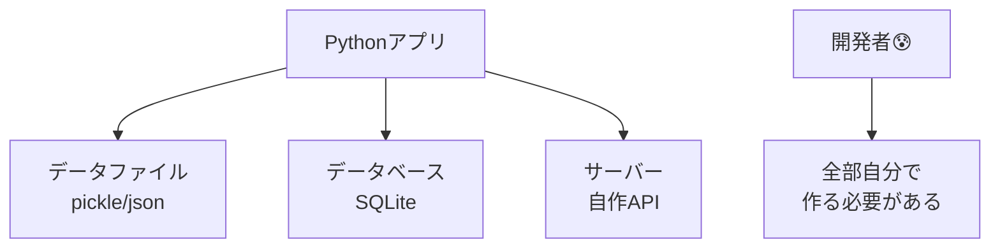
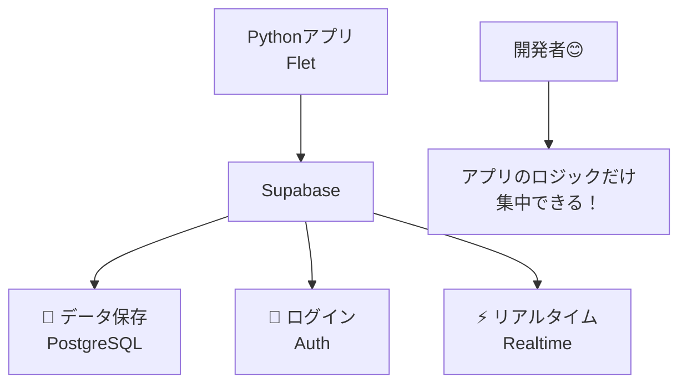
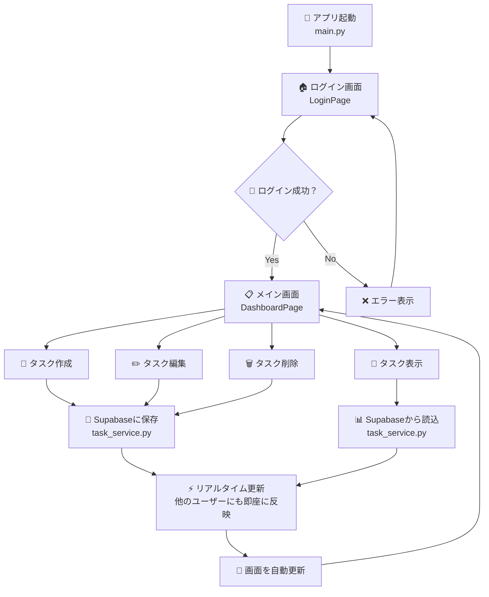
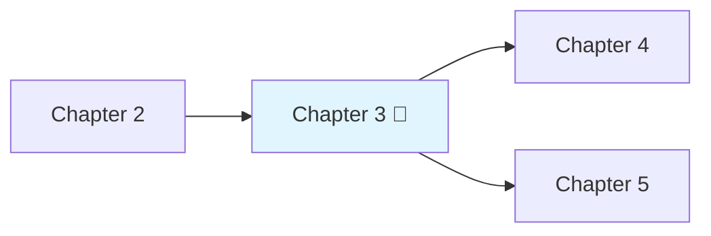

# Chapter 3: パターン1 - クライアントサイド実装 🏠

---
**📚 目次に戻る**: [📖 学習ガイド](./textbook_index.md)  
**⬅️ 前の章**: [Chapter 2: 認証システムの実装](./chapter02.md)  
**➡️ 次の章**: [Chapter 4: Edge Functions活用](./chapter04.md)  
**🎯 学習レベル**: 🌱 基礎 ➜ 🚀 応用  
**⏱️ 推定学習時間**: 6-10時間  
**🏗️ アーキテクチャ**: 木造住宅工法（シンプル・高速・個人向け）
---

## 🔄 **前章の復習**（Chapter 2からの継続）

Chapter 2で学んだ**認証・認可の基本概念**を振り返りましょう：
- ✅ **認証（Authentication）**: 「あなたは誰ですか？」の確認
- ✅ **認可（Authorization）**: 「何をしていいですか？」の制御  
- ✅ **RLS（Row Level Security）**: データベースレベルでの自動アクセス制御
- ✅ **JWT**: 安全なセッション管理・API認証の仕組み

これらのセキュリティ基盤を使って、今度は**実際に動くアプリケーション**を作成します。

> 💡 **Chapter 2の理解度確認**: 認証と認可の違い、RLSの役割を説明できますか？不安な場合は[Chapter 2](./chapter02.md)を復習してください。

## 🎯 この章で学ぶこと（初心者向け）

この章では、**「手作りアプリ」**的なアプローチでSupabaseを使った実用的なアプリを作ります。

- 🌱 **初心者**: Pythonアプリが実際にSupabaseと通信する様子がわかる
- 🚀 **中級者**: リアルタイム機能とエラーハンドリングの実装方法がわかる  
- 💪 **上級者**: クライアントサイドアーキテクチャの設計パターンが理解できる

## 💡 まずは身近な例から：「デスクトップのTodoアプリ」

想像してみてください。あなたが**Todoアプリ**を作るとします：

```
✅ 「買い物リスト」を作りたい
✅ 家族と共有したい（リアルタイム更新）
✅ スマホからもパソコンからも使いたい
✅ オフラインでも使えると嬉しい
```

### 🤔 従来の方法だと...



**大変なこと**：
- 🔧 データベース設計・管理
- 🌐 サーバー・API開発  
- 🔄 リアルタイム同期の仕組み
- 🔐 ログイン機能の実装
- 📱 複数デバイス対応

### 🎉 パターン1（クライアントサイド）なら...



**メリット**：
- ⚡ **シンプル**: PythonからSupabaseに直接接続
- 🚀 **高速開発**: サーバー不要で即座にプロトタイプ
- 💝 **低コスト**: サーバー運用費用なし
- 🔧 **デバッグ簡単**: 全てのコードが手元にある

---

## 🏗️ 今回作るアプリ：「タスク管理システム」

### 📱 どんなアプリ？

**家族で使う買い物リスト**のようなアプリを作ります：

```
🏠 家族のタスク管理アプリ
├── 👤 お父さん：「牛乳を買う」を追加
├── 👩 お母さん：リアルタイムで追加されたタスクを確認
├── 👧 娘：「宿題を終わらせる」を追加
└── 🔄 みんなの画面が即座に同期される
```

### ✨ 実装する機能

| 機能 | 初心者向け説明 | 技術的な説明 |
|------|:-------------:|:-------------|
| 🔐 **ログイン** | アプリを開くとログイン画面 | Supabase Auth でメール認証 |
| 📝 **タスク追加** | 「買い物」「宿題」等を追加 | PostgreSQL への INSERT 操作 |
| 👀 **タスク表示** | みんなのタスクが一覧表示 | SELECT クエリ + RLS で権限管理 |
| ⚡ **リアルタイム** | 他の人が追加すると即座に表示 | WebSocket でリアルタイム同期 |
| 📱 **オフライン対応** | ネット切れても表示される | ローカルキャッシュ機能 |

### 🛠️ 使用技術（初心者向け説明）

```
🖥️ デスクトップアプリ: Python Flet
   └─ 「Windowsアプリのような見た目が作れるPythonライブラリ」

☁️ バックエンド: Supabase
   ├─ 📄 データ保存: PostgreSQL
   ├─ 🔐 ログイン機能: Supabase Auth
   └─ ⚡ リアルタイム: Realtime

🔒 セキュリティ: RLS (Row Level Security)
   └─ 「自分のタスクしか見えない仕組み」
```

### 📂 今回作成したソースコードの場所

このプロジェクトの実際に動作するコードは以下にあります：

```bash
📁 src/chapter03-task-manager/
├── 📄 main.py                 # ← ここからアプリが始まる
├── 📄 requirements.txt        # ← 必要なライブラリ一覧
├── 📄 .env.example           # ← 設定ファイル例
├── 📁 src/                   # ← メインのコード
│   ├── 📄 app.py             # ← アプリのメイン処理
│   ├── 📄 database.py        # ← データベース接続
│   └── 📄 models.py          # ← データの形を定義
├── 📁 config/                # ← 設定関連
├── 📁 models/                # ← データモデル
├── 📁 services/              # ← 各種サービス
├── 📁 ui/                    # ← 画面・UI関連
└── 📁 utils/                 # ← ユーティリティ
```

> 💡 **重要**: これらのコードは実際に動作する完全なアプリケーションです！
> `src/chapter03-task-manager/` フォルダの README.md に詳しい実行方法があります。

---

## 🔍 実際のコードを見てみよう！

このセクションでは、作成したアプリの**実際のソースコード**を段階的に説明します。

### 📄 Step 1: アプリのエントリーポイント（main.py）

まず、アプリが起動する最初のファイルを見てみましょう：

```python
# src/chapter03-task-manager/main.py（抜粋）

#!/usr/bin/env python3
"""
Chapter 3: タスク管理システム - メインアプリケーション
Fletを使用したクライアントサイド実装パターンのデモ
"""

import flet as ft
from src.app import TaskManagerApp

async def main(page: ft.Page):
    """
    Fletアプリケーションのメインエントリーポイント
    """
    # ページ基本設定
    page.title = "タスク管理システム"
    page.window_width = 1200
    page.window_height = 800
    
    # アプリケーション初期化・起動
    app = TaskManagerApp(page)
    await app.run()

if __name__ == "__main__":
    # Fletアプリケーション起動
    ft.app(target=main, view=ft.AppView.FLET_APP)
```

**🔰 初心者向け解説**：

| コード部分 | 何をしているか | なぜ必要か |
|:----------|:-------------|:----------|
| `import flet as ft` | Fletライブラリを読み込み | デスクトップアプリの見た目を作るため |
| `async def main(page)` | アプリのメイン関数を定義 | Fletは非同期処理を使うため |
| `page.title = "..."` | ウィンドウのタイトルを設定 | ユーザーが分かりやすいように |
| `TaskManagerApp(page)` | 実際のアプリロジックを呼び出し | メイン処理を別ファイルに分離 |
| `ft.app(target=main)` | Fletアプリとして起動 | デスクトップアプリとして表示 |

### 📄 Step 2: アプリのメイン処理（app.py）

次に、実際のアプリロジックを見てみましょう：

```python
# src/chapter03-task-manager/src/app.py（抜粋）

import flet as ft
from services.auth_service import AuthService
from services.task_service import TaskService
from ui.pages.login_page import LoginPage
from ui.pages.dashboard_page import DashboardPage

class AppState:
    """アプリケーション状態管理"""
    
    def __init__(self):
        self.current_user = None      # 現在ログインしているユーザー
        self.current_page = "login"   # 今表示している画面
        self.tasks = []              # タスクのリスト
        self.is_loading = False      # 読み込み中かどうか

class TaskManagerApp:
    """タスク管理アプリケーションメインクラス"""
    
    def __init__(self, page: ft.Page):
        self.page = page
        self.state = AppState()
        
        # Supabaseと通信するサービスを初期化
        self.auth_service = AuthService()    # ログイン・ログアウト
        self.task_service = TaskService()    # タスクの作成・表示・更新
        
        # 画面ページ
        self.login_page = LoginPage(self)
        self.dashboard_page = DashboardPage(self)
    
    async def run(self):
        """アプリケーションを開始"""
        # 最初はログイン画面を表示
        await self.show_login_page()
```

**🔰 初心者向け解説**：

| クラス・概念 | 何をしているか | 身近な例 |
|:----------|:-------------|:---------|
| `AppState` | アプリの「今の状況」を管理 | 「今どのページにいるか」「誰がログインしているか」を覚えておくメモ帳 |
| `AuthService` | ログイン・ログアウト処理 | マンションのオートロック管理人 |
| `TaskService` | タスクの作成・表示・更新 | 買い物リストの管理係 |
| `LoginPage` | ログイン画面 | アプリの玄関口 |
| `DashboardPage` | メイン画面 | タスクが表示される居間 |

### 📄 Step 3: Supabaseとの通信（auth_service.py）

ログイン機能がどのようにSupabaseと通信するかを見てみましょう：

```python
# services/auth_service.py（抜粋・簡略化）

from supabase import create_client
import os

class AuthService:
    def __init__(self):
        # Supabaseに接続
        url = os.getenv("SUPABASE_URL")
        key = os.getenv("SUPABASE_ANON_KEY")
        self.supabase = create_client(url, key)
    
    async def login(self, email: str, password: str):
        """ログイン処理"""
        try:
            # Supabaseにログイン情報を送信
            response = await self.supabase.auth.sign_in_with_password({
                "email": email,
                "password": password
            })
            
            if response.user:
                return {"success": True, "user": response.user}
            else:
                return {"success": False, "error": "ログインに失敗しました"}
                
        except Exception as e:
            return {"success": False, "error": str(e)}
    
    async def signup(self, email: str, password: str):
        """ユーザー登録処理"""
        try:
            response = await self.supabase.auth.sign_up({
                "email": email,
                "password": password
            })
            return {"success": True, "user": response.user}
        except Exception as e:
            return {"success": False, "error": str(e)}
```

**🔰 初心者向け解説**：

| コード部分 | 何をしているか | 身近な例 |
|:----------|:-------------|:---------|
| `create_client(url, key)` | Supabaseへの接続を準備 | 銀行のATMにカードを挿入 |
| `sign_in_with_password()` | ログイン情報をSupabaseに送信 | ATMに暗証番号を入力 |
| `response.user` | ログイン成功時のユーザー情報 | ATMが「ようこそ田中様」と表示 |
| `try/except` | エラーが起きた時の対処 | ATMで「暗証番号が違います」と表示 |

### 📄 Step 4: データの形を定義（task.py）

タスクがどのような情報を持つかを定義している部分を見てみましょう：

```python
# models/task.py（抜粋・簡略化）

from pydantic import BaseModel
from enum import Enum
from datetime import datetime, date

class TaskPriority(str, Enum):
    LOW = "low"        # 低い
    MEDIUM = "medium"  # 普通
    HIGH = "high"      # 高い
    URGENT = "urgent"  # 緊急

class TaskStatus(str, Enum):
    TODO = "todo"                # やること
    IN_PROGRESS = "in_progress"  # 進行中
    COMPLETED = "completed"      # 完了
    CANCELLED = "cancelled"      # キャンセル

class Task(BaseModel):
    """タスクモデル"""
    
    id: int = None                    # タスクの番号
    title: str                       # タスクのタイトル（「牛乳を買う」等）
    description: str = None          # 詳細説明（省略可能）
    priority: TaskPriority = "medium" # 優先度
    status: TaskStatus = "todo"      # 状態
    due_date: date = None           # 期限日（省略可能）
    user_id: str = None             # 作成したユーザー
    created_at: datetime = None     # 作成日時
    updated_at: datetime = None     # 更新日時
    
    @property
    def is_overdue(self) -> bool:
        """期限切れかどうかを判定"""
        if self.due_date and self.status != "completed":
            return self.due_date < date.today()
        return False
    
    @property
    def priority_color(self) -> str:
        """優先度に応じた色を返す"""
        if self.priority == "urgent":
            return "#9C27B0"    # 紫（緊急）
        elif self.priority == "high":
            return "#F44336"    # 赤（高い）
        elif self.priority == "medium":
            return "#FF9800"    # オレンジ（普通）
        else:
            return "#4CAF50"    # 緑（低い）
```

**🔰 初心者向け解説**：

| 概念 | 何をしているか | 身近な例 |
|:-----|:-------------|:---------|
| `Enum` | 選択肢を限定する | 買い物リストの「緊急度」を「高・中・低」の3つだけに制限 |
| `BaseModel` | データの「型」を決める | 住所録の「名前は文字、電話番号は数字」のような決まりごと |
| `@property` | 計算して結果を返す | 「今日の日付と期限を比べて、期限切れかどうか自動判定」 |
| `is_overdue` | 期限切れ判定 | 「牛乳の期限が昨日だから、赤く表示する」 |
| `priority_color` | 優先度別の色 | 「緊急なタスクは赤、普通のタスクは緑で表示」 |

### 📄 Step 5: アプリの流れ（全体像）

これまでのコードがどのように連携するかを図で見てみましょう：



**流れの説明**：
1. **アプリ起動**: main.py でアプリが始まる
2. **ログイン**: AuthService を使ってSupabaseに認証
3. **メイン画面**: DashboardPage でタスク一覧を表示
4. **タスク操作**: 作成・表示・編集・削除
5. **データ同期**: Supabaseを通じて他のユーザーとリアルタイム同期
6. **画面更新**: 変更があると自動で画面が更新される

---

## 🚀 実際に動かしてみよう！（ハンズオン）

### 📋 Step 1: 環境準備

**必要なもの**：
- Python 3.11以上
- テキストエディタ（VS Code推奨）
- Supabaseアカウント（無料）

**セットアップ手順**：

```bash
# 1. プロジェクトディレクトリに移動
cd src/chapter03-task-manager

# 2. 仮想環境作成（推奨）
python -m venv venv

# 3. 仮想環境有効化
# Windows:
venv\Scripts\activate
# Mac/Linux:
source venv/bin/activate

# 4. 依存関係インストール
pip install -r requirements.txt

# 5. 環境設定ファイル作成
cp .env.example .env
```

### 📋 Step 2: Supabase設定

1. **Supabaseプロジェクト作成**
   - https://supabase.com にアクセス
   - 「New Project」でプロジェクト作成
   - プロジェクト名: `task-manager-tutorial`

2. **API設定の取得**
   - Project Settings → API
   - 「URL」と「anon public key」をコピー

3. **環境変数設定**
   ```bash
   # .env ファイルを編集
   SUPABASE_URL=https://your-project.supabase.co
   SUPABASE_ANON_KEY=your-anon-key-here
   ```

### 📋 Step 3: データベーステーブル作成

Supabase Dashboard で以下のSQLを実行：

```sql
-- タスクテーブル作成
CREATE TABLE tasks (
    id SERIAL PRIMARY KEY,
    title TEXT NOT NULL,
    description TEXT,
    priority TEXT DEFAULT 'medium',
    status TEXT DEFAULT 'todo',
    due_date DATE,
    user_id UUID REFERENCES auth.users(id),
    created_at TIMESTAMP DEFAULT NOW(),
    updated_at TIMESTAMP DEFAULT NOW()
);

-- Row Level Security 有効化
ALTER TABLE tasks ENABLE ROW LEVEL SECURITY;

-- ユーザーは自分のタスクのみ参照可能
CREATE POLICY "Users can view own tasks" ON tasks
    FOR SELECT USING (auth.uid() = user_id);

-- ユーザーは自分のタスクのみ作成可能  
CREATE POLICY "Users can create own tasks" ON tasks
    FOR INSERT WITH CHECK (auth.uid() = user_id);

-- ユーザーは自分のタスクのみ更新可能
CREATE POLICY "Users can update own tasks" ON tasks
    FOR UPDATE USING (auth.uid() = user_id);

-- ユーザーは自分のタスクのみ削除可能
CREATE POLICY "Users can delete own tasks" ON tasks
    FOR DELETE USING (auth.uid() = user_id);
```

### 📋 Step 4: アプリケーション実行

```bash
# アプリケーション起動
python main.py
```

**期待される動作**：
1. ✅ デスクトップアプリが起動
2. ✅ ログイン画面が表示
3. ✅ 新規ユーザー登録が可能
4. ✅ ログイン後、タスク一覧が表示
5. ✅ タスクの作成・編集・削除が可能

### 📋 Step 5: 機能テスト

**基本機能のテスト**：

| テスト項目 | 操作手順 | 期待結果 |
|:----------|:---------|:---------|
| 🔐 ユーザー登録 | メール・パスワード入力→「登録」 | Supabaseからメール認証要求 |
| 🔑 ログイン | 認証済みメール・パスワード→「ログイン」 | メイン画面に遷移 |
| 📝 タスク作成 | 「+」ボタン→タイトル入力→「保存」 | タスクが一覧に表示 |
| ✏️ タスク編集 | タスククリック→内容変更→「保存」 | 変更が反映される |
| ✅ タスク完了 | タスクのチェックボックスをクリック | ステータスが「完了」に変更 |
| 🗑️ タスク削除 | タスク選択→「削除」ボタン | タスクが一覧から消える |

### 🐛 よくあるエラーと対処法

#### エラー1: 「ModuleNotFoundError: No module named 'flet'」

**原因**: Fletがインストールされていない
**対処法**:
```bash
pip install flet==0.21.2
```

#### エラー2: 「AuthenticationError: Invalid API key」

**原因**: 環境変数の設定ミス
**対処法**:
1. `.env` ファイルの `SUPABASE_URL` と `SUPABASE_ANON_KEY` を確認
2. Supabase Dashboard で正しいキーをコピー
3. アプリを再起動

#### エラー3: 「Table 'tasks' doesn't exist」

**原因**: データベーステーブルが作成されていない
**対処法**:
1. Supabase Dashboard → SQL Editor
2. 上記の CREATE TABLE文を実行
3. テーブルが作成されたか確認

#### エラー4: ログインできるがタスクが表示されない

**原因**: RLS（Row Level Security）の設定不備
**対処法**:
1. ポリシーが正しく作成されているか確認
2. `auth.uid()` が正しく動作しているか確認

### 💡 学習のポイント

1. **段階的に理解**: まずアプリを動かしてから、コードを読む
2. **エラーを恐れない**: エラーメッセージは貴重な学習材料
3. **コードを変更**: 優先度の色を変えたり、新しい項目を追加してみる
4. **ログを確認**: `print()` や `logger` で動作を追跡する

### 🎯 次の挑戦

基本機能が動いたら、以下の機能追加に挑戦してみましょう：

1. **タスクの検索機能**: タイトルでフィルタリング
2. **優先度別表示**: 緊急タスクを上に表示
3. **期限アラート**: 期限が近いタスクを強調表示
4. **統計表示**: 完了率のグラフ表示

---

## 📚 学習進度別ガイド

### 🌱 初心者（プログラミング経験1年未満）

**この章で重点的に学ぶべきこと**：

| 学習項目 | 時間配分 | 重要度 | 学習方法 |
|:---------|:--------:|:------:|:---------|
| 📱 **アプリの実行** | 2時間 | ⭐⭐⭐ | まずは動かしてみる |
| 🔧 **環境構築** | 1時間 | ⭐⭐⭐ | エラーメッセージと格闘 |
| 📄 **コードの読み方** | 4時間 | ⭐⭐ | 1行ずつ丁寧に理解 |
| 🐛 **エラーの対処** | 2時間 | ⭐⭐⭐ | エラーを恐れずに挑戦 |

**学習の進め方**：
1. ✅ **Step 1-4**: まずアプリを動かす（理解は後回し）
2. ✅ **コード解説**: 各ファイルの役割を理解
3. ✅ **小さな変更**: タイトルや色を変えてみる
4. ✅ **エラー体験**: 意図的にコードを壊して修復練習

**つまずきポイントと解決法**：

| つまずきポイント | よくある原因 | 解決のヒント |
|:----------------|:-------------|:-------------|
| 環境構築でエラー | Python・pip未インストール | 公式サイトから最新版をインストール |
| モジュールエラー | 仮想環境を使っていない | `python -m venv venv` で仮想環境作成 |
| Supabaseエラー | API キーの設定ミス | Dashboard で正しいキーをコピー |
| アプリが起動しない | 依存関係の不備 | `pip install -r requirements.txt` を再実行 |

### 🚀 中級者（プログラミング経験1-3年）

**この章で重点的に学ぶべきこと**：

| 学習項目 | 時間配分 | 重要度 | 学習方法 |
|:---------|:--------:|:------:|:---------|
| 🏗️ **アーキテクチャ設計** | 3時間 | ⭐⭐⭐ | MVCパターンの理解 |
| ⚡ **リアルタイム機能** | 2時間 | ⭐⭐⭐ | WebSocket の仕組み |
| 🔐 **セキュリティ(RLS)** | 2時間 | ⭐⭐⭐ | ポリシーの設計思想 |
| 🎨 **UI/UX設計** | 2時間 | ⭐⭐ | Fletの活用方法 |

**学習の進め方**：
1. ✅ **アーキテクチャ理解**: サービス層の責務分担
2. ✅ **機能拡張**: 新しい機能の追加に挑戦
3. ✅ **最適化**: パフォーマンス改善
4. ✅ **テスト**: エラーハンドリングの充実

**発展課題**：
- 📊 **データ可視化**: タスク統計のグラフ表示
- 🔔 **通知機能**: 期限アラートの実装
- 📱 **レスポンシブ**: 画面サイズ対応
- 🌐 **多言語対応**: i18n の実装

### 💪 上級者（プログラミング経験3年以上）

**この章で重点的に学ぶべきこと**：

| 学習項目 | 時間配分 | 重要度 | 学習方法 |
|:---------|:--------:|:------:|:---------|
| 🔧 **設計パターン** | 2時間 | ⭐⭐⭐ | 他パターンとの比較検討 |
| 📈 **スケーラビリティ** | 3時間 | ⭐⭐⭐ | 大規模化の課題と対策 |
| 🛡️ **セキュリティ深堀り** | 2時間 | ⭐⭐⭐ | 脆弱性の分析と対策 |
| 🚀 **パフォーマンス** | 2時間 | ⭐⭐ | ボトルネック分析 |

**学習の進め方**：
1. ✅ **設計思想の理解**: なぜこのパターンを選択したか
2. ✅ **制約と限界の把握**: クライアントサイドの課題
3. ✅ **他手法との比較**: Edge Functions・独立APIとの違い
4. ✅ **プロダクション対応**: 運用を見据えた改善

**プロダクション課題**：
- 🔄 **オフライン対応**: データ同期戦略
- 📊 **ログ・監視**: エラートラッキング
- 🔧 **CI/CD**: 自動デプロイパイプライン
- 📦 **パッケージング**: 配布可能な実行ファイル作成

### 🎯 各レベル共通の学習チェックリスト

**基本理解**：
- [ ] Supabaseクライアントライブラリの使い方
- [ ] Row Level Security (RLS) の仕組み
- [ ] リアルタイム機能の実装方法
- [ ] 認証・認可の統合方法

**実践スキル**：
- [ ] Python + Flet でのGUIアプリ開発
- [ ] 非同期処理（async/await）の活用
- [ ] エラーハンドリングとログ出力
- [ ] 環境変数と設定管理

**応用知識**：
- [ ] クライアントサイドパターンの適用場面
- [ ] 他のアーキテクチャパターンとの比較
- [ ] セキュリティリスクと対策
- [ ] パフォーマンスとスケーラビリティ

### 📖 次の章への準備

**Chapter 4 に進む前に確認すべきこと**：

| 確認項目 | チェック |
|:---------|:--------:|
| タスク管理アプリが正常に動作する | □ |
| Supabaseの基本操作ができる | □ |
| RLSの仕組みを理解している | □ |
| 基本的なエラーは自力で解決できる | □ |

**Chapter 4 の予習ポイント**：
- 🌐 **Edge Functions**: サーバーレス関数の概念
- 🏃 **Deno**: Node.js とは異なるランタイム
- 📦 **TypeScript**: 型安全なJavaScript
- ⚡ **API設計**: RESTful なエンドポイント設計

---

## 3.1 技術的なアーキテクチャ詳細

### プロジェクト構造

```
task-manager/
├── main.py                 # アプリエントリーポイント
├── requirements.txt        # 依存関係
├── config/
│   ├── __init__.py
│   ├── settings.py         # 設定管理
│   └── database.py         # Supabase接続設定
├── models/
│   ├── __init__.py
│   ├── base.py            # 基底モデル
│   ├── user.py            # ユーザーモデル
│   └── task.py            # タスクモデル
├── services/
│   ├── __init__.py
│   ├── auth_service.py    # 認証サービス
│   ├── task_service.py    # タスクサービス
│   └── realtime_service.py # リアルタイムサービス
├── ui/
│   ├── __init__.py
│   ├── components/        # 再利用コンポーネント
│   ├── pages/            # ページコンポーネント
│   └── utils/            # UI ユーティリティ
└── utils/
    ├── __init__.py
    ├── cache.py          # キャッシュ管理
    ├── exceptions.py     # カスタム例外
    └── validators.py     # バリデーション
```

### 依存関係設定

```python
# requirements.txt
flet==0.21.2
supabase==2.3.4
pydantic==2.5.0
python-dotenv==1.0.0
httpx==0.25.2
asyncio-mqtt==0.16.1
```

### 基本設定

```python
# config/settings.py
from pydantic_settings import BaseSettings
from typing import Optional
import os

class Settings(BaseSettings):
    # Supabase設定
    SUPABASE_URL: str
    SUPABASE_ANON_KEY: str
    SUPABASE_SERVICE_KEY: Optional[str] = None
    
    # アプリケーション設定
    APP_NAME: str = "Task Manager"
    APP_VERSION: str = "1.0.0"
    DEBUG: bool = False
    
    # キャッシュ設定
    CACHE_TTL: int = 300  # 5分
    MAX_CACHE_SIZE: int = 1000
    
    # UI設定
    WINDOW_WIDTH: int = 1200
    WINDOW_HEIGHT: int = 800
    THEME_MODE: str = "light"
    
    class Config:
        env_file = ".env"
        case_sensitive = True

settings = Settings()
```

```python
# config/database.py
from supabase import create_client, Client
from config.settings import settings
from typing import Optional
import logging

class SupabaseManager:
    _instance: Optional['SupabaseManager'] = None
    _client: Optional[Client] = None
    
    def __new__(cls) -> 'SupabaseManager':
        if cls._instance is None:
            cls._instance = super().__new__(cls)
        return cls._instance
    
    def initialize(self) -> Client:
        """Supabaseクライアント初期化"""
        if self._client is None:
            try:
                self._client = create_client(
                    supabase_url=settings.SUPABASE_URL,
                    supabase_key=settings.SUPABASE_ANON_KEY
                )
                logging.info("Supabaseクライアント初期化完了")
            except Exception as e:
                logging.error(f"Supabase初期化エラー: {e}")
                raise
        return self._client
    
    @property
    def client(self) -> Client:
        if self._client is None:
            return self.initialize()
        return self._client
    
    def get_user(self):
        """現在のユーザー取得"""
        return self._client.auth.get_user()
    
    def is_authenticated(self) -> bool:
        """認証状態確認"""
        try:
            user = self.get_user()
            return user.user is not None
        except:
            return False

# シングルトンインスタンス
supabase_manager = SupabaseManager()
```

### データモデル定義

```python
# models/base.py
from pydantic import BaseModel, Field
from typing import Optional, Any, Dict
from datetime import datetime
import uuid

class BaseEntity(BaseModel):
    id: Optional[int] = None
    created_at: Optional[datetime] = None
    updated_at: Optional[datetime] = None
    
    class Config:
        from_attributes = True
        json_encoders = {
            datetime: lambda v: v.isoformat()
        }

class SupabaseResponse(BaseModel):
    """Supabase APIレスポンス基底クラス"""
    data: Optional[Any] = None
    error: Optional[Dict[str, Any]] = None
    count: Optional[int] = None
    
    @property
    def is_success(self) -> bool:
        return self.error is None
    
    @property
    def error_message(self) -> str:
        if self.error:
            return self.error.get('message', 'Unknown error')
        return ""
```

```python
# models/task.py
from models.base import BaseEntity
from enum import Enum
from typing import Optional
from datetime import datetime, date
from pydantic import Field, validator

class TaskPriority(str, Enum):
    LOW = "low"
    MEDIUM = "medium"
    HIGH = "high"
    URGENT = "urgent"

class TaskStatus(str, Enum):
    TODO = "todo"
    IN_PROGRESS = "in_progress" 
    COMPLETED = "completed"
    CANCELLED = "cancelled"

class Task(BaseEntity):
    title: str = Field(..., min_length=1, max_length=200)
    description: Optional[str] = Field(None, max_length=1000)
    priority: TaskPriority = TaskPriority.MEDIUM
    status: TaskStatus = TaskStatus.TODO
    due_date: Optional[date] = None
    completed_at: Optional[datetime] = None
    user_id: Optional[str] = None  # UUID string
    assignee_id: Optional[str] = None
    project_id: Optional[int] = None
    tags: Optional[list[str]] = Field(default_factory=list)
    
    @validator('completed_at', always=True)
    def set_completed_at(cls, v, values):
        """完了状態時の自動タイムスタンプ設定"""
        if values.get('status') == TaskStatus.COMPLETED and v is None:
            return datetime.now()
        elif values.get('status') != TaskStatus.COMPLETED:
            return None
        return v
    
    @property
    def is_overdue(self) -> bool:
        """期限切れ判定"""
        if self.due_date and self.status not in [TaskStatus.COMPLETED, TaskStatus.CANCELLED]:
            return self.due_date < date.today()
        return False
    
    @property
    def priority_order(self) -> int:
        """優先度による並び順"""
        order_map = {
            TaskPriority.LOW: 0,
            TaskPriority.MEDIUM: 1,
            TaskPriority.HIGH: 2,
            TaskPriority.URGENT: 3
        }
        return order_map.get(self.priority, 0)

class TaskFilter(BaseModel):
    """タスクフィルタリング条件"""
    status: Optional[TaskStatus] = None
    priority: Optional[TaskPriority] = None
    assignee_id: Optional[str] = None
    project_id: Optional[int] = None
    overdue_only: bool = False
    search_query: Optional[str] = None
    
class TaskCreate(BaseModel):
    title: str = Field(..., min_length=1, max_length=200)
    description: Optional[str] = Field(None, max_length=1000)
    priority: TaskPriority = TaskPriority.MEDIUM
    due_date: Optional[date] = None
    assignee_id: Optional[str] = None
    project_id: Optional[int] = None
    tags: list[str] = Field(default_factory=list)

class TaskUpdate(BaseModel):
    title: Optional[str] = Field(None, min_length=1, max_length=200)
    description: Optional[str] = Field(None, max_length=1000)
    priority: Optional[TaskPriority] = None
    status: Optional[TaskStatus] = None
    due_date: Optional[date] = None
    assignee_id: Optional[str] = None
    project_id: Optional[int] = None
    tags: Optional[list[str]] = None
```

### 認証サービス

```python
# services/auth_service.py
from config.database import supabase_manager
from models.user import User, UserCreate, UserUpdate
from typing import Optional, Dict, Any
from gotrue.errors import AuthError
import logging

class AuthService:
    def __init__(self):
        self.supabase = supabase_manager.client
        self._current_user: Optional[User] = None
    
    async def sign_up(self, email: str, password: str, 
                      user_data: Optional[Dict[str, Any]] = None) -> Dict[str, Any]:
        """ユーザー登録"""
        try:
            response = await self.supabase.auth.sign_up({
                "email": email,
                "password": password,
                "options": {
                    "data": user_data or {}
                }
            })
            
            if response.user:
                logging.info(f"ユーザー登録成功: {email}")
                return {"success": True, "user": response.user}
            else:
                return {"success": False, "error": "Registration failed"}
                
        except AuthError as e:
            logging.error(f"登録エラー: {e}")
            return {"success": False, "error": str(e)}
    
    async def sign_in(self, email: str, password: str) -> Dict[str, Any]:
        """ログイン"""
        try:
            response = await self.supabase.auth.sign_in_with_password({
                "email": email,
                "password": password
            })
            
            if response.user:
                self._current_user = User(**response.user.model_dump())
                logging.info(f"ログイン成功: {email}")
                return {"success": True, "user": response.user}
            else:
                return {"success": False, "error": "Invalid credentials"}
                
        except AuthError as e:
            logging.error(f"ログインエラー: {e}")
            return {"success": False, "error": str(e)}
    
    async def sign_out(self) -> Dict[str, Any]:
        """ログアウト"""
        try:
            await self.supabase.auth.sign_out()
            self._current_user = None
            logging.info("ログアウト完了")
            return {"success": True}
        except AuthError as e:
            logging.error(f"ログアウトエラー: {e}")
            return {"success": False, "error": str(e)}
    
    def get_current_user(self) -> Optional[User]:
        """現在のユーザー取得"""
        if self._current_user:
            return self._current_user
            
        try:
            user_response = self.supabase.auth.get_user()
            if user_response.user:
                self._current_user = User(**user_response.user.model_dump())
                return self._current_user
        except:
            pass
        return None
    
    def is_authenticated(self) -> bool:
        """認証状態確認"""
        return self.get_current_user() is not None
    
    async def update_user(self, user_data: UserUpdate) -> Dict[str, Any]:
        """ユーザー情報更新"""
        try:
            response = await self.supabase.auth.update_user({
                "data": user_data.model_dump(exclude_unset=True)
            })
            
            if response.user:
                self._current_user = User(**response.user.model_dump())
                return {"success": True, "user": response.user}
            else:
                return {"success": False, "error": "Update failed"}
                
        except AuthError as e:
            logging.error(f"ユーザー更新エラー: {e}")
            return {"success": False, "error": str(e)}

# シングルトンインスタンス
auth_service = AuthService()
```

### タスクサービス

```python
# services/task_service.py
from config.database import supabase_manager
from models.task import Task, TaskCreate, TaskUpdate, TaskFilter
from services.auth_service import auth_service
from utils.cache import cache_manager
from typing import List, Optional, Dict, Any
from postgrest.exceptions import APIError
import logging

class TaskService:
    def __init__(self):
        self.supabase = supabase_manager.client
        self.table_name = "tasks"
    
    async def create_task(self, task_data: TaskCreate) -> Dict[str, Any]:
        """タスク作成"""
        try:
            current_user = auth_service.get_current_user()
            if not current_user:
                return {"success": False, "error": "認証が必要です"}
            
            # タスクデータに作成者を設定
            task_dict = task_data.model_dump()
            task_dict["user_id"] = current_user.id
            
            response = await self.supabase.table(self.table_name)\
                .insert(task_dict)\
                .execute()
            
            if response.data:
                task = Task(**response.data[0])
                # キャッシュ無効化
                cache_manager.clear_pattern("tasks:*")
                logging.info(f"タスク作成成功: {task.title}")
                return {"success": True, "task": task}
            else:
                return {"success": False, "error": "タスク作成に失敗しました"}
                
        except APIError as e:
            logging.error(f"タスク作成エラー: {e}")
            return {"success": False, "error": str(e)}
    
    async def get_tasks(self, filter_params: Optional[TaskFilter] = None) -> List[Task]:
        """タスク一覧取得"""
        try:
            current_user = auth_service.get_current_user()
            if not current_user:
                return []
            
            # キャッシュキー生成
            cache_key = f"tasks:{current_user.id}"
            if filter_params:
                cache_key += f":{hash(filter_params.model_dump_json())}"
            
            # キャッシュチェック
            cached_tasks = cache_manager.get(cache_key)
            if cached_tasks is not None:
                return [Task(**task) for task in cached_tasks]
            
            # データベースクエリ構築
            query = self.supabase.table(self.table_name)\
                .select("*")\
                .eq("user_id", current_user.id)
            
            # フィルタ適用
            if filter_params:
                query = self._apply_filters(query, filter_params)
            
            # 並び順設定
            query = query.order("created_at", desc=True)
            
            response = await query.execute()
            
            if response.data:
                tasks = [Task(**task_data) for task_data in response.data]
                # キャッシュ保存
                cache_manager.set(
                    cache_key, 
                    [task.model_dump() for task in tasks]
                )
                return tasks
            else:
                return []
                
        except APIError as e:
            logging.error(f"タスク取得エラー: {e}")
            return []
    
    def _apply_filters(self, query, filters: TaskFilter):
        """フィルタ条件をクエリに適用"""
        if filters.status:
            query = query.eq("status", filters.status)
        
        if filters.priority:
            query = query.eq("priority", filters.priority)
        
        if filters.assignee_id:
            query = query.eq("assignee_id", filters.assignee_id)
        
        if filters.project_id:
            query = query.eq("project_id", filters.project_id)
        
        if filters.search_query:
            query = query.or_(
                f"title.ilike.%{filters.search_query}%,"
                f"description.ilike.%{filters.search_query}%"
            )
        
        if filters.overdue_only:
            from datetime import date
            query = query.lt("due_date", date.today().isoformat())\
                         .in_("status", ["todo", "in_progress"])
        
        return query
    
    async def update_task(self, task_id: int, 
                         update_data: TaskUpdate) -> Dict[str, Any]:
        """タスク更新"""
        try:
            current_user = auth_service.get_current_user()
            if not current_user:
                return {"success": False, "error": "認証が必要です"}
            
            # 更新データ準備
            update_dict = update_data.model_dump(exclude_unset=True)
            
            response = await self.supabase.table(self.table_name)\
                .update(update_dict)\
                .eq("id", task_id)\
                .eq("user_id", current_user.id)\
                .execute()
            
            if response.data:
                task = Task(**response.data[0])
                # キャッシュ無効化
                cache_manager.clear_pattern("tasks:*")
                logging.info(f"タスク更新成功: {task.title}")
                return {"success": True, "task": task}
            else:
                return {"success": False, "error": "タスクが見つからないか、更新権限がありません"}
                
        except APIError as e:
            logging.error(f"タスク更新エラー: {e}")
            return {"success": False, "error": str(e)}
    
    async def delete_task(self, task_id: int) -> Dict[str, Any]:
        """タスク削除"""
        try:
            current_user = auth_service.get_current_user()
            if not current_user:
                return {"success": False, "error": "認証が必要です"}
            
            response = await self.supabase.table(self.table_name)\
                .delete()\
                .eq("id", task_id)\
                .eq("user_id", current_user.id)\
                .execute()
            
            if response.data:
                # キャッシュ無効化
                cache_manager.clear_pattern("tasks:*")
                logging.info(f"タスク削除成功: ID {task_id}")
                return {"success": True}
            else:
                return {"success": False, "error": "タスクが見つからないか、削除権限がありません"}
                
        except APIError as e:
            logging.error(f"タスク削除エラー: {e}")
            return {"success": False, "error": str(e)}
    
    async def get_task_statistics(self) -> Dict[str, Any]:
        """タスク統計情報取得"""
        try:
            current_user = auth_service.get_current_user()
            if not current_user:
                return {}
            
            cache_key = f"task_stats:{current_user.id}"
            cached_stats = cache_manager.get(cache_key)
            if cached_stats is not None:
                return cached_stats
            
            # 各ステータスの件数取得
            response = await self.supabase.rpc(
                'get_task_statistics',
                {'user_uuid': current_user.id}
            ).execute()
            
            if response.data:
                stats = response.data[0]
                cache_manager.set(cache_key, stats, ttl=60)  # 1分キャッシュ
                return stats
            else:
                return {}
                
        except APIError as e:
            logging.error(f"統計取得エラー: {e}")
            return {}

# シングルトンインスタンス
task_service = TaskService()
```

---

## 3.2 リアルタイム更新とエラーハンドリング

### リアルタイムサービス

```python
# services/realtime_service.py
from config.database import supabase_manager
from services.auth_service import auth_service
from typing import Callable, Dict, Any, Optional
from supabase.lib.realtime_client import RealtimeClient
import logging
import asyncio

class RealtimeService:
    def __init__(self):
        self.supabase = supabase_manager.client
        self._subscriptions: Dict[str, Any] = {}
        self._callbacks: Dict[str, list[Callable]] = {}
        self._is_connected = False
        
    async def connect(self):
        """リアルタイム接続開始"""
        try:
            current_user = auth_service.get_current_user()
            if not current_user:
                logging.warning("リアルタイム接続: ユーザー未認証")
                return False
            
            # タスクテーブルの変更を監視
            await self._subscribe_to_tasks()
            self._is_connected = True
            logging.info("リアルタイム接続成功")
            return True
            
        except Exception as e:
            logging.error(f"リアルタイム接続エラー: {e}")
            return False
    
    async def disconnect(self):
        """リアルタイム接続終了"""
        try:
            for subscription_id in list(self._subscriptions.keys()):
                await self._unsubscribe(subscription_id)
            
            self._is_connected = False
            logging.info("リアルタイム接続終了")
            
        except Exception as e:
            logging.error(f"リアルタイム切断エラー: {e}")
    
    async def _subscribe_to_tasks(self):
        """タスクテーブル変更監視"""
        current_user = auth_service.get_current_user()
        if not current_user:
            return
        
        subscription_id = "tasks_subscription"
        
        # 既存の購読があれば削除
        if subscription_id in self._subscriptions:
            await self._unsubscribe(subscription_id)
        
        try:
            # Supabase Realtime購読
            subscription = self.supabase.table("tasks")\
                .on("*", self._handle_task_change)\
                .subscribe()
            
            self._subscriptions[subscription_id] = subscription
            logging.info("タスクリアルタイム監視開始")
            
        except Exception as e:
            logging.error(f"タスク監視エラー: {e}")
    
    def _handle_task_change(self, payload: Dict[str, Any]):
        """タスク変更イベントハンドラ"""
        try:
            event_type = payload.get("eventType")
            record = payload.get("new", payload.get("old", {}))
            
            current_user = auth_service.get_current_user()
            if not current_user:
                return
            
            # 自分のタスクのみ処理
            if record.get("user_id") != current_user.id:
                return
            
            logging.info(f"タスク変更検知: {event_type}, ID: {record.get('id')}")
            
            # 登録されたコールバック実行
            for callback in self._callbacks.get("task_change", []):
                try:
                    callback(event_type, record)
                except Exception as e:
                    logging.error(f"コールバック実行エラー: {e}")
                    
        except Exception as e:
            logging.error(f"タスク変更処理エラー: {e}")
    
    def register_callback(self, event_type: str, callback: Callable):
        """コールバック登録"""
        if event_type not in self._callbacks:
            self._callbacks[event_type] = []
        self._callbacks[event_type].append(callback)
        logging.info(f"コールバック登録: {event_type}")
    
    def unregister_callback(self, event_type: str, callback: Callable):
        """コールバック解除"""
        if event_type in self._callbacks:
            try:
                self._callbacks[event_type].remove(callback)
                logging.info(f"コールバック解除: {event_type}")
            except ValueError:
                pass
    
    async def _unsubscribe(self, subscription_id: str):
        """購読解除"""
        if subscription_id in self._subscriptions:
            try:
                subscription = self._subscriptions[subscription_id]
                await subscription.unsubscribe()
                del self._subscriptions[subscription_id]
                logging.info(f"購読解除: {subscription_id}")
            except Exception as e:
                logging.error(f"購読解除エラー: {e}")
    
    @property
    def is_connected(self) -> bool:
        return self._is_connected

# シングルトンインスタンス
realtime_service = RealtimeService()
```

### エラーハンドリング

```python
# utils/exceptions.py
class TaskManagerException(Exception):
    """アプリケーション基底例外"""
    def __init__(self, message: str, error_code: str = None):
        self.message = message
        self.error_code = error_code
        super().__init__(self.message)

class AuthenticationError(TaskManagerException):
    """認証エラー"""
    pass

class AuthorizationError(TaskManagerException):
    """認可エラー"""
    pass

class ValidationError(TaskManagerException):
    """バリデーションエラー"""
    pass

class NetworkError(TaskManagerException):
    """ネットワークエラー"""
    pass

class DataNotFoundError(TaskManagerException):
    """データ未発見エラー"""
    pass

# utils/error_handler.py
import logging
import flet as ft
from typing import Dict, Any, Callable
from utils.exceptions import *

class ErrorHandler:
    def __init__(self):
        self.error_callbacks: Dict[type, Callable] = {}
    
    def register_handler(self, exception_type: type, handler: Callable):
        """エラーハンドラ登録"""
        self.error_callbacks[exception_type] = handler
    
    def handle_error(self, error: Exception, page: ft.Page = None) -> bool:
        """エラー処理"""
        error_type = type(error)
        
        # 特定のハンドラがあれば実行
        if error_type in self.error_callbacks:
            try:
                return self.error_callbacks[error_type](error, page)
            except Exception as e:
                logging.error(f"エラーハンドラ実行失敗: {e}")
        
        # デフォルト処理
        return self._default_error_handler(error, page)
    
    def _default_error_handler(self, error: Exception, page: ft.Page = None) -> bool:
        """デフォルトエラーハンドラ"""
        error_message = str(error)
        logging.error(f"未処理エラー: {error_message}")
        
        if page:
            self._show_error_dialog(page, "エラーが発生しました", error_message)
        
        return True
    
    def _show_error_dialog(self, page: ft.Page, title: str, message: str):
        """エラーダイアログ表示"""
        dialog = ft.AlertDialog(
            title=ft.Text(title),
            content=ft.Text(message),
            actions=[
                ft.TextButton("OK", on_click=lambda _: self._close_dialog(page))
            ]
        )
        page.dialog = dialog
        dialog.open = True
        page.update()
    
    def _close_dialog(self, page: ft.Page):
        """ダイアログ閉じる"""
        if page.dialog:
            page.dialog.open = False
            page.update()

# グローバルエラーハンドラ
error_handler = ErrorHandler()
```

### 接続管理とオフライン対応

```python
# utils/connection_manager.py
import asyncio
import logging
from typing import Callable, Optional
from datetime import datetime, timedelta
import httpx

class ConnectionManager:
    def __init__(self, check_interval: int = 30):
        self.check_interval = check_interval
        self._is_online = True
        self._last_check = None
        self._status_callbacks: list[Callable] = []
        self._check_task: Optional[asyncio.Task] = None
        
    async def start_monitoring(self):
        """接続監視開始"""
        if self._check_task is None or self._check_task.done():
            self._check_task = asyncio.create_task(self._monitor_connection())
            logging.info("接続監視開始")
    
    async def stop_monitoring(self):
        """接続監視停止"""
        if self._check_task and not self._check_task.done():
            self._check_task.cancel()
            try:
                await self._check_task
            except asyncio.CancelledError:
                pass
            logging.info("接続監視停止")
    
    async def _monitor_connection(self):
        """接続状態監視ループ"""
        while True:
            try:
                await self._check_connection()
                await asyncio.sleep(self.check_interval)
            except asyncio.CancelledError:
                break
            except Exception as e:
                logging.error(f"接続チェックエラー: {e}")
                await asyncio.sleep(5)  # エラー時は短間隔で再試行
    
    async def _check_connection(self):
        """実際の接続チェック"""
        try:
            # Supabaseヘルスチェック
            from config.settings import settings
            
            async with httpx.AsyncClient(timeout=5.0) as client:
                response = await client.get(f"{settings.SUPABASE_URL}/rest/v1/")
                is_online = response.status_code == 200
                
        except Exception as e:
            logging.warning(f"接続チェック失敗: {e}")
            is_online = False
        
        # 状態変更時のみ通知
        if is_online != self._is_online:
            self._is_online = is_online
            self._last_check = datetime.now()
            
            status = "オンライン" if is_online else "オフライン"
            logging.info(f"接続状態変更: {status}")
            
            # コールバック実行
            for callback in self._status_callbacks:
                try:
                    callback(is_online)
                except Exception as e:
                    logging.error(f"接続状態コールバックエラー: {e}")
    
    def register_status_callback(self, callback: Callable[[bool], None]):
        """接続状態変更コールバック登録"""
        self._status_callbacks.append(callback)
    
    def unregister_status_callback(self, callback: Callable[[bool], None]):
        """接続状態変更コールバック解除"""
        try:
            self._status_callbacks.remove(callback)
        except ValueError:
            pass
    
    @property
    def is_online(self) -> bool:
        return self._is_online
    
    @property
    def last_check(self) -> Optional[datetime]:
        return self._last_check

# シングルトンインスタンス
connection_manager = ConnectionManager()
```

---

## 3.3 制約と適用範囲の判断

### パフォーマンス分析

**メモリ使用量監視**:
```python
# utils/performance.py
import psutil
import time
from typing import Dict, Any
from dataclasses import dataclass
from datetime import datetime

@dataclass
class PerformanceMetrics:
    timestamp: datetime
    memory_usage_mb: float
    cpu_usage_percent: float
    active_tasks_count: int
    cache_hit_ratio: float

class PerformanceMonitor:
    def __init__(self):
        self.metrics_history: list[PerformanceMetrics] = []
        self.max_history = 100
    
    def collect_metrics(self, active_tasks: int = 0) -> PerformanceMetrics:
        """現在のパフォーマンスメトリクス収集"""
        process = psutil.Process()
        
        metrics = PerformanceMetrics(
            timestamp=datetime.now(),
            memory_usage_mb=process.memory_info().rss / 1024 / 1024,
            cpu_usage_percent=process.cpu_percent(),
            active_tasks_count=active_tasks,
            cache_hit_ratio=cache_manager.hit_ratio
        )
        
        self.metrics_history.append(metrics)
        if len(self.metrics_history) > self.max_history:
            self.metrics_history.pop(0)
        
        return metrics
    
    def get_performance_summary(self) -> Dict[str, Any]:
        """パフォーマンス要約取得"""
        if not self.metrics_history:
            return {}
        
        recent_metrics = self.metrics_history[-10:]  # 直近10件
        
        return {
            "avg_memory_mb": sum(m.memory_usage_mb for m in recent_metrics) / len(recent_metrics),
            "max_memory_mb": max(m.memory_usage_mb for m in recent_metrics),
            "avg_cpu_percent": sum(m.cpu_usage_percent for m in recent_metrics) / len(recent_metrics),
            "cache_hit_ratio": recent_metrics[-1].cache_hit_ratio,
            "measurement_count": len(self.metrics_history)
        }

performance_monitor = PerformanceMonitor()
```

### 適用判断フレームワーク

```python
# utils/architecture_advisor.py
from enum import Enum
from typing import Dict, Any, List
from dataclasses import dataclass

class ProjectScale(Enum):
    SMALL = "small"      # < 1000 users
    MEDIUM = "medium"    # 1000-10000 users  
    LARGE = "large"      # > 10000 users

class ComplexityLevel(Enum):
    LOW = "low"          # 基本CRUD
    MEDIUM = "medium"    # ビジネスロジック有
    HIGH = "high"        # 複雑な処理・外部連携

@dataclass
class ProjectRequirements:
    expected_users: int
    concurrent_users: int
    business_logic_complexity: ComplexityLevel
    real_time_required: bool
    offline_support_required: bool
    third_party_integrations: int
    compliance_requirements: List[str]
    development_timeline_weeks: int
    team_size: int

class ArchitectureAdvisor:
    def __init__(self):
        self.decision_matrix = {
            "client_side": {
                "pros": [
                    "高速な開発",
                    "簡単なデプロイ",
                    "リアルタイム機能標準搭載",
                    "運用コスト低"
                ],
                "cons": [
                    "スケーラビリティ制限",
                    "複雑ロジック実装困難", 
                    "セキュリティ境界制限",
                    "オフライン機能制限"
                ],
                "max_recommended_users": 1000,
                "suitable_complexity": [ComplexityLevel.LOW, ComplexityLevel.MEDIUM]
            }
        }
    
    def evaluate_client_side_fit(self, requirements: ProjectRequirements) -> Dict[str, Any]:
        """クライアントサイド実装適合性評価"""
        score = 100  # 満点から減点方式
        issues = []
        recommendations = []
        
        # ユーザー数評価
        if requirements.expected_users > 1000:
            score -= 30
            issues.append("想定ユーザー数が推奨上限を超過")
            recommendations.append("Edge Functions または独立APIサーバーを検討")
        
        # 複雑性評価
        if requirements.business_logic_complexity == ComplexityLevel.HIGH:
            score -= 25
            issues.append("ビジネスロジックが複雑")
            recommendations.append("サーバーサイド実装でロジック分離を推奨")
        
        # 外部連携評価
        if requirements.third_party_integrations > 3:
            score -= 20
            issues.append("外部連携が多い")
            recommendations.append("API Gateway パターンを検討")
        
        # コンプライアンス評価
        sensitive_compliance = ["GDPR", "HIPAA", "SOX", "PCI-DSS"]
        if any(req in sensitive_compliance for req in requirements.compliance_requirements):
            score -= 15
            issues.append("厳格なコンプライアンス要件")
            recommendations.append("セキュリティ境界の明確化が必要")
        
        # 開発リソース評価
        if requirements.development_timeline_weeks < 4:
            score += 15  # 短期開発では有利
            recommendations.append("迅速な開発が可能")
        
        if requirements.team_size < 3:
            score += 10  # 小チームでは有利
            recommendations.append("小規模チームでの開発効率が良い")
        
        return {
            "suitability_score": max(0, score),
            "recommendation": self._get_recommendation(score),
            "issues": issues,
            "recommendations": recommendations,
            "estimated_dev_time_weeks": self._estimate_dev_time(requirements),
            "estimated_maintenance_effort": self._estimate_maintenance(requirements)
        }
    
    def _get_recommendation(self, score: int) -> str:
        if score >= 80:
            return "強く推奨"
        elif score >= 60:
            return "推奨"
        elif score >= 40:
            return "条件付き推奨"
        else:
            return "非推奨"
    
    def _estimate_dev_time(self, req: ProjectRequirements) -> int:
        base_weeks = 2  # 基本実装時間
        
        if req.business_logic_complexity == ComplexityLevel.MEDIUM:
            base_weeks += 1
        elif req.business_logic_complexity == ComplexityLevel.HIGH:
            base_weeks += 3
        
        base_weeks += req.third_party_integrations * 0.5
        
        if req.offline_support_required:
            base_weeks += 1
        
        return int(base_weeks)
    
    def _estimate_maintenance(self, req: ProjectRequirements) -> str:
        factors = []
        
        if req.expected_users > 500:
            factors.append("ユーザー増加による負荷監視")
        
        if req.business_logic_complexity == ComplexityLevel.HIGH:
            factors.append("複雑ロジックのメンテナンス")
        
        if req.third_party_integrations > 2:
            factors.append("外部連携の変更対応")
        
        if len(factors) == 0:
            return "低"
        elif len(factors) <= 2:
            return "中"
        else:
            return "高"

# 使用例
advisor = ArchitectureAdvisor()

# プロジェクト要件例
sample_requirements = ProjectRequirements(
    expected_users=500,
    concurrent_users=50,
    business_logic_complexity=ComplexityLevel.MEDIUM,
    real_time_required=True,
    offline_support_required=False,
    third_party_integrations=2,
    compliance_requirements=["GDPR"],
    development_timeline_weeks=6,
    team_size=2
)

evaluation = advisor.evaluate_client_side_fit(sample_requirements)
```

### 移行戦略

**段階的移行パス**:
```python
# utils/migration_planner.py
from enum import Enum
from typing import List, Dict, Any
from dataclasses import dataclass

class MigrationPhase(Enum):
    ASSESSMENT = "assessment"
    PREPARATION = "preparation" 
    MIGRATION = "migration"
    VALIDATION = "validation"
    CLEANUP = "cleanup"

@dataclass
class MigrationTask:
    name: str
    description: str
    estimated_hours: int
    dependencies: List[str]
    risk_level: str  # "low", "medium", "high"

class MigrationPlanner:
    def generate_migration_plan(self, 
                               current_pattern: str, 
                               target_pattern: str,
                               project_size: str) -> Dict[str, Any]:
        """移行計画生成"""
        
        if current_pattern == "client_side" and target_pattern == "edge_functions":
            return self._plan_client_to_edge_migration(project_size)
        elif current_pattern == "client_side" and target_pattern == "api_server":
            return self._plan_client_to_api_migration(project_size)
        else:
            return {"error": "未対応の移行パス"}
    
    def _plan_client_to_edge_migration(self, project_size: str) -> Dict[str, Any]:
        """クライアント→Edge Functions移行計画"""
        tasks = [
            MigrationTask(
                name="ビジネスロジック抽出",
                description="クライアントからサーバーサイドに移行するロジックの特定",
                estimated_hours=8,
                dependencies=[],
                risk_level="medium"
            ),
            MigrationTask(
                name="Edge Functions開発環境構築",
                description="Deno環境とデプロイパイプライン構築",
                estimated_hours=4,
                dependencies=[],
                risk_level="low"
            ),
            MigrationTask(
                name="認証連携テスト",
                description="Edge Functions での JWT 検証テスト",
                estimated_hours=6,
                dependencies=["Edge Functions開発環境構築"],
                risk_level="medium"
            ),
            MigrationTask(
                name="段階的機能移行",
                description="重要度の低い機能から順次移行",
                estimated_hours=16,
                dependencies=["ビジネスロジック抽出", "認証連携テスト"],
                risk_level="high"
            ),
            MigrationTask(
                name="パフォーマンステスト",
                description="移行後の性能検証",
                estimated_hours=8,
                dependencies=["段階的機能移行"],
                risk_level="medium"
            )
        ]
        
        return {
            "migration_path": "client_side → edge_functions",
            "estimated_total_hours": sum(task.estimated_hours for task in tasks),
            "phases": {
                MigrationPhase.ASSESSMENT.value: tasks[:1],
                MigrationPhase.PREPARATION.value: tasks[1:3],
                MigrationPhase.MIGRATION.value: tasks[3:4],
                MigrationPhase.VALIDATION.value: tasks[4:5]
            },
            "key_risks": [
                "Edge Functions のコールドスタート遅延",
                "複雑なクエリの TypeScript 移植",
                "デバッグ難易度の増加"
            ],
            "success_metrics": [
                "API レスポンス時間 < 200ms",
                "エラー率 < 0.1%",
                "機能完全性の維持"
            ]
        }

migration_planner = MigrationPlanner()
```

---

## トラブルシューティング

### Flet固有の問題

#### 問題1: Fletアプリケーションが起動しない

**症状**:
- `flet.app()` 実行時にエラー
- ブラウザが開かない

**診断手順**:
```python
import flet as ft
import logging

# デバッグモード有効化
logging.basicConfig(level=logging.DEBUG)

def main(page: ft.Page):
    print(f"Page created: {page}")
    page.add(ft.Text("Hello, World!"))

# ポート指定で起動テスト
ft.app(target=main, port=8080, view=ft.AppView.WEB_BROWSER)
```

**解決策**:
- Fletのバージョン確認: `pip show flet`
- ポート競合チェック: `netstat -ano | findstr :8000`
- ファイアウォール設定確認

#### 問題2: Supabaseクライアント接続エラー

**症状**:
- `supabase.table()` 実行時の接続タイムアウト
- `Invalid API key` エラー

**診断手順**:
```python
import os
from supabase import create_client

# 環境変数確認
print(f"URL: {os.getenv('SUPABASE_URL')}")
print(f"Key: {os.getenv('SUPABASE_ANON_KEY')[:10]}...")

# 接続テスト
try:
    supabase = create_client(
        os.getenv('SUPABASE_URL'),
        os.getenv('SUPABASE_ANON_KEY')
    )
    # 簡単なクエリでテスト
    response = supabase.table('_test').select('*').limit(1).execute()
    print("Connection successful")
except Exception as e:
    print(f"Connection failed: {e}")
```

### クライアントサイド実装の一般的な問題

#### 問題3: RLSポリシーでデータアクセスできない

**症状**:
- 認証後もデータが取得できない
- `permission denied` エラー

**解決手順**:
1. **認証状態確認**:
```python
def check_auth_status(supabase):
    user = supabase.auth.get_user()
    if user.user:
        print(f"User ID: {user.user.id}")
        print(f"Email: {user.user.email}")
        return True
    else:
        print("User not authenticated")
        return False
```

2. **RLSポリシー確認**:
```sql
-- Supabase SQLエディタで実行
SELECT policyname, cmd, qual 
FROM pg_policies 
WHERE tablename = 'tasks';
```

3. **段階的テスト**:
```python
# 1. 認証なしでpublicテーブルアクセス
response = supabase.table('public_table').select('*').execute()

# 2. 認証ありでprotectedテーブルアクセス  
user = supabase.auth.get_user()
if user.user:
    response = supabase.table('tasks').select('*').execute()
```

#### 問題4: リアルタイム更新が動作しない

**症状**:
- データベース変更がUIに反映されない
- リアルタイムサブスクリプションエラー

**解決手順**:
```python
import flet as ft

def setup_realtime_debug(supabase, page):
    def handle_changes(payload):
        print(f"Realtime payload: {payload}")
        # UI更新処理
        page.update()
    
    def handle_error(error):
        print(f"Realtime error: {error}")
    
    # リアルタイム設定
    subscription = supabase.table('tasks').on(
        'INSERT', handle_changes
    ).on(
        'UPDATE', handle_changes  
    ).on(
        'DELETE', handle_changes
    ).subscribe()
    
    return subscription
```

### パフォーマンス問題

#### 問題5: 大量データ読み込み時の遅延

**症状**:
- 初期データ読み込みが遅い
- UIがフリーズする

**最適化手法**:
```python
import asyncio
import flet as ft

async def load_data_paginated(supabase, page_size=50):
    """ページネーション付きデータ読み込み"""
    offset = 0
    all_data = []
    
    while True:
        response = await supabase.table('tasks').select('*').range(
            offset, offset + page_size - 1
        ).execute()
        
        if not response.data:
            break
            
        all_data.extend(response.data)
        offset += page_size
        
        # UI更新の機会を提供
        await asyncio.sleep(0.1)
    
    return all_data

# 非同期UI更新
async def update_ui_async(page, data):
    for item in data:
        page.add(ft.Text(item['title']))
        await asyncio.sleep(0.01)  # UIレスポンシブ性確保
    page.update()
```

### デバッグとログ

#### 包括的デバッグ設定

```python
import logging
import flet as ft
from supabase import create_client

# ログ設定
logging.basicConfig(
    level=logging.DEBUG,
    format='%(asctime)s - %(name)s - %(levelname)s - %(message)s',
    handlers=[
        logging.FileHandler('app_debug.log'),
        logging.StreamHandler()
    ]
)

class DebugSupabaseClient:
    def __init__(self, url, key):
        self.client = create_client(url, key)
        self.logger = logging.getLogger(__name__)
    
    def table(self, table_name):
        self.logger.debug(f"Accessing table: {table_name}")
        return self.client.table(table_name)
    
    def auth(self):
        return self.client.auth

# 使用例
def main(page: ft.Page):
    page.title = "Debug Task Manager"
    
    # デバッグ用クライアント
    supabase = DebugSupabaseClient(
        os.getenv('SUPABASE_URL'),
        os.getenv('SUPABASE_ANON_KEY')
    )
    
    # アプリケーション処理...
```

---

## まとめ

クライアントサイド実装パターンは、迅速な開発と簡単な運用を実現する一方で、スケーラビリティとセキュリティに制約があります。

**適用推奨条件**:
- 想定ユーザー数 < 1,000名
- ビジネスロジック複雑度: 低〜中
- 開発期間: 短期（2-8週間）
- チーム規模: 小規模（1-3名）

**制約事項**:
- クライアント側でのビジネスロジック実装によるセキュリティリスク
- RLSのみでの認可制御による柔軟性の制限
- 大量データ処理時のクライアント負荷

## 理解度チェック

以下の項目が理解できていることを確認してください：

### 基本概念
- [ ] Fletフレームワークの基本構造を説明できる
- [ ] Supabaseクライアントの初期化と設定ができる
- [ ] RLSポリシーの設計と実装ができる

### 実装スキル
- [ ] 認証機能付きFletアプリを実装できる
- [ ] リアルタイム機能を統合できる
- [ ] エラーハンドリングを適切に実装できる

### 応用力
- [ ] 要件に応じてクライアントサイドキャッシュを設計できる
- [ ] パフォーマンス問題を特定し最適化できる
- [ ] 他のアーキテクチャパターンとの違いを説明できる

## 実践課題

さらなる理解のために以下を実装してください：

1. **基本課題**: タスクのカテゴリ分類機能追加
2. **応用課題**: オフライン対応とデータ同期機能
3. **発展課題**: 複数プロジェクト管理機能

## 次のステップ

### 復習推奨ポイント
理解が不十分な場合は以下を復習してください：
- **認証実装**: [Chapter 2: 認証・認可設計](./chapter02.md)を確認
- **RLS設計**: [セキュリティ強化](./chapter07.md)で詳細学習
- **パフォーマンス**: [Chapter 6: パフォーマンス最適化](./chapter06.md)で深掘り

### 関連リソース
- [Flet公式ドキュメント](https://flet.dev/docs/)
- [Supabase Python クライアント](https://supabase.com/docs/reference/python/introduction)
- [環境構築ガイド](./environment_setup_guide.md)

---

## 章間ナビゲーション

| 前の章 | 現在の章 | 次の章 |
|---------|----------|--------|
| [Chapter 2: 認証・認可設計](./chapter02.md) | **Chapter 3: クライアントサイド実装** | [Chapter 4: Edge Functions実装](./chapter04.md) |

### 学習パス確認



### 関連章への参照
- **前提となる章**: [Chapter 2](./chapter02.md) - 認証・認可基礎
- **並行学習可能**: [Chapter 4](./chapter04.md) - Edge Functions
- **後続の発展**: [Chapter 6](./chapter06.md) - パフォーマンス最適化

## 📝 Chapter 3 学習まとめ

### 📊 **学習進捗トラッキング**
この章の学習進捗を以下のチェックリストで確認してください：

#### 🌱 **基礎理解（必須）**
- [ ] クライアントサイド実装のメリット・デメリットを説明できる
- [ ] Python Fletの基本的なUI コンポーネント・レイアウトを理解した
- [ ] Supabaseクライアントライブラリの基本的な使い方を理解した
- [ ] CRUD操作（作成・読み取り・更新・削除）を実装できる

#### 🚀 **応用理解（推奨）**
- [ ] リアルタイム機能（リアルタイム購読・更新）を実装できる
- [ ] Fletでの状態管理・イベント処理パターンを理解した
- [ ] エラーハンドリング・ユーザーフィードバックを適切に実装できる
- [ ] レスポンシブなUI設計・ユーザー体験を考慮した実装ができる

#### 💪 **発展理解（上級者向け）**
- [ ] 大量データの効率的な表示・ページネーション実装ができる
- [ ] 複雑なフォーム・バリデーション・データ検証を実装できる
- [ ] パフォーマンス最適化（キャッシュ・遅延読み込み等）を実装できる
- [ ] 他のアーキテクチャパターンとの比較・選択基準を説明できる

#### 🔧 **実践スキル（確認推奨）**
- [ ] 開発環境の構築・Fletアプリケーションの起動ができる
- [ ] タスク管理システムの基本機能を実装できる
- [ ] Supabaseとの認証連携を実装できる
- [ ] 基本的なデバッグ・トラブルシューティングができる

### ✅ **習得できたスキル**
- ✅ Python Flet + Supabase Clientの統合実装
- ✅ リアルタイム更新機能の実装
- ✅ オフライン対応・エラーハンドリング
- ✅ クライアントサイドアーキテクチャの設計パターン理解

### 🎯 **クライアントサイドパターンの特徴まとめ**
| 項目 | 特徴 | 適用場面 |
|:-----|:-----|:---------|
| **🏠 構造** | 木造住宅（シンプル・軽量） | 個人用途・小規模チーム |
| **⚡ 開発速度** | 最速（直接DB接続） | プロトタイプ・MVP開発 |
| **💰 コスト** | 最安（サーバー不要） | 予算制約のあるプロジェクト |
| **📈 スケール** | 小〜中規模（〜5,000人） | スタートアップ・社内ツール |

### 🔄 **他パターンとの比較**
```
🏠 Client-side ← 現在学習済み
├── 👍 メリット: 高速開発・低コスト・シンプル
└── 👎 制約: スケール限界・複雑ロジック困難

🏢 Edge Functions ← 次章で学習
├── 👍 柔軟性・自動スケール・外部連携
└── 👎 TypeScript学習・複雑性増加

🏦 API Server ← Chapter 5で学習  
├── 👍 完全制御・大規模対応・エンタープライズ
└── 👎 開発時間・運用コスト・複雑性
```

### 💡 **実際のプロジェクトでの選択指針**
| 要件 | Client-side適用度 | 推奨判断 |
|:-----|:-----------------|:---------|
| ユーザー数 < 1,000人 | ✅ 最適 | **強く推奨** |
| 開発期間 < 4週間 | ✅ 最適 | **強く推奨** |
| 複雑ビジネスロジック | ❌ 不適合 | Edge/API検討 |
| 高セキュリティ要件 | ⚠️ 制限あり | API Server推奨 |

---

## 🚀 次章予告：Edge Functionsパターン

### 📋 **次章に向けた準備課題**

Chapter 4のEdge Functions実装をスムーズに進めるために、以下を確認・準備してください：

#### **必須準備**
- [ ] Chapter 3のタスク管理システムを実際に動かしてみた
- [ ] サーバーサイド処理が必要な場面の理解（決済・メール送信など）
- [ ] JavaScript/TypeScriptの基本文法（変数・関数・Promise）

#### **推奨準備**  
- [ ] Deno環境のインストール・基本操作
- [ ] REST APIの基本概念（GET・POST・PUT・DELETE）
- [ ] 非同期処理（async/await）の理解

#### **学習知識の確認**
- [ ] クライアントサイド実装のメリット・デメリットを説明できる
- [ ] どんな場面でサーバーサイド処理が必要か理解している
- [ ] 複雑なビジネスロジックをどこで処理すべきか判断できる

#### **準備が不安な場合**
- 🔍 [Deno公式ガイド](https://deno.land/manual) でDeno環境を確認
- 📚 JavaScript/TypeScript復習：[MDN Web Docs](https://developer.mozilla.org/ja/docs/Web/JavaScript)
- 💡 Chapter 3で不明な点があれば先に解決してから次章へ

Chapter 4では、「病院薬剤管理システム」を例に、**プレハブ工法（Edge Functions）**を学習します：

### 🏢 **Edge Functionsの特徴**
- 🔧 **外部システム連携**: 薬局・医師・保険システムとの連携
- ⚡ **自動スケーリング**: 患者数増加に自動対応
- 🌐 **サーバーレス**: インフラ管理不要
- 🔄 **柔軟なロジック**: 複雑な薬剤相互作用チェック

### 💊 **具体的な実装例**
- 🏥 薬剤在庫管理・処方チェックシステム
- 📋 外部薬局との在庫連携API
- ⚠️ 薬剤相互作用・アレルギーチェック
- 📱 患者向け服薬指導システム

**🔄 学習の進化**: 木造住宅（Chapter 3）→ プレハブ工法（Chapter 4）→ 鉄筋コンクリート（Chapter 5）

---

**📍 ナビゲーション**
- **📚 目次**: [📖 学習ガイド](./textbook_index.md)
- **⬅️ 前の章**: [Chapter 2: 認証システム](./chapter02.md)
- **➡️ 次の章**: [Chapter 4: Edge Functions活用](./chapter04.md)
- **🏠 同レベル**: [Chapter 5: API Server実装](./chapter05-1.md)
- **🔧 実践**: [サンプルコード](./src/chapter03-task-manager/) | [動作検証](./src/verify_apps.py)

### 📚 **関連リソース**
- 🔧 [トラブルシューティング](./troubleshooting_guide.md)
- 🎯 [パターン選択ガイド](./pattern_selection_guide.md)  
- 📋 [運用チェックリスト](./operational_checklists.md)
- 🔍 [コード検証ガイド](./code_verification.md)