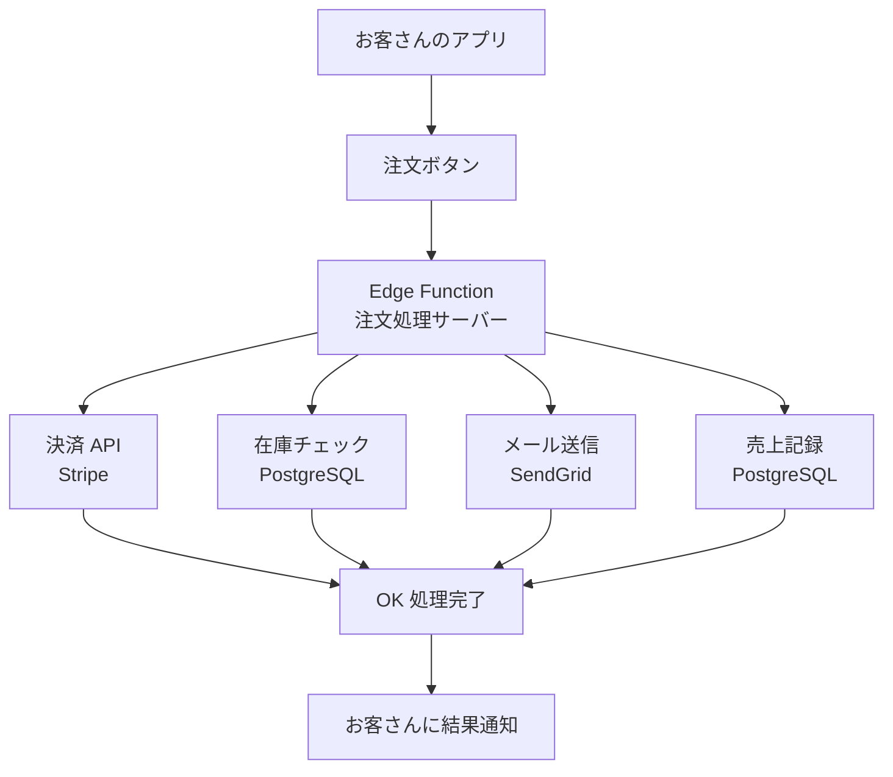
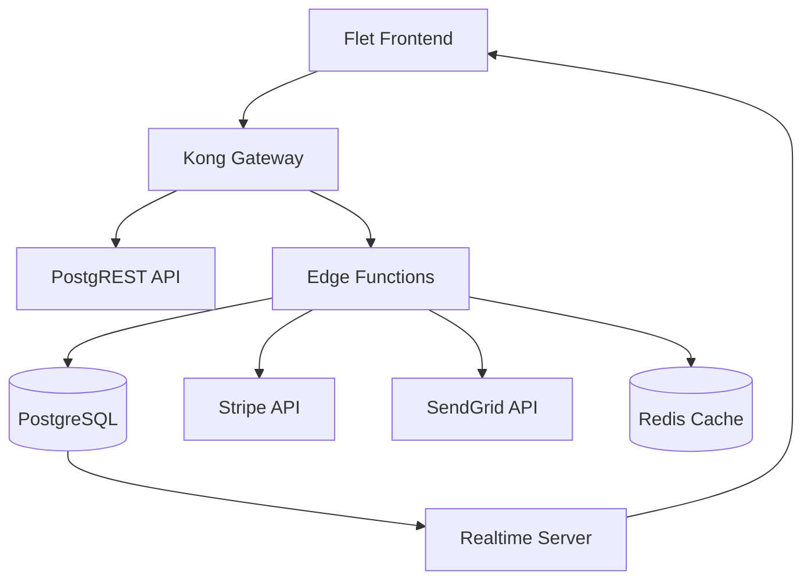

# 第4章：パターン2 - Edge Functions 活用

---
- **目次に戻る**: [はじめに]({{ '/introduction/' | relative_url }})
- **前の章**: [第3章：パターン1 - クライアントサイド実装]({{ '/chapters/chapter03/' | relative_url }})
- **次の章**: [第5-1章：パターン3 - 独立 API サーバー]({{ '/chapters/chapter05-1/' | relative_url }})
- **アーキテクチャ**: Edge Functions（サーバーレス関数）
- **学習レベル**:  基礎 |  応用 |  発展
- **推定学習時間**: 4〜6時間
- **難易度**: 中級（JavaScript/TypeScript知識必要）
---

## この章で扱う構成
- 構成: Edge Functions（サーバーレス実装）
- 推奨用途: 軽量 API・外部連携・低レイテンシ処理
- 非推奨用途: 長時間バッチや重い計算を前提とするケース

## **前章の復習**（第3章からの継続）

第3章で学んだ**クライアントサイド実装**を振り返りましょう：
- [OK] **Python Flet**: デスクトップアプリ的な UI 開発
- [OK] **Supabase Client**: データベースとの直接通信
- [OK] **リアルタイム**: データ変更の即座反映
- [OK] **適用場面**: 個人・小規模チーム（〜5,000人）の迅速開発

しかし、クライアントサイドでは**処理できない複雑な業務**があります。今度はサーバーサイドで処理する仕組みを学びます。

> **第3章の理解度確認**: クライアントサイド実装のメリット・制約を説明できますか？不安な場合は[第3章]({{ '/chapters/chapter03/' | relative_url }})を復習してください。

## この章で学ぶこと（初心者向け）

この章では、EC注文処理を題材にEdge Functionsの設計を学び、local-onlyの最小教材で入力検証と合計計算を確認します。

- **初心者**: サーバーレス関数がどのように動くかがわかる
- **中級者**: 複雑なビジネスロジックをサーバーサイドで処理する方法がわかる
- **上級者**: 外部 API 連携とトランザクション処理の設計パターンが理解できる

## まずは身近な例から：「オンラインショップ」

想像してみてください。あなたが**オンラインでお弁当を注文**するとします：

```text
 オンライン弁当ショップ
├──  お客さん：「から揚げ弁当 × 2」をカートに追加
├──  決済：クレジットカードで支払い
├──  確認：注文確認メールが届く
├──  調理：お店で弁当を作る
├──  配送：配達員が届ける
└──  記録：売上と在庫の管理
```

### なぜサーバーサイド処理が必要？

第3章のクライアントサイドだけでは処理できない複雑な業務があります：

| 処理 | クライアントサイド | サーバーサイド | なぜ？ |
|:-----|:------------------|:---------------|:-------|
|  **決済処理**| [NG] 危険 | [OK] 安全 | カード情報は絶対にクライアントで扱えない |
|  **在庫管理**| [NG] 不正確 | [OK] 正確 | 複数人が同時注文すると売り越しリスク |
|  **メール送信**| [NG] 不可能 | [OK] 可能 | 外部 API 連携はサーバーでのみ可能 |
|  **複雑な計算**| [WARN] 改ざんリスク | [OK] 安全 | 税計算・割引計算は改ざんされる可能性 |

### パターン2（Edge Functions）なら...



**メリット**：
- **セキュア**: 重要な処理をサーバーサイドで安全に実行
- **高速**: 世界中のエッジサーバーで処理（低レイテンシ）
- **スケーラブル**: アクセス増加時も自動でスケール
- **コスト効率**: 使った分だけの従量課金

---

## 今回作るアプリ：「ECサイト注文処理システム」

### どんなアプリ？

**オンライン弁当ショップ**の設計を題材にします。リポジトリで実行できる範囲は、後述するlocal-only教材に限定されます：

```text
 オンライン弁当ショップ
├──  フロントエンド：商品一覧・カート・注文画面
├──  Edge Functions：注文処理・決済・メール送信
├──  商品管理：在庫・価格・カテゴリ管理
└──  管理画面：売上分析・注文状況監視
```

### 設計として扱う機能

| 機能 | 初心者向け説明 | 技術的な説明 |
|------|:-------------:|:-------------|
|  **注文処理**| カートの商品を確定注文に変換 | Edge Function で複雑なビジネスロジック処理 |
|  **決済処理**| クレジットカード決済 | Stripe API との安全な連携 |
|  **在庫管理**| 注文時の在庫減算・売り越し防止 | PostgreSQL トランザクション処理 |
|  **通知システム**| 注文確認・配送通知メール | SendGrid API でのメール自動送信 |
|  **売上分析**| 日次・月次の売上集計 | SQL 集計クエリとリアルタイム更新 |

### 使用技術（初心者向け説明）

```text
 サーバーレス関数: Edge Functions (Deno)
   └─ 「必要な時だけ動くクラウド上の小さなプログラム」

 フロントエンド: TypeScript クライアント
   └─ 「ユーザーが触る画面部分」

 決済処理: Stripe API
   └─ 「クレジットカード決済を安全に処理する外部サービス」

 メール送信: SendGrid API
   └─ 「注文確認メールなどを自動送信する外部サービス」

 データベース: PostgreSQL + RLS
   └─ 「商品・注文・ユーザー情報を安全に保存」
```

### 同梱教材と設計例の境界

<!-- chapter04-example-contract:start -->
実際にリポジトリへ同梱している実行対象は `examples/chapter04-ecommerce/` だけです。

- 実行対象: `supabase/config.toml`、migration、seed、`process-order`、server-owned local catalog、注文検証・合計計算、handler-level Deno test
- 実行しない設計例: フロントエンド、注文永続化、認証・認可、在庫引当、Stripe / SendGrid、remote deploy
- 安全境界: requestは `product_id` / `quantity` だけを受け付け、client価格を拒否する。`verify_jwt=false` のlocal-only教材はlink/deployしない
- 実行手順と停止手順: `examples/chapter04-ecommerce/README.md`

以降で `設計例（同梱外）` と記したコードとpathは、構成を検討するための概念例です。
同梱教材の実装または実動保証を表しません。
<!-- chapter04-example-contract:end -->

```text
examples/chapter04-ecommerce/
├── README.md
└── supabase/
    ├── config.toml
    ├── migrations/
    │   └── 20260719000000_create_order_example.sql
    ├── seed.sql
    └── functions/
        └── process-order/
            ├── catalog.json
            ├── catalog.ts
            ├── handler.ts
            ├── handler_test.ts
            ├── index.ts
            ├── order.ts
            └── order_test.ts
```

> **同梱教材の保証範囲**: local-onlyで入力検証、合計計算、migration / seed、
> Function起動を確認できます。完全なECサイトではなく、決済・メール送信・remote projectは
> 含みません。
> **LOCAL-ONLY / NONDEPLOY**: `verify_jwt=false` の同梱Functionをremote projectへlink/deployしません。

---

## 設計例のコードを見てみよう

このセクションは、ECサイトへ拡張する場合の設計を段階的に説明します。
`設計例（同梱外）` と記したコードはリポジトリ資産ではなく、そのままの実行を保証しません。
実行可能な最小コードは `examples/chapter04-ecommerce/supabase/functions/process-order/` を
参照してください。

### Step 1: Edge Function のエントリーポイント（index.ts）

まず、注文処理を行うサーバーレス関数を見てみましょう：

```typescript
// 設計例（同梱外）: supabase/functions/process-order/index.ts

import { serve } from "https://deno.land/std@0.208.0/http/server.ts"
import { createClient } from 'https://esm.sh/@supabase/supabase-js@2.39.0'

// 注文リクエストの形を定義
interface OrderRequest {
  action: 'create' | 'update_status' | 'process_payment' | 'send_notification'
  order_data?: {
    user_id: string
    items: Array<{
      product_id: number
      quantity: number
    }>
    shipping_address: {
      name: string
      address: string
      city: string
      postal_code: string
      phone: string
    }
    payment_method: string
  }
  order_id?: string
  status?: string
}

// メイン処理関数
serve(async (req: Request): Promise<Response> => {
  try {
    // 1. 認証チェック
    const authHeader = req.headers.get('Authorization')
    if (!authHeader) {
      throw new Error('認証ヘッダーが必要です')
    }

    // 2. Supabase に接続
    const supabase = createClient(
      Deno.env.get('SUPABASE_URL') ?? '',
      Deno.env.get('SUPABASE_SECRET_KEY') ?? ''
    )

    // 3. ユーザー認証
    const { data: { user }, error: authError } = await supabase.auth.getUser(
      authHeader.replace('Bearer ', '')
    )

    if (authError || !user) {
      throw new Error('無効な認証トークンです')
    }

    // 4. リクエストデータ取得
    const requestData: OrderRequest = await req.json()

    // 5. アクションに応じた処理実行
    let result
    switch (requestData.action) {
      case 'create':
        result = await createOrder(supabase, user.id, requestData.order_data!)
        break
      case 'process_payment':
        result = await processPayment(supabase, requestData.order_id!, requestData.payment_data!)
        break
      case 'send_notification':
        result = await sendNotification(supabase, requestData.order_id!)
        break
      default:
        throw new Error('無効なアクションです')
    }

    // 6. 結果をレスポンスとして返す
    return new Response(JSON.stringify(result), {
      headers: { 'Content-Type': 'application/json' },
      status: 200
    })

  } catch (error) {
    // エラーが発生した場合の処理
    return new Response(JSON.stringify({
      success: false,
      error: error.message
    }), {
      headers: { 'Content-Type': 'application/json' },
      status: 400
    })
  }
})
```

**初心者向け解説**：

| コード部分 | 何をしているか | 身近な例 |
|:----------|:-------------|:---------|
| `serve()` | HTTP リクエストを受け取る | コンビニの店員がお客さんの注文を聞く |
| `interface OrderRequest` | 注文データの形を決める | 注文用紙の書式を決める |
| 認証チェック | 誰が注文しているかを確認 | 会員カードの確認 |
| `switch (action)` | 要求に応じて処理を分岐 | 「購入」「返品」「問い合わせ」で対応を変える |
| `try/catch` | エラーが起きた時の対処 | 何か問題があったらお客さんに謝罪・説明 |

### Step 2: 注文作成処理（createOrder）

実際の注文処理がどのように行われるかを見てみましょう：

```typescript
// 注文作成処理（簡略化版）
async function createOrder(supabase: any, userId: string, orderData: any) {
  // 1. トランザクション開始
  const { data, error } = await supabase.rpc('create_order_transaction', {
    p_user_id: userId,
    p_items: orderData.items,
    p_shipping_address: orderData.shipping_address
  })

  if (error) {
    throw new Error(`注文作成エラー: ${error.message}`)
  }

  // 2. 在庫チェック・更新
  for (const item of orderData.items) {
    const { data: product } = await supabase
      .from('products')
      .select('stock_quantity')
      .eq('id', item.product_id)
      .single()

    if (product.stock_quantity < item.quantity) {
      throw new Error(`商品ID ${item.product_id} の在庫が不足しています`)
    }

    // 在庫減算
    await supabase
      .from('products')
      .update({
        stock_quantity: product.stock_quantity - item.quantity
      })
      .eq('id', item.product_id)
  }

  // 3. 注文レコード作成
  const { data: newOrder } = await supabase
    .from('orders')
    .insert({
      user_id: userId,
      status: 'pending',
      total_amount: calculateTotal(orderData.items),
      shipping_address: orderData.shipping_address,
      created_at: new Date().toISOString()
    })
    .select()
    .single()

  return { success: true, order_id: newOrder.id }
}
```

**初心者向け解説**：

| 処理 | 何をしているか | 身近な例 |
|:-----|:-------------|:---------|
| **トランザクション**| 複数の処理をまとめて実行 | 銀行振込で「引き落とし」と「入金」を同時実行 |
| **在庫チェック**| 商品の残りを確認 | 店員が「その商品、在庫ありますか？」を確認 |
| **在庫更新**| 購入分を在庫から減らす | レジで商品をスキャンして在庫から除く |
| **注文レコード作成**| 注文情報をデータベースに保存 | レシートを発行して記録を残す |

### Step 3: 決済処理との連携（processPayment）

Stripe API との連携部分を見てみましょう：

```typescript
// 決済処理（簡略化版）
async function processPayment(supabase: any, orderId: string, paymentData: any) {
  try {
    // 1. Stripe API に決済リクエスト送信
    const stripeResponse = await fetch('https://api.stripe.com/v1/payment_intents', {
      method: 'POST',
      headers: {
        'Authorization': `Bearer ${Deno.env.get('STRIPE_SECRET_KEY')}`,
        'Content-Type': 'application/x-www-form-urlencoded'
      },
      body: new URLSearchParams({
        amount: paymentData.amount.toString(),
        currency: 'jpy',
        payment_method: paymentData.payment_method_id,
        confirm: 'true'
      })
    })

    const paymentResult = await stripeResponse.json()

    // 2. 決済成功時の処理
    if (paymentResult.status === 'succeeded') {
      // 注文ステータスを「支払い完了」に更新
      await supabase
        .from('orders')
        .update({
          status: 'paid',
          payment_id: paymentResult.id,
          paid_at: new Date().toISOString()
        })
        .eq('id', orderId)

      // 3. 注文確認メール送信
      await sendOrderConfirmationEmail(orderId)

      return { success: true, payment_id: paymentResult.id }
    } else {
      throw new Error('決済に失敗しました')
    }

  } catch (error) {
    // 決済失敗時は注文をキャンセル
    await supabase
      .from('orders')
      .update({ status: 'cancelled' })
      .eq('id', orderId)

    throw error
  }
}
```

**初心者向け解説**：

| 処理 | 何をしているか | 身近な例 |
|:-----|:-------------|:---------|
| **Stripe API 呼び出し**| 外部の決済システムに依頼 | コンビニでクレジットカード端末を操作 |
| **決済確認**| 支払いが成功したかチェック | 「カードが通りました」の確認 |
| **ステータス更新**| 注文状況を「支払い完了」に変更 | レシートに「支払い済み」のスタンプ |
| **エラー処理**| 決済失敗時は注文をキャンセル | カードエラーの場合は購入をキャンセル |

---

## 設計例の概要: ECサイト注文処理システム

以下の機能・構成は、同梱教材から発展させる場合の設計例です。Stripe / SendGrid、
フロントエンド、永続化処理は同梱していません。

### 機能要件

- **商品管理**: 在庫管理・価格設定・カテゴリ分類
- **注文処理**: カート管理・注文確定・在庫減算
- **決済連携**: Stripe決済・支払い状況管理
- **通知システム**: 注文確認・配送通知メール
- **管理機能**: 注文状況監視・売上分析

### アーキテクチャ設計



---

## 4.1 Deno Edge Functions構成

### プロジェクト構造

以下は将来拡張の設計例（同梱外）であり、repositoryの実在pathではありません。

```text
ecommerce-platform/
├── supabase/
│   ├── functions/
│   │   ├── process-order/
│   │   │   ├── index.ts           # 注文処理エントリーポイント
│   │   │   ├── handlers/          # ビジネスロジックハンドラ
│   │   │   ├── services/          # 外部サービス連携
│   │   │   ├── models/            # 型定義
│   │   │   └── utils/             # ユーティリティ
│   │   ├── webhook-stripe/
│   │   │   └── index.ts           # Stripe Webhook処理
│   │   ├── send-notifications/
│   │   │   └── index.ts           # 通知処理
│   │   ├── inventory-management/
│   │   │   └── index.ts           # 在庫管理
│   │   └── _shared/               # 共通ライブラリ
│   │       ├── database.ts        # DB 接続
│   │       ├── auth.ts            # 認証ヘルパー
│   │       ├── validation.ts      # バリデーション
│   │       └── errors.ts          # エラーハンドリング
│   ├── migrations/
│   └── config.toml
├── frontend/
│   └── flet-client/               # Fletクライアント
└── scripts/
    ├── deploy.sh                  # デプロイスクリプト
    └── test-functions.sh          # テストスクリプト
```

### 基本設定とユーティリティ

```typescript
// 設計例（同梱外）: supabase/functions/_shared/database.ts
import { createClient } from 'https://esm.sh/@supabase/supabase-js@2.39.0'

export interface DatabaseConfig {
  url: string
  serviceKey: string
  schema?: string
}

export class DatabaseConnection {
  private static instance: DatabaseConnection
  private client: any

  private constructor(config: DatabaseConfig) {
    this.client = createClient(config.url, config.serviceKey, {
      auth: {
        autoRefreshToken: false,
        persistSession: false
      },
      db: {
        schema: config.schema || 'public'
      }
    })
  }

  public static getInstance(config?: DatabaseConfig): DatabaseConnection {
    if (!DatabaseConnection.instance && config) {
      DatabaseConnection.instance = new DatabaseConnection(config)
    } else if (!DatabaseConnection.instance) {
      throw new Error('Database configuration required for first initialization')
    }
    return DatabaseConnection.instance
  }

  public getClient() {
    return this.client
  }

  // トランザクション実行
  public async withTransaction<T>(
    operation: (client: any) => Promise<T>
  ): Promise<T> {
    // PostgreSQL トランザクション開始
    const { data: startResult, error: startError } = await this.client
      .rpc('begin_transaction')

    if (startError) {
      throw new Error(`Transaction start failed: ${startError.message}`)
    }

    try {
      const result = await operation(this.client)

      // コミット
      const { error: commitError } = await this.client
        .rpc('commit_transaction')

      if (commitError) {
        throw new Error(`Transaction commit failed: ${commitError.message}`)
      }

      return result
    } catch (error) {
      // ロールバック
      await this.client.rpc('rollback_transaction')
      throw error
    }
  }
}

// 初期化ヘルパー
export function initDatabase(): DatabaseConnection {
  const config: DatabaseConfig = {
    url: Deno.env.get('SUPABASE_URL')!,
    serviceKey: Deno.env.get('SUPABASE_SECRET_KEY')!
  }

  return DatabaseConnection.getInstance(config)
}
```

```typescript
// 設計例（同梱外）: supabase/functions/_shared/auth.ts
import { verify } from 'https://deno.land/x/djwt@v3.0.1/mod.ts'
import { createClient } from 'https://esm.sh/@supabase/supabase-js@2.39.0'

export interface AuthContext {
  user: {
    id: string
    email: string
    role: string
    metadata?: any
  } | null
  isAuthenticated: boolean
}

export class AuthService {
  private jwtSecret: string

  constructor() {
    this.jwtSecret = Deno.env.get('SUPABASE_JWT_SECRET')!
  }

  public async validateRequest(request: Request): Promise<AuthContext> {
    const authHeader = request.headers.get('Authorization')

    if (!authHeader || !authHeader.startsWith('Bearer ')) {
      return { user: null, isAuthenticated: false }
    }

    const token = authHeader.substring(7)

    try {
      const payload = await verify(token, this.jwtSecret, 'HS256')

      return {
        user: {
          id: payload.sub as string,
          email: payload.email as string,
          role: payload.role as string,
          metadata: payload.user_metadata
        },
        isAuthenticated: true
      }
    } catch (error) {
      console.error('JWT validation failed:', error)
      return { user: null, isAuthenticated: false }
    }
  }

  public requireAuth(authContext: AuthContext): void {
    if (!authContext.isAuthenticated || !authContext.user) {
      throw new Error('Authentication required')
    }
  }

  public requireRole(authContext: AuthContext, requiredRole: string): void {
    this.requireAuth(authContext)

    if (authContext.user!.role !== requiredRole) {
      throw new Error(`Role ${requiredRole} required`)
    }
  }
}

export const authService = new AuthService()
```

### 型定義とモデル

```typescript
// 設計例（同梱外）: supabase/functions/_shared/models.ts
export interface Product {
  id: number
  name: string
  description: string
  price: number
  category_id: number
  stock_quantity: number
  sku: string
  image_urls: string[]
  is_active: boolean
  created_at: string
  updated_at: string
}

export interface CartItem {
  product_id: number
  quantity: number
  unit_price: number
}

export interface Order {
  id?: number
  user_id: string
  status: OrderStatus
  total_amount: number
  tax_amount: number
  shipping_amount: number
  currency: string
  shipping_address: Address
  billing_address: Address
  payment_method_id?: string
  stripe_payment_intent_id?: string
  items: OrderItem[]
  created_at?: string
  updated_at?: string
}

export interface OrderItem {
  id?: number
  order_id?: number
  product_id: number
  quantity: number
  unit_price: number
  total_price: number
  product_snapshot: Partial<Product>
}

export interface Address {
  street: string
  city: string
  state: string
  postal_code: string
  country: string
  phone?: string
}

export enum OrderStatus {
  PENDING = 'pending',
  CONFIRMED = 'confirmed',
  PROCESSING = 'processing',
  SHIPPED = 'shipped',
  DELIVERED = 'delivered',
  CANCELLED = 'cancelled',
  REFUNDED = 'refunded'
}

export interface OrderRequest {
  cart_items: CartItem[]
  shipping_address: Address
  billing_address: Address
  payment_method_id: string
}

export interface OrderResponse {
  order: Order
  payment_client_secret?: string
  requires_action?: boolean
}
```

### バリデーション

```typescript
// 設計例（同梱外）: supabase/functions/_shared/validation.ts
export class ValidationError extends Error {
  constructor(
    message: string,
    public field?: string,
    public code?: string
  ) {
    super(message)
    this.name = 'ValidationError'
  }
}

export interface ValidationRule<T> {
  validate: (value: T) => boolean | Promise<boolean>
  message: string
}

export class Validator<T> {
  private rules: ValidationRule<T>[] = []

  public addRule(rule: ValidationRule<T>): this {
    this.rules.push(rule)
    return this
  }

  public async validate(value: T): Promise<void> {
    for (const rule of this.rules) {
      const isValid = await rule.validate(value)
      if (!isValid) {
        throw new ValidationError(rule.message)
      }
    }
  }
}

// 基本バリデーションルール
export const ValidationRules = {
  required: <T>(message = 'This field is required'): ValidationRule<T> => ({
    validate: (value) => value !== null && value !== undefined && value !== '',
    message
  }),

  email: (message = 'Invalid email format'): ValidationRule<string> => ({
    validate: (value) => /^[^\s@]+@[^\s@]+\.[^\s@]+$/.test(value),
    message
  }),

  minLength: (min: number, message?: string): ValidationRule<string> => ({
    validate: (value) => value.length >= min,
    message: message || `Minimum length is ${min}`
  }),

  positiveNumber: (message = 'Must be a positive number'): ValidationRule<number> => ({
    validate: (value) => value > 0,
    message
  }),

  inRange: (min: number, max: number): ValidationRule<number> => ({
    validate: (value) => value >= min && value <= max,
    message: `Value must be between ${min} and ${max}`
  })
}

// 注文バリデーション
export async function validateOrderRequest(orderRequest: OrderRequest): Promise<void> {
  // カートアイテム検証
  if (!orderRequest.cart_items || orderRequest.cart_items.length === 0) {
    throw new ValidationError('Cart cannot be empty')
  }

  for (const item of orderRequest.cart_items) {
    await new Validator<number>()
      .addRule(ValidationRules.positiveNumber('Product ID must be positive'))
      .validate(item.product_id)

    await new Validator<number>()
      .addRule(ValidationRules.inRange(1, 100))
      .validate(item.quantity)
  }

  // 住所検証
  await validateAddress(orderRequest.shipping_address, 'shipping')
  await validateAddress(orderRequest.billing_address, 'billing')
}

async function validateAddress(address: Address, type: string): Promise<void> {
  const requiredFields = ['street', 'city', 'state', 'postal_code', 'country']

  for (const field of requiredFields) {
    await new Validator<string>()
      .addRule(ValidationRules.required(`${type} ${field} is required`))
      .addRule(ValidationRules.minLength(1))
      .validate((address as any)[field])
  }
}
```

---

## 4.2 トランザクション処理と外部 API 連携

### 注文処理メイン関数

```typescript
// 設計例（同梱外）: supabase/functions/process-order/index.ts
import { serve } from 'https://deno.land/std@0.207.0/http/server.ts'
import { corsHeaders } from './_shared/cors.ts'
import { authService } from './_shared/auth.ts'
import { initDatabase } from './_shared/database.ts'
import { validateOrderRequest } from './_shared/validation.ts'
import { OrderProcessor } from './handlers/order-processor.ts'
import { ErrorHandler } from './_shared/errors.ts'

serve(async (req: Request) => {
  // CORS処理
  if (req.method === 'OPTIONS') {
    return new Response('ok', { headers: corsHeaders })
  }

  try {
    // 認証確認
    const authContext = await authService.validateRequest(req)
    authService.requireAuth(authContext)

    // リクエスト解析
    const orderRequest = await req.json()
    await validateOrderRequest(orderRequest)

    // データベース初期化
    const db = initDatabase()

    // 注文処理実行
    const orderProcessor = new OrderProcessor(db, authContext.user!)
    const result = await orderProcessor.processOrder(orderRequest)

    return new Response(
      JSON.stringify({ success: true, data: result }),
      {
        headers: { ...corsHeaders, 'Content-Type': 'application/json' },
        status: 200
      }
    )

  } catch (error) {
    return ErrorHandler.handleError(error, req)
  }
})
```

### 注文処理ハンドラー

```typescript
// 設計例（同梱外）: supabase/functions/process-order/handlers/order-processor.ts
import { DatabaseConnection } from './_shared/database.ts'
import { Order, OrderRequest, OrderResponse, OrderStatus, OrderItem } from './_shared/models.ts'
import { InventoryService } from './services/inventory-service.ts'
import { PaymentService } from './services/payment-service.ts'
import { NotificationService } from './services/notification-service.ts'

export class OrderProcessor {
  private inventoryService: InventoryService
  private paymentService: PaymentService
  private notificationService: NotificationService

  constructor(
    private db: DatabaseConnection,
    private user: { id: string; email: string }
  ) {
    this.inventoryService = new InventoryService(db)
    this.paymentService = new PaymentService()
    this.notificationService = new NotificationService()
  }

  public async processOrder(orderRequest: OrderRequest): Promise<OrderResponse> {
    return await this.db.withTransaction(async (client) => {
      // 1. 在庫確認・予約
      const inventoryReservation = await this.inventoryService
        .reserveInventory(orderRequest.cart_items)

      try {
        // 2. 注文作成
        const order = await this.createOrder(orderRequest, inventoryReservation.total_amount)

        // 3. 決済処理開始
        const paymentResult = await this.paymentService.createPaymentIntent({
          amount: order.total_amount,
          currency: order.currency,
          order_id: order.id!,
          customer_email: this.user.email,
          payment_method_id: orderRequest.payment_method_id
        })

        // 4. 注文更新（決済情報追加）
        await this.updateOrderWithPayment(order.id!, paymentResult.payment_intent_id)

        // 5. 決済確認が必要でない場合は在庫確定
        if (!paymentResult.requires_action) {
          await this.inventoryService.confirmReservation(inventoryReservation.reservation_id)
          await this.updateOrderStatus(order.id!, OrderStatus.CONFIRMED)

          // 6. 確認通知送信
          await this.notificationService.sendOrderConfirmation(order, this.user.email)
        }

        return {
          order,
          payment_client_secret: paymentResult.client_secret,
          requires_action: paymentResult.requires_action
        }

      } catch (error) {
        // エラー時は在庫予約解除
        await this.inventoryService.releaseReservation(inventoryReservation.reservation_id)
        throw error
      }
    })
  }

  private async createOrder(
    orderRequest: OrderRequest,
    calculatedTotal: number
  ): Promise<Order> {
    const client = this.db.getClient()

    // 注文計算
    const taxAmount = Math.round(calculatedTotal * 0.1) // 10%税金
    const shippingAmount = calculatedTotal > 5000 ? 0 : 500 // 5000円以上で送料無料
    const totalAmount = calculatedTotal + taxAmount + shippingAmount

    // 注文作成
    const { data: orderData, error: orderError } = await client
      .from('orders')
      .insert({
        user_id: this.user.id,
        status: OrderStatus.PENDING,
        total_amount: totalAmount,
        tax_amount: taxAmount,
        shipping_amount: shippingAmount,
        currency: 'jpy',
        shipping_address: orderRequest.shipping_address,
        billing_address: orderRequest.billing_address
      })
      .select()
      .single()

    if (orderError) {
      throw new Error(`Order creation failed: ${orderError.message}`)
    }

    // 注文アイテム作成
    const orderItems: OrderItem[] = await this.createOrderItems(
      orderData.id,
      orderRequest.cart_items
    )

    return {
      ...orderData,
      items: orderItems
    }
  }

  private async createOrderItems(
    orderId: number,
    cartItems: any[]
  ): Promise<OrderItem[]> {
    const client = this.db.getClient()
    const orderItems: OrderItem[] = []

    for (const cartItem of cartItems) {
      // 商品情報取得
      const { data: product, error: productError } = await client
        .from('products')
        .select('*')
        .eq('id', cartItem.product_id)
        .single()

      if (productError || !product) {
        throw new Error(`Product not found: ${cartItem.product_id}`)
      }

      const totalPrice = product.price * cartItem.quantity

      // 注文アイテム作成
      const { data: orderItemData, error: orderItemError } = await client
        .from('order_items')
        .insert({
          order_id: orderId,
          product_id: cartItem.product_id,
          quantity: cartItem.quantity,
          unit_price: product.price,
          total_price: totalPrice,
          product_snapshot: {
            name: product.name,
            description: product.description,
            sku: product.sku
          }
        })
        .select()
        .single()

      if (orderItemError) {
        throw new Error(`Order item creation failed: ${orderItemError.message}`)
      }

      orderItems.push(orderItemData)
    }

    return orderItems
  }

  private async updateOrderWithPayment(
    orderId: number,
    paymentIntentId: string
  ): Promise<void> {
    const client = this.db.getClient()

    const { error } = await client
      .from('orders')
      .update({
        stripe_payment_intent_id: paymentIntentId,
        updated_at: new Date().toISOString()
      })
      .eq('id', orderId)

    if (error) {
      throw new Error(`Order payment update failed: ${error.message}`)
    }
  }

  private async updateOrderStatus(
    orderId: number,
    status: OrderStatus
  ): Promise<void> {
    const client = this.db.getClient()

    const { error } = await client
      .from('orders')
      .update({
        status,
        updated_at: new Date().toISOString()
      })
      .eq('id', orderId)

    if (error) {
      throw new Error(`Order status update failed: ${error.message}`)
    }
  }
}
```

### 在庫管理サービス

```typescript
// 設計例（同梱外）: supabase/functions/process-order/services/inventory-service.ts
import { DatabaseConnection } from './_shared/database.ts'

export interface InventoryReservation {
  reservation_id: string
  items: Array<{
    product_id: number
    quantity: number
    unit_price: number
  }>
  total_amount: number
  expires_at: string
}

export class InventoryService {
  constructor(private db: DatabaseConnection) {}

  public async reserveInventory(cartItems: any[]): Promise<InventoryReservation> {
    const client = this.db.getClient()
    const reservationId = crypto.randomUUID()
    const expiresAt = new Date(Date.now() + 15 * 60 * 1000) // 15分後
    let totalAmount = 0
    const reservationItems = []

    for (const cartItem of cartItems) {
      // 在庫確認
      const { data: product, error: productError } = await client
        .from('products')
        .select('id, price, stock_quantity')
        .eq('id', cartItem.product_id)
        .eq('is_active', true)
        .single()

      if (productError || !product) {
        throw new Error(`Product not available: ${cartItem.product_id}`)
      }

      if (product.stock_quantity < cartItem.quantity) {
        throw new Error(
          `Insufficient stock for product ${cartItem.product_id}. ` +
          `Available: ${product.stock_quantity}, Requested: ${cartItem.quantity}`
        )
      }

      // 在庫予約記録作成
      const { error: reservationError } = await client
        .from('inventory_reservations')
        .insert({
          reservation_id: reservationId,
          product_id: cartItem.product_id,
          quantity: cartItem.quantity,
          unit_price: product.price,
          expires_at: expiresAt.toISOString()
        })

      if (reservationError) {
        throw new Error(`Inventory reservation failed: ${reservationError.message}`)
      }

      // 予約済み在庫更新
      const { error: stockError } = await client
        .from('products')
        .update({
          stock_quantity: product.stock_quantity - cartItem.quantity
        })
        .eq('id', cartItem.product_id)

      if (stockError) {
        throw new Error(`Stock update failed: ${stockError.message}`)
      }

      const itemTotal = product.price * cartItem.quantity
      totalAmount += itemTotal

      reservationItems.push({
        product_id: cartItem.product_id,
        quantity: cartItem.quantity,
        unit_price: product.price
      })
    }

    return {
      reservation_id: reservationId,
      items: reservationItems,
      total_amount: totalAmount,
      expires_at: expiresAt.toISOString()
    }
  }

  public async confirmReservation(reservationId: string): Promise<void> {
    const client = this.db.getClient()

    // 予約確定
    const { error } = await client
      .from('inventory_reservations')
      .update({
        status: 'confirmed',
        confirmed_at: new Date().toISOString()
      })
      .eq('reservation_id', reservationId)

    if (error) {
      throw new Error(`Reservation confirmation failed: ${error.message}`)
    }
  }

  public async releaseReservation(reservationId: string): Promise<void> {
    const client = this.db.getClient()

    // 予約されたアイテム取得
    const { data: reservations, error: getError } = await client
      .from('inventory_reservations')
      .select('product_id, quantity')
      .eq('reservation_id', reservationId)
      .eq('status', 'pending')

    if (getError) {
      throw new Error(`Failed to get reservations: ${getError.message}`)
    }

    // 在庫復元
    for (const reservation of reservations || []) {
      const { error: restoreError } = await client
        .rpc('restore_inventory', {
          product_id: reservation.product_id,
          quantity: reservation.quantity
        })

      if (restoreError) {
        console.error(`Failed to restore inventory for product ${reservation.product_id}:`, restoreError)
      }
    }

    // 予約削除
    const { error: deleteError } = await client
      .from('inventory_reservations')
      .delete()
      .eq('reservation_id', reservationId)

    if (deleteError) {
      throw new Error(`Reservation deletion failed: ${deleteError.message}`)
    }
  }

  // 期限切れ予約の自動クリーンアップ
  public async cleanupExpiredReservations(): Promise<void> {
    const client = this.db.getClient()

    const { data: expiredReservations, error: getError } = await client
      .from('inventory_reservations')
      .select('reservation_id')
      .eq('status', 'pending')
      .lt('expires_at', new Date().toISOString())

    if (getError) {
      console.error('Failed to get expired reservations:', getError)
      return
    }

    for (const reservation of expiredReservations || []) {
      try {
        await this.releaseReservation(reservation.reservation_id)
      } catch (error) {
        console.error(`Failed to cleanup reservation ${reservation.reservation_id}:`, error)
      }
    }
  }
}
```

### 決済サービス（Stripe連携）

```typescript
// 設計例（同梱外）: supabase/functions/process-order/services/payment-service.ts
import Stripe from 'https://esm.sh/stripe@14.5.0?target=deno'

export interface PaymentRequest {
  amount: number
  currency: string
  order_id: number
  customer_email: string
  payment_method_id: string
}

export interface PaymentResult {
  payment_intent_id: string
  client_secret: string
  requires_action: boolean
  status: string
}

export class PaymentService {
  private stripe: Stripe

  constructor() {
    const stripeSecretKey = Deno.env.get('STRIPE_SECRET_KEY')
    if (!stripeSecretKey) {
      throw new Error('STRIPE_SECRET_KEY environment variable is required')
    }
    this.stripe = new Stripe(stripeSecretKey, {
      apiVersion: '2023-10-16'
    })
  }

  public async createPaymentIntent(request: PaymentRequest): Promise<PaymentResult> {
    try {
      // Stripe顧客作成または取得
      const customer = await this.getOrCreateCustomer(request.customer_email)

      // PaymentIntent作成
      const paymentIntent = await this.stripe.paymentIntents.create({
        amount: request.amount,
        currency: request.currency,
        customer: customer.id,
        payment_method: request.payment_method_id,
        confirmation_method: 'manual',
        confirm: true,
        metadata: {
          order_id: request.order_id.toString(),
          source: 'ecommerce_platform'
        }
      })

      return {
        payment_intent_id: paymentIntent.id,
        client_secret: paymentIntent.client_secret!,
        requires_action: paymentIntent.status === 'requires_action',
        status: paymentIntent.status
      }

    } catch (error) {
      console.error('Stripe payment error:', error)

      if (error instanceof Stripe.errors.StripeCardError) {
        throw new Error(`Card error: ${error.message}`)
      } else if (error instanceof Stripe.errors.StripeInvalidRequestError) {
        throw new Error(`Invalid request: ${error.message}`)
      } else {
        throw new Error(`Payment failed: ${error.message}`)
      }
    }
  }

  private async getOrCreateCustomer(email: string): Promise<Stripe.Customer> {
    // 既存顧客検索
    const existingCustomers = await this.stripe.customers.list({
      email: email,
      limit: 1
    })

    if (existingCustomers.data.length > 0) {
      return existingCustomers.data[0]
    }

    // 新規顧客作成
    return await this.stripe.customers.create({
      email: email,
      metadata: {
        source: 'ecommerce_platform'
      }
    })
  }

  public async confirmPayment(paymentIntentId: string): Promise<PaymentResult> {
    try {
      const paymentIntent = await this.stripe.paymentIntents.confirm(paymentIntentId)

      return {
        payment_intent_id: paymentIntent.id,
        client_secret: paymentIntent.client_secret!,
        requires_action: paymentIntent.status === 'requires_action',
        status: paymentIntent.status
      }

    } catch (error) {
      console.error('Payment confirmation error:', error)
      throw new Error(`Payment confirmation failed: ${error.message}`)
    }
  }

  public async refundPayment(
    paymentIntentId: string,
    amount?: number,
    reason?: string
  ): Promise<Stripe.Refund> {
    try {
      return await this.stripe.refunds.create({
        payment_intent: paymentIntentId,
        amount: amount,
        reason: reason as Stripe.RefundCreateParams.Reason
      })

    } catch (error) {
      console.error('Refund error:', error)
      throw new Error(`Refund failed: ${error.message}`)
    }
  }
}
```

### Stripeウェブフック処理

> **Auth の責務境界**: `auth` schema は自動生成 API から公開されません。Auth が正本として保持するメールアドレスが特権処理で必要な場合は、下記のような service-role Edge Function から Admin API を使用します。secret key を公開クライアントへ渡してはいけません。

```typescript
// 設計例（同梱外）: supabase/functions/webhook-stripe/index.ts
import { serve } from 'https://deno.land/std@0.207.0/http/server.ts'
import Stripe from 'https://esm.sh/stripe@14.5.0?target=deno'
import { initDatabase } from './_shared/database.ts'
import { OrderStatus } from './_shared/models.ts'
import { NotificationService } from './process-order/services/notification-service.ts'

const stripe = new Stripe(Deno.env.get('STRIPE_SECRET_KEY')!, {
  apiVersion: '2023-10-16'
})

const webhookSecret = Deno.env.get('STRIPE_WEBHOOK_SECRET')!

serve(async (req: Request) => {
  if (req.method !== 'POST') {
    return new Response('Method not allowed', { status: 405 })
  }

  try {
    const body = await req.text()
    const signature = req.headers.get('stripe-signature')!

    // Stripe署名検証
    const event = stripe.webhooks.constructEvent(body, signature, webhookSecret)

    const db = initDatabase()
    const client = db.getClient()
    const notificationService = new NotificationService()

    switch (event.type) {
      case 'payment_intent.succeeded':
        await handlePaymentSucceeded(event.data.object as Stripe.PaymentIntent, client, notificationService)
        break

      case 'payment_intent.payment_failed':
        await handlePaymentFailed(event.data.object as Stripe.PaymentIntent, client, notificationService)
        break

      case 'payment_intent.requires_action':
        await handlePaymentRequiresAction(event.data.object as Stripe.PaymentIntent, client)
        break

      default:
        console.log(`Unhandled event type: ${event.type}`)
    }

    return new Response(JSON.stringify({ received: true }), {
      headers: { 'Content-Type': 'application/json' },
      status: 200
    })

  } catch (error) {
    console.error('Webhook error:', error)
    return new Response(
      JSON.stringify({ error: error.message }),
      {
        headers: { 'Content-Type': 'application/json' },
        status: 400
      }
    )
  }
})

async function handlePaymentSucceeded(
  paymentIntent: Stripe.PaymentIntent,
  client: any,
  notificationService: NotificationService
) {
  const orderId = paymentIntent.metadata.order_id

  // 注文状態更新
  const { data: order, error: updateError } = await client
    .from('orders')
    .update({
      status: OrderStatus.CONFIRMED,
      updated_at: new Date().toISOString()
    })
    .eq('stripe_payment_intent_id', paymentIntent.id)
    .select(`
      *,
      order_items (
        *,
        product_snapshot
      )
    `)
    .single()

  if (updateError) {
    console.error('Failed to update order:', updateError)
    return
  }

  // 在庫確定
  const { error: inventoryError } = await client
    .rpc('confirm_inventory_for_order', { order_id: parseInt(orderId) })

  if (inventoryError) {
    console.error('Failed to confirm inventory:', inventoryError)
  }

  // 確認メール送信。auth schema は PostgREST で公開されないため、
  // service-role Edge Function から Auth Admin API で正本を参照する。
  try {
    const { data: userData, error: userError } =
      await client.auth.admin.getUserById(order.user_id)

    if (userError) throw userError

    const user = userData?.user
    if (user?.email) {
      await notificationService.sendOrderConfirmation(order, user.email)
    }
  } catch (error) {
    console.error('Failed to send confirmation email:', error)
  }
}

async function handlePaymentFailed(
  paymentIntent: Stripe.PaymentIntent,
  client: any,
  notificationService: NotificationService
) {
  // 注文キャンセル
  const { error: updateError } = await client
    .from('orders')
    .update({
      status: OrderStatus.CANCELLED,
      updated_at: new Date().toISOString()
    })
    .eq('stripe_payment_intent_id', paymentIntent.id)

  if (updateError) {
    console.error('Failed to cancel order:', updateError)
    return
  }

  // 在庫復元
  const orderId = paymentIntent.metadata.order_id
  const { error: inventoryError } = await client
    .rpc('restore_inventory_for_order', { order_id: parseInt(orderId) })

  if (inventoryError) {
    console.error('Failed to restore inventory:', inventoryError)
  }
}

async function handlePaymentRequiresAction(
  paymentIntent: Stripe.PaymentIntent,
  client: any
) {
  // 3DS認証待ち状態を記録
  const { error } = await client
    .from('orders')
    .update({
      status: OrderStatus.PENDING,
      updated_at: new Date().toISOString()
    })
    .eq('stripe_payment_intent_id', paymentIntent.id)

  if (error) {
    console.error('Failed to update order for 3DS:', error)
  }
}
```

---

### 4.2.4 Edge Functionsでの AI 推論（内蔵 AI API）

Supabase Edge Functionsには **内蔵 AI API**があり、外部依存なしで推論が実行できます。
**埋め込み生成・チャット・分類**などの処理を、エッジで完結させる構成が取れます。

```typescript
// Edge Functions AI API（概念例）
import 'jsr:@supabase/functions-js/edge-runtime.d.ts'

const session = new Supabase.ai.Session('model-name')
const embedding = await session.run('search query')
```

**補足**:
- 低レイテンシで実行できるため **RAGの前処理**に有効
- 外部 API を使わないため **鍵管理やコスト見積り**が容易

### 4.2.5 外部LLM連携（Ollama/Llamafile など）

外部LLMを使う場合は **Edge Functionsをゲートウェイ**にして
**認証・レート制限・監査ログ**を一箇所に集約します。

**典型構成**:
1. クライアント → Edge Function（認証/入力検証）
2. Edge Function → 外部LLM（Ollama / Llamafile / OpenAI など）
3. Edge Function → DB（プロンプト/出力/コスト/モデルを記録）

### 4.2.6 AI ゲートウェイ・パターン（監査と安全性）

AI アプリでは「**誰が何に対して、どのモデルで何を生成したか**」が重要です。
Edge Functionsを **AI ゲートウェイ**として設計し、次を必ず記録します：

- リクエスト元（tenant_id / user_id）
- 参照したドキュメントID（RAGのretrievalログ）
- モデル名 / プロンプトバージョン / 推定コスト
- 出力のハッシュ（監査や再現性のため）

**実装例（概念）**:
```typescript
import { createClient } from 'https://esm.sh/@supabase/supabase-js@2'

const supabase = createClient(
  Deno.env.get('SUPABASE_URL')!,
  Deno.env.get('SUPABASE_SECRET_KEY')!
)

Deno.serve(async (req) => {
  const authHeader = req.headers.get('Authorization') || ''
  if (!authHeader.startsWith('Bearer ')) {
    return new Response('Unauthorized', { status: 401 })
  }
  const jwt = authHeader.replace('Bearer ', '')
  const { data: userData } = await supabase.auth.getUser(jwt)
  const user = userData?.user
  if (!user) return new Response('Unauthorized', { status: 401 })

  const body = await req.json()
  if (!body.prompt || typeof body.prompt !== 'string') {
    return new Response('Invalid input', { status: 400 })
  }
  // tenant_id はserver-controlled app_metadataだけから得る。user_metadataをfallbackにしない。
  const tenantId = user.app_metadata?.tenant_id
  if (typeof tenantId !== 'string' || tenantId.length === 0) {
    return new Response('Missing tenant', { status: 403 })
  }

  // 例: 簡易レート制限（実運用は専用ストアで管理）
  // await checkRateLimit(user.id)

  // 外部LLM呼び出し（概念例）
  const llmRes = await fetch(Deno.env.get('LLM_ENDPOINT_URL')!, {
    method: 'POST',
    headers: {
      'Content-Type': 'application/json',
      'Authorization': `Bearer ${Deno.env.get('LLM_API_KEY')}`
    },
    body: JSON.stringify({ prompt: body.prompt })
  })
  const llmJson = await llmRes.json()

  // 監査ログ保存
  const outputText = llmJson.output ?? ''
  const hashBuf = await crypto.subtle.digest(
    'SHA-256',
    new TextEncoder().encode(outputText)
  )
  const outputHash = Array.from(new Uint8Array(hashBuf))
    .map(b => b.toString(16).padStart(2, '0')).join('')

  const promptHashBuf = await crypto.subtle.digest(
    'SHA-256',
    new TextEncoder().encode(body.prompt)
  )
  const promptHash = Array.from(new Uint8Array(promptHashBuf))
    .map(b => b.toString(16).padStart(2, '0')).join('')

  await supabase.from('ai_audit_logs').insert({
    tenant_id: tenantId,
    user_id: user.id,
    model_name: llmJson.model ?? 'unknown',
    prompt_hash: promptHash,
    output_hash: outputHash,
    cost_usd: llmJson.cost_usd ?? null
  })

  return new Response(JSON.stringify(llmJson), {
    headers: { 'Content-Type': 'application/json' }
  })
})
```

**認可境界とclaim鮮度**: このEdge Functionのtenant判定は `app_metadata.tenant_id` だけを使います。`user_metadata` は利用者が更新できるため、同名の値をfallbackにしてはいけません。`getUser(jwt)` はAuth serverへ問い合わせてdatabase上のuser objectを取得するため、ローカルでJWT payloadだけを読む処理とは異なり、更新後のuser recordを参照できます。一方、membership/revocationの別テーブルまで自動で検証するものではなく、`auth.jwt()` を使うRLSのclaimも既発行tokenのままです。tenant剥奪など高リスク操作は、重要処理の前に信頼済みサーバーがauthoritativeなmembership/revocation状態を照会して拒否し、JWT refresh/re-authを併用します。既発行access tokenはsign out後も期限まで有効であり得るため、sign outだけを即時失効とみなしません。

### 4.2.7 自動埋め込み生成（後章への接続）

埋め込み生成は **Edge Functions + キュー + トリガ**で自動化できます。
詳しい構成は **第5-4章（RAG/ベクトル検索アーキテクチャ）**で扱います。

---

## 4.3 運用考慮事項とモニタリング

### 4.3.1 ファイルストレージ（/tmp と /s3 の使い分け）

Edge Functions には **永続ストレージ**と**一時ストレージ**の2種類があります。
用途に応じて使い分けると、安全性とコストの両面で有利です。

**永続ストレージ（S3互換）**:
- `/s3/<bucket>` にマウントされる
- Supabase Storage や S3互換バケットを利用可能
- **成果物・キャッシュ・監査ログ**など長期保存向け

**一時ストレージ（/tmp）**:
- 呼び出しごとにリセットされる
- 変換処理・一時ファイルに限定

```typescript
// 永続ストレージ（S3互換）への読み書き
const data = await Deno.readFile('/s3/my-bucket/results.csv')
await Deno.writeTextFile('/s3/my-bucket/output.txt', 'hello')

// 一時ストレージ
await Deno.writeTextFile('/tmp/work.txt', 'temp')
```

**永続ストレージ利用時の環境変数（Secrets）**:
- `S3FS_ENDPOINT_URL`
- `S3FS_REGION`
- `S3FS_ACCESS_KEY_ID`
- `S3FS_SECRET_ACCESS_KEY`

### パフォーマンス最適化

```typescript
// 設計例（同梱外）: supabase/functions/_shared/performance.ts
export class PerformanceMonitor {
  private static readonly SLOW_QUERY_THRESHOLD = 1000 // 1秒
  private static readonly MEMORY_WARNING_THRESHOLD = 50 * 1024 * 1024 // 50MB

  public static async measureExecution<T>(
    name: string,
    operation: () => Promise<T>
  ): Promise<T> {
    const startTime = Date.now()
    const startMemory = this.getMemoryUsage()

    try {
      const result = await operation()
      const executionTime = Date.now() - startTime
      const memoryUsed = this.getMemoryUsage() - startMemory

      // メトリクス記録
      this.logMetrics(name, executionTime, memoryUsed, true)

      // 警告チェック
      if (executionTime > this.SLOW_QUERY_THRESHOLD) {
        console.warn(`Slow operation detected: ${name} took ${executionTime}ms`)
      }

      if (memoryUsed > this.MEMORY_WARNING_THRESHOLD) {
        console.warn(`High memory usage: ${name} used ${memoryUsed / 1024 / 1024}MB`)
      }

      return result

    } catch (error) {
      const executionTime = Date.now() - startTime
      const memoryUsed = this.getMemoryUsage() - startMemory

      this.logMetrics(name, executionTime, memoryUsed, false)
      throw error
    }
  }

  private static getMemoryUsage(): number {
    return Deno.memoryUsage().heapUsed
  }

  private static logMetrics(
    operation: string,
    executionTime: number,
    memoryUsed: number,
    success: boolean
  ): void {
    const metrics = {
      timestamp: new Date().toISOString(),
      operation,
      execution_time_ms: executionTime,
      memory_used_bytes: memoryUsed,
      success,
      environment: Deno.env.get('ENVIRONMENT') || 'development'
    }

    // 本番環境では外部監視システムに送信
    if (Deno.env.get('ENVIRONMENT') === 'production') {
      this.sendToMonitoringSystem(metrics)
    } else {
      console.log('Performance metrics:', metrics)
    }
  }

  private static async sendToMonitoringSystem(metrics: any): Promise<void> {
    // DataDog, NewRelic, CloudWatch等への送信
    const monitoringEndpoint = Deno.env.get('MONITORING_ENDPOINT')
    if (!monitoringEndpoint) return

    try {
      await fetch(monitoringEndpoint, {
        method: 'POST',
        headers: {
          'Content-Type': 'application/json',
          'Authorization': `Bearer ${Deno.env.get('MONITORING_API_KEY')}`
        },
        body: JSON.stringify(metrics)
      })
    } catch (error) {
      console.error('Failed to send metrics:', error)
    }
  }
}

// 使用例装飾子
export function monitored(target: any, propertyKey: string, descriptor: PropertyDescriptor) {
  const originalMethod = descriptor.value

  descriptor.value = async function (...args: any[]) {
    return await PerformanceMonitor.measureExecution(
      `${target.constructor.name}.${propertyKey}`,
      () => originalMethod.apply(this, args)
    )
  }

  return descriptor
}
```

### エラー監視とアラート

```typescript
// 設計例（同梱外）: supabase/functions/_shared/monitoring.ts
export enum AlertSeverity {
  INFO = 'info',
  WARNING = 'warning',
  ERROR = 'error',
  CRITICAL = 'critical'
}

export interface Alert {
  id: string
  severity: AlertSeverity
  title: string
  description: string
  metadata?: Record<string, any>
  timestamp: string
  function_name: string
}

export class AlertManager {
  private static readonly ALERT_WEBHOOK = Deno.env.get('SLACK_WEBHOOK_URL')
  private static readonly ERROR_RATE_THRESHOLD = 0.05 // 5%
  private static readonly RESPONSE_TIME_THRESHOLD = 2000 // 2秒

  private static errorCounts = new Map<string, number>()
  private static requestCounts = new Map<string, number>()

  public static async sendAlert(alert: Alert): Promise<void> {
    console.error(`[ALERT] ${alert.severity.toUpperCase()}: ${alert.title}`, alert)

    // 重要度が高い場合はSlack通知
    if (alert.severity === AlertSeverity.ERROR || alert.severity === AlertSeverity.CRITICAL) {
      await this.sendSlackAlert(alert)
    }

    // アラート履歴保存
    await this.saveAlertHistory(alert)
  }

  private static async sendSlackAlert(alert: Alert): Promise<void> {
    if (!this.ALERT_WEBHOOK) return

    const color = alert.severity === AlertSeverity.CRITICAL ? '#ff0000' : '#ff9900'
    const message = {
      attachments: [{
        color,
        title: `[CRITICAL] ${alert.title}`,
        text: alert.description,
        fields: [
          {
            title: 'Function',
            value: alert.function_name,
            short: true
          },
          {
            title: 'Severity',
            value: alert.severity.toUpperCase(),
            short: true
          },
          {
            title: 'Timestamp',
            value: alert.timestamp,
            short: false
          }
        ]
      }]
    }

    try {
      await fetch(this.ALERT_WEBHOOK, {
        method: 'POST',
        headers: { 'Content-Type': 'application/json' },
        body: JSON.stringify(message)
      })
    } catch (error) {
      console.error('Failed to send Slack alert:', error)
    }
  }

  private static async saveAlertHistory(alert: Alert): Promise<void> {
    try {
      const db = initDatabase()
      const client = db.getClient()

      await client.from('alert_history').insert({
        alert_id: alert.id,
        severity: alert.severity,
        title: alert.title,
        description: alert.description,
        metadata: alert.metadata,
        function_name: alert.function_name,
        created_at: alert.timestamp
      })
    } catch (error) {
      console.error('Failed to save alert history:', error)
    }
  }

  public static trackRequest(functionName: string, success: boolean): void {
    const currentRequests = this.requestCounts.get(functionName) || 0
    this.requestCounts.set(functionName, currentRequests + 1)

    if (!success) {
      const currentErrors = this.errorCounts.get(functionName) || 0
      this.errorCounts.set(functionName, currentErrors + 1)
    }

    // 定期的にエラー率チェック
    this.checkErrorRate(functionName)
  }

  private static checkErrorRate(functionName: string): void {
    const errors = this.errorCounts.get(functionName) || 0
    const requests = this.requestCounts.get(functionName) || 0

    if (requests >= 10) { // 最低10リクエストで判定
      const errorRate = errors / requests

      if (errorRate > this.ERROR_RATE_THRESHOLD) {
        this.sendAlert({
          id: crypto.randomUUID(),
          severity: AlertSeverity.WARNING,
          title: 'High Error Rate Detected',
          description: `Function ${functionName} has error rate of ${(errorRate * 100).toFixed(2)}%`,
          metadata: { errors, requests, errorRate },
          timestamp: new Date().toISOString(),
          function_name: functionName
        })

        // カウンターリセット
        this.errorCounts.set(functionName, 0)
        this.requestCounts.set(functionName, 0)
      }
    }
  }
}

// ヘルスチェック関数
export async function healthCheck(): Promise<{ status: string; checks: any[] }> {
  const checks = []

  // データベース接続チェック
  try {
    const db = initDatabase()
    const client = db.getClient()
    await client.from('health_check').select('1').limit(1)
    checks.push({ name: 'database', status: 'healthy' })
  } catch (error) {
    checks.push({ name: 'database', status: 'unhealthy', error: error.message })
  }

  // Stripe API チェック
  try {
    const stripe = new Stripe(Deno.env.get('STRIPE_SECRET_KEY')!, {
      apiVersion: '2023-10-16'
    })
    await stripe.accounts.retrieve()
    checks.push({ name: 'stripe', status: 'healthy' })
  } catch (error) {
    checks.push({ name: 'stripe', status: 'unhealthy', error: error.message })
  }

  const allHealthy = checks.every(check => check.status === 'healthy')

  return {
    status: allHealthy ? 'healthy' : 'unhealthy',
    checks
  }
}
```

### 実務レビューゲート: Edge Functions運用境界

Edge Functions は Deno 互換のサーバーサイド TypeScript 実行環境です。公開 API 化しやすい一方で、Secrets と JWT 検証の扱いを誤ると RLS 迂回やWebhookなりすましにつながります。

- **Secrets分離**: ユーザー操作は publishable key + ユーザーJWT で RLS を通し、管理操作だけ secret key / legacy `service_role` を使います。ログには API キー全文、JWT、Webhook署名、外部 API キーを出しません。
- **環境変数の整合**: 本書のサンプルでは `SUPABASE_URL`、`SUPABASE_PUBLISHABLE_KEY`、`SUPABASE_SECRET_KEY` を標準名にします。legacy `SUPABASE_ANON_KEY` / `SUPABASE_SERVICE_ROLE_KEY` や hosted Edge Functions のデフォルトSecretsを使う場合は、章内の変数名とSecrets登録名の対応をPRに明記します。
- **JWT 検証**: 認証済みユーザー向け関数は Supabase の JWT 検証を有効にしたままデプロイします。`--no-verify-jwt` は公開Webhook、独自 API キー検証、または publishable/secret key 互換制約により必要な関数だけに限定します。
- **公開Webhook**: Stripe等のWebhookでは `--no-verify-jwt` を使う代わりに、関数内部で署名検証、リプレイ対策、冪等性キー、レート制限、監査ログを確認します。
- **CI/CD**: `supabase functions serve`、`supabase db reset`、型生成、関数単体テスト、Secrets未混入チェックをPR単位で再実行可能にします。

### デプロイとCI/CD（設計例・同梱外）

remote projectへのlink / deployは、このlocal-only教材の対象外です。実行可能なremote command、
access token、project ref、Secrets設定は掲載しません。production化する場合は、同梱Functionを
流用せず、JWT検証、認証・認可、DB transaction、Secrets管理、監査、rollbackを別projectで
設計・reviewしてください。

### コスト最適化

```typescript
// 設計例（同梱外）: supabase/functions/_shared/cost-optimization.ts
export class CostOptimizer {
  private static readonly REQUEST_CACHE = new Map<string, any>()
  private static readonly CACHE_TTL = 60000 // 1分

  // レスポンスキャッシュ
  public static getCachedResponse(key: string): any {
    const cached = this.REQUEST_CACHE.get(key)
    if (cached && Date.now() - cached.timestamp < this.CACHE_TTL) {
      return cached.data
    }
    return null
  }

  public static setCachedResponse(key: string, data: any): void {
    this.REQUEST_CACHE.set(key, {
      data,
      timestamp: Date.now()
    })

    // キャッシュサイズ制限
    if (this.REQUEST_CACHE.size > 100) {
      const oldestKey = this.REQUEST_CACHE.keys().next().value
      this.REQUEST_CACHE.delete(oldestKey)
    }
  }

  // リクエスト結合（同じリクエストをまとめる）
  private static pendingRequests = new Map<string, Promise<any>>()

  public static async deduplicateRequest<T>(
    key: string,
    operation: () => Promise<T>
  ): Promise<T> {
    // 既に実行中のリクエストがあれば結果を待つ
    if (this.pendingRequests.has(key)) {
      return this.pendingRequests.get(key)!
    }

    // 新しいリクエスト実行
    const promise = operation().finally(() => {
      this.pendingRequests.delete(key)
    })

    this.pendingRequests.set(key, promise)
    return promise
  }

  // コールドスタート最適化
  public static warmup(): void {
    // 重要な依存関係を事前ロード
    initDatabase()

    // 外部サービス接続テスト
    this.testExternalConnections()
  }

  private static async testExternalConnections(): Promise<void> {
    try {
      // Stripe接続テスト
      const stripe = new Stripe(Deno.env.get('STRIPE_SECRET_KEY')!, {
        apiVersion: '2023-10-16'
      })
      await stripe.accounts.retrieve()
    } catch (error) {
      console.warn('Stripe connection test failed:', error)
    }
  }
}

// 使用例
export async function optimizedHandler(request: Request): Promise<Response> {
  // ウォームアップ
  CostOptimizer.warmup()

  const cacheKey = `${request.method}:${request.url}`

  // キャッシュチェック
  const cached = CostOptimizer.getCachedResponse(cacheKey)
  if (cached) {
    return new Response(JSON.stringify(cached), {
      headers: { 'Content-Type': 'application/json' }
    })
  }

  // 重複リクエスト排除
  const result = await CostOptimizer.deduplicateRequest(cacheKey, async () => {
    // 実際の処理
    return await processRequest(request)
  })

  // 結果キャッシュ
  CostOptimizer.setCachedResponse(cacheKey, result)

  return new Response(JSON.stringify(result), {
    headers: { 'Content-Type': 'application/json' }
  })
}
```

---

## トラブルシューティング

### Deno Edge Functions固有の問題

#### 問題1: Edge Functionのlocal起動失敗

**症状**:

- Functionが正常に起動しない
- TypeScript compile error
- local stackまたはportの競合

**診断手順**:

```bash
# repositoryにexact pinしたCLIとDenoを確認
mise exec node@24 -- npx --no-install supabase --version
mise exec node@24 -- npx --no-install deno --version

# local-only projectの状態を確認
mise exec node@24 -- npx --no-install supabase status \
  --workdir examples/chapter04-ecommerce

# .envやremote projectを使わずlocal Functionを起動
mise exec node@24 -- npx --no-install supabase functions serve process-order \
  --workdir examples/chapter04-ecommerce
```

**解決策**:
```typescript
// 設計例（同梱外）: supabase/functions/process-order/index.ts
// 1. import パスの明示化
import { serve } from "https://deno.land/std@0.207.0/http/server.ts"
import { corsHeaders } from "./_shared/cors.ts"

// 2. TypeScript 設定確認
// deno.json または import_map.json の設定
{
  "imports": {
    "@supabase/supabase-js": "https://esm.sh/@supabase/supabase-js@2.38.0"
  }
}

// 3. 関数エントリーポイントの確認
serve(async (req: Request) => {
  try {
    // 必ず Response を返す
    return new Response(
      JSON.stringify({ success: true }),
      {
        headers: { ...corsHeaders, "Content-Type": "application/json" },
        status: 200
      }
    )
  } catch (error) {
    return new Response(
      JSON.stringify({ error: error.message }),
      {
        headers: { ...corsHeaders, "Content-Type": "application/json" },
        status: 500
      }
    )
  }
})
```

#### 問題2: JWT 認証エラー

**症状**:
- `Invalid JWT` エラー
- 認証済みユーザーでも 401 エラー
- トークン検証失敗

**診断手順**:
```typescript
// 設計例（同梱外）: supabase/functions/_shared/debug-auth.ts
import { verify } from 'https://deno.land/x/djwt@v3.0.1/mod.ts'

export async function debugAuth(request: Request) {
  const authHeader = request.headers.get('Authorization')

  console.log('Auth Header:', authHeader)

  if (!authHeader) {
    console.log('No Authorization header found')
    return null
  }

  const token = authHeader.replace('Bearer ', '')
  console.log('Token (first 20 chars):', token.substring(0, 20) + '...')

  const jwtSecret = Deno.env.get('SUPABASE_JWT_SECRET')
  console.log('JWT Secret configured:', !!jwtSecret)

  try {
    const payload = await verify(token, jwtSecret!, 'HS256')
    console.log('JWT Payload:', JSON.stringify(payload, null, 2))
    return payload
  } catch (error) {
    console.log('JWT Verification Error:', error.message)
    return null
  }
}

// 使用例
serve(async (req: Request) => {
  const authPayload = await debugAuth(req)

  if (!authPayload) {
    return new Response(
      JSON.stringify({ error: 'Authentication failed' }),
      { status: 401, headers: corsHeaders }
    )
  }

  // 処理続行...
})
```

**解決策**:
```typescript
// 正しい JWT 検証実装
import { verify } from 'https://deno.land/x/djwt@v3.0.1/mod.ts'

class AuthService {
  private jwtSecret: string

  constructor() {
    this.jwtSecret = Deno.env.get('SUPABASE_JWT_SECRET')!
    if (!this.jwtSecret) {
      throw new Error('SUPABASE_JWT_SECRET is not configured')
    }
  }

  async validateRequest(request: Request): Promise<AuthContext> {
    const authHeader = request.headers.get('Authorization')

    if (!authHeader || !authHeader.startsWith('Bearer ')) {
      return { user: null, isAuthenticated: false }
    }

    const token = authHeader.substring(7)

    try {
      const payload = await verify(token, this.jwtSecret, 'HS256')

      // トークンの有効期限チェック
      const now = Math.floor(Date.now() / 1000)
      if (payload.exp && payload.exp < now) {
        console.warn('Token expired')
        return { user: null, isAuthenticated: false }
      }

      return {
        user: {
          id: payload.sub as string,
          email: payload.email as string,
          role: payload.role as string,
          metadata: payload.user_metadata
        },
        isAuthenticated: true
      }
    } catch (error) {
      console.error('JWT validation failed:', error)
      return { user: null, isAuthenticated: false }
    }
  }
}
```

#### 問題3: データベース接続エラー

**症状**:
- `connection timeout` エラー
- `too many connections` エラー
- データベースクエリ失敗

**診断手順**:
```typescript
// 設計例（同梱外）: supabase/functions/_shared/db-diagnostics.ts
import { createClient } from 'https://esm.sh/@supabase/supabase-js@2.39.0'

export async function diagnosticDatabaseConnection() {
  const url = Deno.env.get('SUPABASE_URL')
  const serviceKey = Deno.env.get('SUPABASE_SECRET_KEY')

  console.log('Database URL configured:', !!url)
  console.log('Service Key configured:', !!serviceKey)

  if (!url || !serviceKey) {
    throw new Error('Database configuration missing')
  }

  const client = createClient(url, serviceKey)

  try {
    // 簡単な接続テスト
    const { data, error } = await client
      .from('_test_connection')
      .select('1')
      .limit(1)

    if (error) {
      console.error('Database connection test failed:', error)

      // 具体的なエラー分析
      if (error.message.includes('permission denied')) {
        console.error('RLS policy or permission issue')
      } else if (error.message.includes('timeout')) {
        console.error('Connection timeout - check network/firewall')
      } else if (error.message.includes('too many connections')) {
        console.error('Connection pool exhausted')
      }

      throw error
    }

    console.log('Database connection successful')
    return client

  } catch (error) {
    console.error('Database diagnostics failed:', error)
    throw error
  }
}

// 接続プール管理
class DatabasePool {
  private static instance: DatabasePool
  private clients: Map<string, any> = new Map()
  private maxConnections = 5

  static getInstance(): DatabasePool {
    if (!DatabasePool.instance) {
      DatabasePool.instance = new DatabasePool()
    }
    return DatabasePool.instance
  }

  getClient(): any {
    const clientId = crypto.randomUUID()

    if (this.clients.size >= this.maxConnections) {
      // 最も古いクライアントを削除
      const oldestId = this.clients.keys().next().value
      this.clients.delete(oldestId)
    }

    const client = createClient(
      Deno.env.get('SUPABASE_URL')!,
      Deno.env.get('SUPABASE_SECRET_KEY')!
    )

    this.clients.set(clientId, client)
    return client
  }
}
```

### 外部 API 連携の問題

#### 問題4: Stripe API エラー

**症状**:
- `card_declined` エラー
- `invalid_request_error` エラー
- Webhook 処理失敗

**診断手順**:
```typescript
// 設計例（同梱外）: supabase/functions/process-order/services/stripe-diagnostics.ts
import Stripe from 'https://esm.sh/stripe@14.5.0?target=deno'

export class StripeDiagnostics {
  private stripe: Stripe

  constructor() {
    const secretKey = Deno.env.get('STRIPE_SECRET_KEY')
    if (!secretKey) {
      throw new Error('STRIPE_SECRET_KEY not configured')
    }

    this.stripe = new Stripe(secretKey, {
      apiVersion: '2023-10-16'
    })
  }

  async testConnection(): Promise<boolean> {
    try {
      await this.stripe.accounts.retrieve()
      console.log('Stripe connection successful')
      return true
    } catch (error) {
      console.error('Stripe connection failed:', error.message)
      return false
    }
  }

  async analyzePaymentError(error: any): Promise<string> {
    if (error instanceof Stripe.errors.StripeCardError) {
      // カードエラー分析
      const decline_code = error.decline_code
      const errorCode = error.code

      const suggestions = {
        'card_declined': 'Customer should try a different card or contact their bank',
        'insufficient_funds': 'Customer has insufficient funds',
        'expired_card': 'Card has expired',
        'incorrect_cvc': 'CVC code is incorrect',
        'processing_error': 'Temporary issue, retry payment'
      }

      return suggestions[errorCode] || 'Generic card error - customer should try again'

    } else if (error instanceof Stripe.errors.StripeInvalidRequestError) {
      // リクエストエラー分析
      console.error('Invalid request to Stripe:', error.message)
      return 'Payment configuration error - contact support'

    } else if (error instanceof Stripe.errors.StripeAPIError) {
      // API エラー
      console.error('Stripe API error:', error.message)
      return 'Payment service temporarily unavailable'

    } else {
      console.error('Unknown Stripe error:', error)
      return 'Payment processing failed - please try again'
    }
  }
}

// 使用例
const diagnostics = new StripeDiagnostics()

try {
  const paymentIntent = await stripe.paymentIntents.create({
    amount: 1000,
    currency: 'jpy',
    // ...
  })
} catch (error) {
  const suggestion = await diagnostics.analyzePaymentError(error)
  console.log('Payment error suggestion:', suggestion)
}
```

#### 問題5: Webhook 署名検証失敗

**症状**:
- `Invalid signature` エラー
- Webhook イベント処理されない
- 重複イベント処理

**解決策**:
```typescript
// 設計例（同梱外）: supabase/functions/webhook-stripe/index.ts
import Stripe from 'https://esm.sh/stripe@14.5.0?target=deno'

const stripe = new Stripe(Deno.env.get('STRIPE_SECRET_KEY')!, {
  apiVersion: '2023-10-16'
})

serve(async (req: Request) => {
  if (req.method !== 'POST') {
    return new Response('Method not allowed', { status: 405 })
  }

  try {
    // リクエストボディとヘッダー取得
    const body = await req.text()
    const signature = req.headers.get('stripe-signature')
    const webhookSecret = Deno.env.get('STRIPE_WEBHOOK_SECRET')

    // デバッグ情報
    console.log('Webhook signature:', signature ? 'present' : 'missing')
    console.log('Webhook secret configured:', !!webhookSecret)
    console.log('Request body length:', body.length)

    if (!signature || !webhookSecret) {
      console.error('Missing signature or webhook secret')
      return new Response('Webhook authentication failed', { status: 400 })
    }

    // 署名検証
    let event: Stripe.Event
    try {
      event = stripe.webhooks.constructEvent(body, signature, webhookSecret)
    } catch (err) {
      console.error('Webhook signature verification failed:', err.message)
      return new Response(`Webhook Error: ${err.message}`, { status: 400 })
    }

    // 重複イベント処理防止
    const eventId = event.id
    const processedEvents = new Set() // 実際の実装では永続化が必要

    if (processedEvents.has(eventId)) {
      console.log(`Event ${eventId} already processed`)
      return new Response(JSON.stringify({ received: true }), { status: 200 })
    }

    // イベント処理
    console.log(`Processing event: ${event.type} (${eventId})`)

    switch (event.type) {
      case 'payment_intent.succeeded':
        await handlePaymentSucceeded(event.data.object as Stripe.PaymentIntent)
        break

      case 'payment_intent.payment_failed':
        await handlePaymentFailed(event.data.object as Stripe.PaymentIntent)
        break

      default:
        console.log(`Unhandled event type: ${event.type}`)
    }

    // 処理済みマーク
    processedEvents.add(eventId)

    return new Response(JSON.stringify({ received: true }), {
      headers: { 'Content-Type': 'application/json' },
      status: 200
    })

  } catch (error) {
    console.error('Webhook processing error:', error)
    return new Response(
      JSON.stringify({ error: 'Webhook processing failed' }),
      {
        headers: { 'Content-Type': 'application/json' },
        status: 500
      }
    )
  }
})

// べき等性を保証するイベント処理
async function handlePaymentSucceeded(paymentIntent: Stripe.PaymentIntent) {
  const orderId = paymentIntent.metadata.order_id

  try {
    const db = initDatabase()
    const client = db.getClient()

    // 現在の注文状態確認
    const { data: order, error: fetchError } = await client
      .from('orders')
      .select('status')
      .eq('stripe_payment_intent_id', paymentIntent.id)
      .single()

    if (fetchError) {
      console.error('Failed to fetch order:', fetchError)
      return
    }

    // 既に処理済みの場合はスキップ
    if (order.status === 'confirmed') {
      console.log(`Order ${orderId} already confirmed`)
      return
    }

    // トランザクション処理
    await db.withTransaction(async (txClient) => {
      // 注文状態更新
      await txClient
        .from('orders')
        .update({
          status: 'confirmed',
          updated_at: new Date().toISOString()
        })
        .eq('stripe_payment_intent_id', paymentIntent.id)

      // 在庫確定
      await txClient
        .rpc('confirm_inventory_for_order', { order_id: parseInt(orderId) })
    })

    console.log(`Payment succeeded for order ${orderId}`)

  } catch (error) {
    console.error(`Failed to handle payment success for order ${orderId}:`, error)
    throw error // 再試行のためエラーを再スロー
  }
}
```

### パフォーマンス問題

#### 問題6: Edge Function タイムアウト

**症状**:
- Function 実行が 30 秒でタイムアウト
- 長時間の処理が完了しない
- メモリ不足エラー

**最適化手法**:
```typescript
// 設計例（同梱外）: supabase/functions/process-order/handlers/optimized-processor.ts
export class OptimizedOrderProcessor {
  private static readonly BATCH_SIZE = 10
  private static readonly TIMEOUT_MS = 25000 // 25秒（余裕を持って）

  async processOrderWithTimeout(orderRequest: OrderRequest): Promise<OrderResponse> {
    const timeoutPromise = new Promise((_, reject) => {
      setTimeout(() => reject(new Error('Processing timeout')), OptimizedOrderProcessor.TIMEOUT_MS)
    })

    const processingPromise = this.processOrderOptimized(orderRequest)

    try {
      return await Promise.race([processingPromise, timeoutPromise]) as OrderResponse
    } catch (error) {
      if (error.message === 'Processing timeout') {
        // 非同期処理に切り替え
        await this.scheduleAsyncProcessing(orderRequest)
        throw new Error('Order queued for async processing')
      }
      throw error
    }
  }

  private async processOrderOptimized(orderRequest: OrderRequest): Promise<OrderResponse> {
    // 並列処理でパフォーマンス向上
    const [inventoryResult, customerData] = await Promise.all([
      this.inventoryService.reserveInventory(orderRequest.cart_items),
      this.getCustomerData(orderRequest.customer_id)
    ])

    // バッチ処理で DB アクセス最適化
    const order = await this.createOrderBatch(orderRequest, inventoryResult)

    return {
      order,
      payment_client_secret: await this.createPaymentIntent(order),
      requires_action: false
    }
  }

  private async createOrderBatch(orderRequest: OrderRequest, inventoryResult: any): Promise<Order> {
    const client = this.db.getClient()

    // 単一トランザクションで複数操作
    return await this.db.withTransaction(async (txClient) => {
      // 注文とアイテムを同時作成
      const orderData = {
        user_id: this.user.id,
        status: OrderStatus.PENDING,
        // ... 他のフィールド
      }

      const { data: order } = await txClient
        .from('orders')
        .insert(orderData)
        .select()
        .single()

      // バッチでアイテム作成
      const orderItems = orderRequest.cart_items.map(item => ({
        order_id: order.id,
        product_id: item.product_id,
        quantity: item.quantity,
        // ... 他のフィールド
      }))

      await txClient
        .from('order_items')
        .insert(orderItems)

      return order
    })
  }

  private async scheduleAsyncProcessing(orderRequest: OrderRequest): Promise<void> {
    // バックグラウンド処理用キューに追加
    const queueItem = {
      type: 'process_order',
      payload: orderRequest,
      created_at: new Date().toISOString(),
      retry_count: 0
    }

    await this.db.getClient()
      .from('processing_queue')
      .insert(queueItem)
  }
}
```

### デバッグとモニタリング

#### 包括的デバッグ設定

```typescript
// 設計例（同梱外）: supabase/functions/_shared/debug.ts
export class EdgeFunctionDebugger {
  private static instance: EdgeFunctionDebugger
  private logs: Array<any> = []

  static getInstance(): EdgeFunctionDebugger {
    if (!EdgeFunctionDebugger.instance) {
      EdgeFunctionDebugger.instance = new EdgeFunctionDebugger()
    }
    return EdgeFunctionDebugger.instance
  }

  log(level: 'debug' | 'info' | 'warn' | 'error', message: string, data?: any) {
    const timestamp = new Date().toISOString()
    const logEntry = {
      timestamp,
      level,
      message,
      data,
      function: this.getFunctionName()
    }

    console[level](`[${timestamp}] ${message}`, data || '')
    this.logs.push(logEntry)

    // ログサイズ制限
    if (this.logs.length > 1000) {
      this.logs = this.logs.slice(-500)
    }
  }

  private getFunctionName(): string {
    const error = new Error()
    const stack = error.stack?.split('\n')[3] || ''
    return stack.split('/').pop()?.split(':')[0] || 'unknown'
  }

  getLogs(): Array<any> {
    return this.logs
  }

  async saveLogsToDatabase() {
    try {
      const db = initDatabase()
      await db.getClient()
        .from('function_logs')
        .insert(this.logs.map(log => ({
          ...log,
          created_at: log.timestamp
        })))

      this.logs = [] // ログクリア
    } catch (error) {
      console.error('Failed to save logs:', error)
    }
  }
}

// 使用例
const debugger = EdgeFunctionDebugger.getInstance()

serve(async (req: Request) => {
  debugger.log('info', 'Function invoked', {
    method: req.method,
    url: req.url
  })

  try {
    // 処理...
    debugger.log('debug', 'Processing order', { orderId: 123 })

    const result = await processOrder()
    debugger.log('info', 'Order processed successfully', result)

    return new Response(JSON.stringify(result), { status: 200 })

  } catch (error) {
    debugger.log('error', 'Order processing failed', {
      error: error.message,
      stack: error.stack
    })

    // ログ保存
    await debugger.saveLogsToDatabase()

    return new Response(
      JSON.stringify({ error: 'Processing failed' }),
      { status: 500 }
    )
  }
})
```

#### パフォーマンス監視

```typescript
// 設計例（同梱外）: supabase/functions/_shared/performance-monitor.ts
export class PerformanceMonitor {
  private metrics: Map<string, number[]> = new Map()

  async measureExecution<T>(
    name: string,
    operation: () => Promise<T>
  ): Promise<T> {
    const startTime = performance.now()
    const startMemory = this.getMemoryUsage()

    try {
      const result = await operation()
      const executionTime = performance.now() - startTime
      const memoryUsed = this.getMemoryUsage() - startMemory

      this.recordMetric(name, executionTime)

      if (executionTime > 1000) { // 1秒以上
        console.warn(`Slow operation: ${name} took ${executionTime.toFixed(2)}ms`)
      }

      if (memoryUsed > 10 * 1024 * 1024) { // 10MB以上
        console.warn(`High memory usage: ${name} used ${(memoryUsed / 1024 / 1024).toFixed(2)}MB`)
      }

      return result

    } catch (error) {
      const executionTime = performance.now() - startTime
      console.error(`Operation failed: ${name} after ${executionTime.toFixed(2)}ms`, error)
      throw error
    }
  }

  private recordMetric(name: string, value: number) {
    if (!this.metrics.has(name)) {
      this.metrics.set(name, [])
    }

    const values = this.metrics.get(name)!
    values.push(value)

    // 最新100件のみ保持
    if (values.length > 100) {
      values.shift()
    }
  }

  getStats(name: string) {
    const values = this.metrics.get(name) || []
    if (values.length === 0) return null

    const sorted = [...values].sort((a, b) => a - b)

    return {
      count: values.length,
      avg: values.reduce((a, b) => a + b, 0) / values.length,
      min: sorted[0],
      max: sorted[sorted.length - 1],
      p50: sorted[Math.floor(sorted.length * 0.5)],
      p95: sorted[Math.floor(sorted.length * 0.95)]
    }
  }

  private getMemoryUsage(): number {
    return Deno.memoryUsage().heapUsed
  }
}

// グローバルインスタンス
export const performanceMonitor = new PerformanceMonitor()

// 使用例
await performanceMonitor.measureExecution('database-query', async () => {
  return await client.from('orders').select('*').execute()
})

await performanceMonitor.measureExecution('stripe-payment', async () => {
  return await stripe.paymentIntents.create(paymentData)
})
```

---

## 同梱教材を実際に動かす（local-only）

### Step 1: 依存関係とunit test

必要なものはNode.js 24（mise経由）です。Supabase CLI `2.109.1` とDeno `2.9.3` は
リポジトリの `package.json` でexact pinされ、`npm ci`で導入されます。

```bash
# リポジトリルートで実行
mise exec node@24 -- npm ci
mise exec node@24 -- npm run check:chapter04-example
mise exec node@24 -- npm run test:chapter04-example
```

Deno testはcatalog・純粋な注文検証と、`Request` / `Response`を使うHTTP handlerを対象とし、
ファイル、ネットワーク、環境変数の権限を付与しません。`npm test`からも同じcheckerと
Deno testを実行します。

### Step 2: local stackとdatabaseの準備

このstepだけは、起動済みのDockerまたはDocker互換runtimeが必要です。Supabaseへのlogin、
remote project、API key、`.env`は不要です。

```bash
cd examples/chapter04-ecommerce

# 同梱済みconfig.tomlを使うため、supabase initは不要
mise exec node@24 -- npx --no-install supabase start

# 同梱migrationを適用し、supabase/seed.sqlを投入
mise exec node@24 -- npx --no-install supabase db reset
```

### Step 3: process-orderを起動して呼び出す

```bash
# terminal 1: local-only Functionを起動
mise exec node@24 -- npx --no-install supabase functions serve process-order
```

`supabase/config.toml`の `[functions.process-order]` は、この認証対象外の教材に限って
`verify_jwt = false`としています。この設定のままremote projectへdeployしないでください。

> **LOCAL-ONLY / NONDEPLOY**: このprojectをremote projectへlinkせず、同梱した
> `process-order`をdeployしません。

```bash
# terminal 2: 入力検証とserver-side合計計算を確認
curl --fail-with-body \
  --request POST \
  --header 'Content-Type: application/json' \
  --data '{"items":[{"product_id":1,"quantity":2},{"product_id":3,"quantity":1}]}' \
  http://127.0.0.1:54321/functions/v1/process-order
```

レスポンスの `status` は `validated`、`total_amount_yen` は `1610` です。
商品名と単価はclient入力ではなくserver-owned local catalogから確定します。
clientが `unit_price_yen` を送った場合は改ざん入力として拒否します。
`persistence: "not_performed"` は、注文の永続化が同梱範囲外であることを明示します。

productionでは、DBからauthoritativeな商品価格を取得し、在庫確認・引当・注文保存を同一
transactionで実行する必要があります。このlocal catalogはproduction DBの代替ではありません。

### Step 4: 安全に停止する

Functionを起動したterminalで `Ctrl-C` を入力し、この教材のproject IDだけを指定して
コンテナと教材用volumeを停止・削除します。

```bash
mise exec node@24 -- npx --no-install supabase stop \
  --project-id chapter04-ecommerce \
  --no-backup
```

### Step 5: トラブルシューティング

- `deno` / `supabase`が見つからない: リポジトリルートで
  `mise exec node@24 -- npm ci`を再実行します。
- container runtimeへ接続できない: Docker互換runtimeを起動してから再実行します。
- portが使用中: 別projectのlocal stackを勝手に停止せず、
  `mise exec node@24 -- npx --no-install supabase status`と
  runtime側の一覧で所有者を確認します。
- 中断後にこの教材のcontainerが残った: 上記のproject IDを限定したstopを実行します。

### 学習のポイント

**初心者（学習時間目安：6〜8時間）**：
- Edge Functionの基本的な動作原理を理解
- Supabase CLI の基本操作をマスター
- ログとデバッグの基本技術を習得

**中級者（学習時間目安：4〜6時間）**：
- トランザクション処理とエラーハンドリング
- セキュリティ（認証・認可・RLS）の深い理解
- パフォーマンス最適化とモニタリング

**上級者（学習時間目安：3〜4時間）**：
- スケーラビリティ戦略と制約の理解
- カスタマイズとアーキテクチャ設計
- 本番環境でのデプロイと運用ベストプラクティス

### 発展課題

以下は同梱範囲を超える発展課題です。別projectで認証・認可、秘密情報管理、冪等性、監査を設計してから取り組みます：

1. **Stripe決済連携**: 実際のクレジットカード決済処理
2. **メール通知機能**: SendGrid API で注文確認メール
3. **在庫アラート**: 在庫不足時の自動通知
4. **注文履歴 API**: 過去の注文データ取得・分析

---

## まとめ

Edge Functionsパターンは、サーバーサイドでのビジネスロジック実装により、セキュリティとスケーラビリティを両立します。

**適用推奨条件**:

- 複雑なビジネスロジック要件
- 外部 API 連携が必要
- トランザクション処理が重要
- セキュリティ要件が厳格

**主要メリット**:

- Supabase 認証・RLS との自然な統合
- TypeScript/Denoによる開発効率
- 自動スケーリング
- 運用負荷の軽減

**考慮事項**:

- コールドスタート遅延
- TypeScript学習コスト
- デバッグの複雑性
- Deno制約（Node.js互換性）

## 学習進度別ガイド

### 初心者（プログラミング経験1年未満）

**この章で重点的に学ぶべきこと**：

| 学習項目 | 時間配分 | 重要度 | 学習方法 |
|:---------|:--------:|:------:|:---------|
|  **開発環境構築**| 2時間 |  | Deno・Supabase CLI のインストール |
|  **基本的なFunction作成**| 3時間 |  | まずは動くものを作る |
|  **ログとデバッグ**| 2時間 |  | エラーメッセージの読み方 |
|  **認証の基本**| 2時間 |  | JWT・RLS の概念理解 |

**学習の進め方**：
1. [OK] **環境構築**: エラーを恐れずに何度でも試す
2. [OK] **サンプルコード**: コピー&ペーストから始める
3. [OK] **小さな変更**: 文字列やレスポンス内容を変えてみる
4. [OK] **エラー体験**: 意図的にエラーを発生させて対処を学ぶ

**つまずきポイントと解決法**：

| つまずきポイント | よくある原因 | 解決のヒント |
|:----------------|:-------------|:-------------|
| Deno がインストールできない | パス設定の問題 | 公式サイトの手順を正確に実行 |
| Edge Function が動かない | 環境変数の設定ミス | `.env` ファイルと Supabase secrets を確認 |
| データベースエラー | RLS ポリシーの理解不足 | まずはポリシーを無効化してテスト |
| 認証がうまくいかない | JWT の概念が不明確 | Supabase Dashboard で JWT を確認 |

### 中級者（プログラミング経験1〜3年）

**この章で重点的に学ぶべきこと**：

| 学習項目 | 時間配分 | 重要度 | 学習方法 |
|:---------|:--------:|:------:|:---------|
|  **トランザクション処理**| 3時間 |  | データ整合性の重要性を理解 |
|  **外部 API 連携**| 2時間 |  | Stripe・SendGrid との統合 |
|  **セキュリティ実装**| 2時間 |  | 認証・認可・バリデーション |
|  **パフォーマンス最適化**| 2時間 |  | キャッシュ・非同期処理 |

**学習の進め方**：
1. [OK] **アーキテクチャ理解**: なぜEdge Functionsを選ぶのか
2. [OK] **セキュリティ設計**: 脅威モデルを考慮した実装
3. [OK] **エラーハンドリング**: 堅牢なシステムの構築
4. [OK] **モニタリング**: 本番運用を意識した設計

**発展課題**：
- **複雑なビジネスロジック**: 割引計算・税計算の実装
- **Webhook処理**: Stripe Webhookの冪等性保証
- **ロードテスト**: 大量リクエストでの動作確認
- **カスタムミドルウェア**: 認証・ログ・レート制限

### 上級者（プログラミング経験3年以上）

**この章で重点的に学ぶべきこと**：

| 学習項目 | 時間配分 | 重要度 | 学習方法 |
|:---------|:--------:|:------:|:---------|
|  **システム設計**| 2時間 |  | 他パターンとの比較分析 |
|  **スケーラビリティ**| 3時間 |  | 制約と限界の理解 |
|  **運用・監視**| 2時間 |  | プロダクション対応 |
|  **CI/CD・デプロイ**| 2時間 |  | 自動化とベストプラクティス |

**学習の進め方**：
1. [OK] **設計思想の理解**: Edge Functionsの適用範囲
2. [OK] **制約と限界の把握**: コールドスタート・実行時間制限
3. [OK] **代替手法との比較**: Lambda・Cloud Functions・独立 API
4. [OK] **エンタープライズ対応**: 監査・コンプライアンス・運用

**アーキテクチャ課題**：
- **マイクロサービス化**: 機能別Function分割戦略
- **データパイプライン**: バッチ処理とリアルタイム処理
- **セキュリティ深化**: OAuth・SAML・多要素認証
- **コスト最適化**: 実行時間・メモリ使用量の分析

### 各レベル共通の学習チェックリスト

**基本理解**：
- [] Edge Functions の動作原理
- [] Deno/TypeScript の基本文法
- [] Supabase 認証・RLS との連携
- [] 外部 API 連携の基本パターン

**実践スキル**：
- [] Edge Functions の開発・デプロイ・運用
- [] トランザクション処理の実装
- [] エラーハンドリングとログ出力
- [] セキュリティ要件の実装

**応用知識**：
- [] Edge Functionsパターンの適用場面
- [] 他のアーキテクチャパターンとの比較
- [] パフォーマンスとコストの最適化
- [] スケーラビリティとメンテナンス性

### 次の章への準備

**第5-1章 に進む前に確認すべきこと**：

| 確認項目 | チェック |
|:---------|:--------:|
| Edge Functions が正常に動作する | □ |
| データベーストランザクションを理解している | □ |
| 外部 API 連携ができる | □ |
| 基本的なエラーは自力で解決できる | □ |

**第5-1章 の予習ポイント**：
- **FastAPI**: Pythonによる高性能WebAPI 開発
- **マルチテナント**: 複数組織のデータ分離
- **SQLAlchemy ORM**: データベースのオブジェクト関係マッピング
- **Redis**: キャッシュとセッション管理

## 第4章 学習まとめ

### **学習進捗トラッキング**
この章の学習進捗を以下のチェックリストで確認してください：

#### **基礎理解（必須）**
- [] Edge Functionsの役割・メリット・制約を説明できる
- [] Deno/TypeScriptの基本的な文法・機能を理解した
- [] サーバーレス関数の概念・実行モデルを理解した
- [] 外部 API 連携（Stripe・SendGrid等）の基本パターンを理解した

#### **応用理解（推奨）**
- [] トランザクション処理・データ整合性の実装パターンを理解した
- [] 在庫管理・予約システム等のビジネスロジックを実装できる
- [] エラーハンドリング・リトライ機構・冪等性を考慮した実装ができる
- [] パフォーマンス最適化・コールドスタート対策を理解した

#### **発展理解（上級者向け）**
- [] 複雑なワークフロー・マルチステップ処理を設計・実装できる
- [] Edge Functionsの制約を理解し、適切な代替手法を選択できる
- [] 監視・ログ・デバッグの手法を活用できる
- [] 他のサーバーレス環境（AWS Lambda・Vercel等）との比較ができる

#### **実践スキル（確認推奨）**
- [] Edge Functionsの開発環境構築・デプロイができる
- [] ECサイト注文処理システムの基本機能を実装できる
- [] Stripe決済・SendGridメール送信を実装できる
- [] 基本的なテスト・デバッグ・トラブルシューティングができる

### [OK] **習得できたスキル**
- [OK] Edge Functions（Deno/TypeScript）による サーバーレス開発
- [OK] トランザクション処理とデータ整合性保証
- [OK] 外部 API 連携（Stripe決済・SendGridメール）
- [OK] リアルタイム在庫管理システムの構築

### **アーキテクチャパターン比較**
| 観点 | 第3章 (クライアント) | 第4章 (Edge Functions) | 第5-1章 予告 (独立 API) |
|:-----|:----------------------|:--------------------------|:----------------------|
| **実装方式**|  クライアントサイド |  サーバーレス関数 |  独立 API サーバー |
| **複雑さ**|  シンプル |  中程度 |  高機能 |
| **適用場面**| CRUD・リアルタイム | 決済・通知・バッチ | エンタープライズ・SaaS |
| **スケーラビリティ**| [WARN] 制限あり | [OK] 自動スケール | [OK] カスタム制御 |

### **次章への準備**
第5-1章で学ぶ独立 API サーバーパターンの基礎概念：
- [OK] 複雑なビジネスロジック処理（Edge Functions 活用経験）
- [OK] 外部システム連携（Stripe・SendGrid実装経験）
- [OK] データベーストランザクション理解
- [OK] 認証・認可機構の実装経験

---

## 次章予告：パターン3 - 独立 API サーバー

第5-1章では、「**大病院の基幹システム**」を例に、エンタープライズ級のシステム設計を学習します：
- **マルチテナント**: 複数病院の完全データ分離システム
- **高度な API**: FastAPI + SQLAlchemy による柔軟なデータ操作
- **パフォーマンス**: Redis活用による高速レスポンス
- **セキュリティ**: エンタープライズ級認証・認可システム

**実用例**: 「病院Aと病院Bのカルテを完全分離しつつ、厚労省への統計レポートは自動生成」する高度なシステム

---

**ナビゲーション**
- **目次**: [はじめに]({{ '/introduction/' | relative_url }})
- **前の章**: [第3章：パターン1 - クライアントサイド実装]({{ '/chapters/chapter03/' | relative_url }})
- **次の章**: [第5-1章：パターン3 - 独立 API サーバー]({{ '/chapters/chapter05-1/' | relative_url }})
- **関連章**: [第1章：Supabase アーキテクチャ理解]({{ '/chapters/chapter01/' | relative_url }}) | [第6章：パフォーマンス最適化]({{ '/chapters/chapter06/' | relative_url }})
- **リソース**: [動作検証]({{ '/guides/code-verification/' | relative_url }}) | [トラブルシューティング]({{ '/guides/troubleshooting/' | relative_url }})
