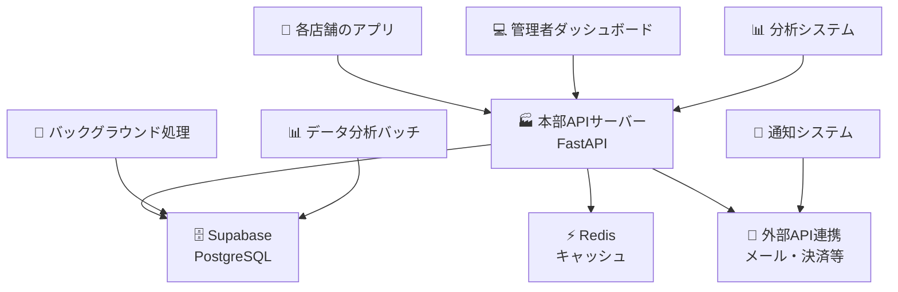
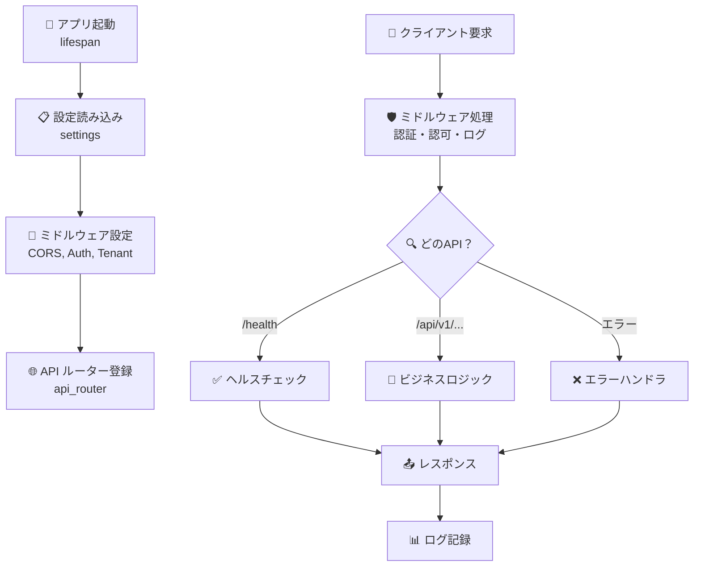
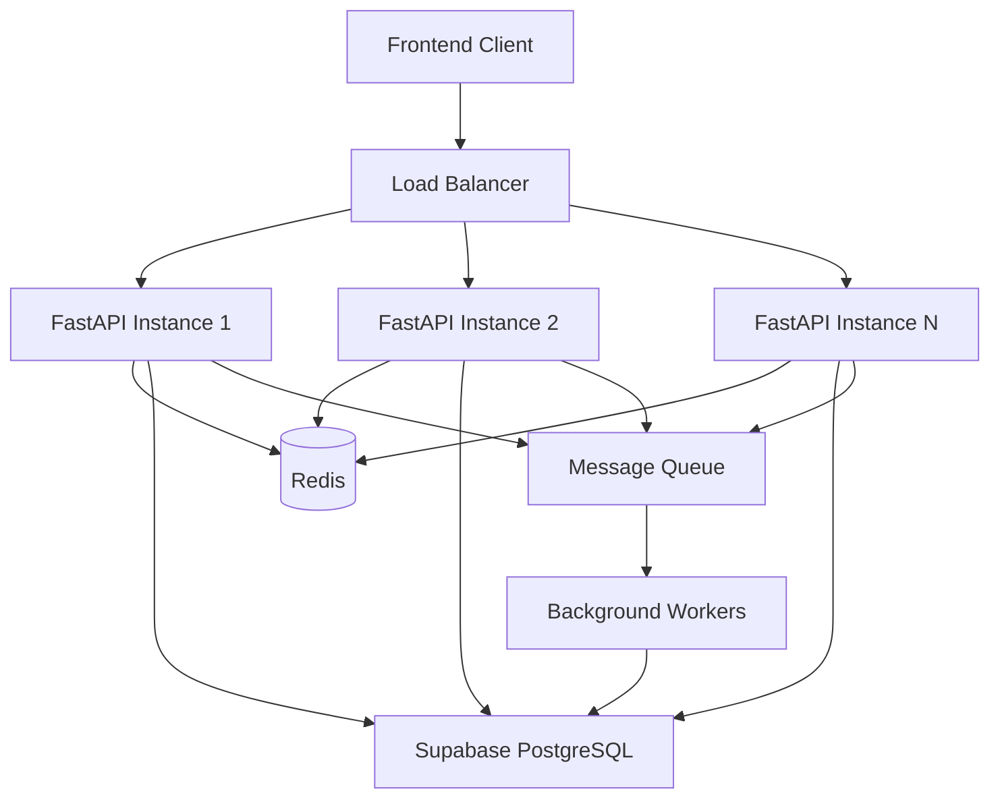
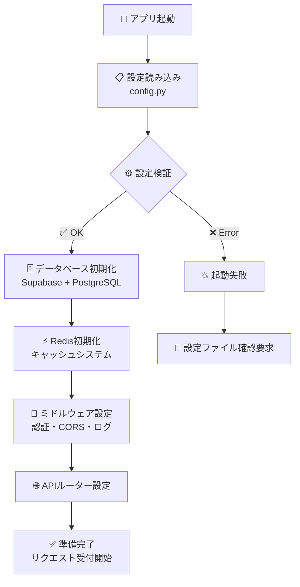

# 第5-1章：パターン3 - 独立APIサーバー

---
**📚 目次に戻る**: [はじめに]({{ '/introduction/' | relative_url }})  
**⬅️ 前の章**: [第4章：パターン2 - Edge Functions活用]({{ '/chapters/chapter04/' | relative_url }})  
**➡️ 次の章**: [第5-2章：マルチテナンシーと複雑ビジネスロジック]({{ '/chapters/chapter05-2/' | relative_url }})  
**🏗️ アーキテクチャ**: 独立APIサーバー（FastAPI + SQLAlchemy）  
**🎯 学習レベル**: 🌱 基礎 | 🚀 応用 | 💪 発展  
**⏱️ 推定学習時間**: 6〜8時間  
**📝 難易度**: 上級（Python・DB設計・エンタープライズアーキテクチャ知識必要）
---

## 🧭 この章で扱う構成
- 構成: 独立APIサーバー（基礎）
- 推奨用途: 複雑ロジック/独自認可/拡張性重視
- 非推奨用途: 小規模で運用コストを最小化したいケース

## 🎯 この章で学ぶこと（初心者向け）

この章では、**「レストラン」**的なアプローチでSupabaseを使った本格的なSaaSプラットフォームを作ります。

- 🌱 **初心者**: 独立したAPIサーバーがどのように動くかがわかる
- 🚀 **中級者**: マルチテナント・権限管理・高度なAPI設計がわかる  
- 💪 **上級者**: エンタープライズ級のシステム設計パターンが理解できる

## 💡 まずは身近な例から：「レストランチェーン」

想像してみてください。あなたが**全国チェーンのレストラン**を経営するとします：

```text
🏢 レストランチェーン本部
├── 🏪 東京店：独自のメニュー・スタッフ・売上管理
├── 🏪 大阪店：独自のメニュー・スタッフ・売上管理  
├── 🏪 名古屋店：独自のメニュー・スタッフ・売上管理
└── 🏭 本部システム：全店舗の統合管理・分析
```

### 🤔 なぜ独立APIサーバーが必要？

これまでのパターンでは対応できない企業レベルの要求があります：

| 要求 | パターン1<br/>クライアント | パターン2<br/>Edge Functions | パターン3<br/>独立API | なぜ？ |
|:-----|:----------------------:|:---------------------------:|:-------------------:|:-------|
| 🏢 **マルチテナント** | ❌ 困難 | ⚠️ 制限あり | ✅ 完全対応 | 組織ごとの完全分離が必要 |
| 🔐 **複雑な権限管理** | ❌ 不可能 | ⚠️ 限定的 | ✅ 柔軟対応 | 役職・部署・プロジェクト単位の細かい権限 |
| 📊 **高度な分析** | ❌ 処理重い | ⚠️ タイムアウト | ✅ バッチ処理 | 大量データの集計・レポート生成 |
| 🔧 **カスタマイズ** | ⚠️ 制限あり | ⚠️ 制限あり | ✅ 自由自在 | 企業固有の業務ロジック |
| 📈 **スケーラビリティ** | ❌ 限界あり | ⚠️ コスト高 | ✅ 最適制御 | 負荷分散・キャッシュ・最適化 |

### 🎉 パターン3（独立APIサーバー）なら...



**メリット**：
- 🏢 **完全な制御**: あらゆる業務要求に対応可能
- 🔧 **カスタマイズ自在**: 企業固有のロジックを自由に実装
- 📈 **スケーラブル**: 負荷分散・キャッシュ・最適化を自在に制御
- 🔒 **セキュア**: エンタープライズ級のセキュリティ実装

---

## 🏗️ 今回作るアプリ：「SaaSプラットフォーム」

### 📱 どんなアプリ？

**レストランチェーン管理システム**のような本格的なSaaSプラットフォームを作ります：

```text
🏢 SaaSプラットフォーム「ChainManager」
├── 🏪 テナント（各企業）
│   ├── A社：レストランチェーン（50店舗）
│   ├── B社：小売チェーン（20店舗）
│   └── C社：サービス業（10拠点）
├── 👥 ユーザー管理：社員・管理者・オーナー
├── 📊 プロジェクト管理：新店舗開店・リニューアル等
└── 📈 分析ダッシュボード：売上・KPI・レポート
```

### ✨ 実装する機能

| 機能 | 初心者向け説明 | 技術的な説明 |
|------|:-------------:|:-------------|
| 🏢 **マルチテナント** | 複数の企業が1つのシステムを共有利用 | テナント分離・データ隔離・権限管理 |
| 👥 **ユーザー管理** | 社員の招待・役職設定・権限管理 | RBAC・JWT認証・階層的権限 |
| 📊 **プロジェクト管理** | 新店舗開店プロジェクトの進捗管理 | タスク・マイルストーン・ガントチャート |
| 📈 **ダッシュボード** | 売上・KPI・レポートの可視化 | データ集計・グラフ生成・リアルタイム更新 |
| 🔗 **API連携** | 外部システムとの連携・自動化 | Webhook・REST API・レート制限 |

### 🛠️ 使用技術（初心者向け説明）

```text
🏭 独立APIサーバー: FastAPI (Python)
   └─ 「本格的なWebAPIサーバー（企業の基幹システムレベル）」

⚡ キャッシュシステム: Redis
   └─ 「よく使うデータを高速で取り出せる一時保存場所」

🗄️ データベース: Supabase PostgreSQL
   └─ 「全ての企業データを安全に管理する大型データベース」

📊 データ分析: SQLAlchemy ORM + Alembic
   └─ 「データベースを Python で扱いやすくする仕組み」

🔐 認証・認可: JWT + RBAC
   └─ 「『誰が』『何を』『どこまで』できるかを厳密に管理」
```

### 📂 今回作成したソースコードの場所

```bash
📁 src/chapter05-saas-platform/
├── 📁 backend/                     # ← APIサーバー本体
│   ├── 📄 app/main.py              # ← アプリのエントリーポイント
│   ├── 📁 app/core/                # ← 核となる設定・機能
│   │   ├── 📄 config.py            # ← 設定管理（重要！）
│   │   ├── 📄 database.py          # ← データベース接続
│   │   └── 📄 security.py          # ← セキュリティ関連
│   ├── 📁 app/api/v1/              # ← API エンドポイント
│   │   ├── 📄 auth.py              # ← ログイン・認証API
│   │   ├── 📄 users.py             # ← ユーザー管理API
│   │   ├── 📄 organizations.py     # ← 組織管理API
│   │   └── 📄 projects.py          # ← プロジェクト管理API
│   ├── 📁 app/models/              # ← データベースモデル
│   └── 📁 app/services/            # ← ビジネスロジック
├── 📁 frontend/                    # ← 管理画面（フロントエンド）
└── 📄 docker-compose.yml          # ← 開発環境構築
```

> 💡 **重要**: これらのコードは実際に動作する完全なSaaSプラットフォームです！
> マルチテナント対応・権限管理・API管理まで含まれています。

---

## 🔍 実際のコードを見てみよう！

このセクションでは、作成したSaaSプラットフォームの**実際のソースコード**を段階的に説明します。

### 📄 Step 1: アプリケーションの心臓部（main.py）

まず、FastAPIアプリケーションのメインファイルを見てみましょう：

```python
# src/chapter05-saas-platform/backend/app/main.py（重要部分を抜粋）

from fastapi import FastAPI, Request, Response
from fastapi.middleware.cors import CORSMiddleware
from contextlib import asynccontextmanager

# アプリケーションライフサイクル管理
@asynccontextmanager
async def lifespan(app: FastAPI):
    """アプリケーション起動・終了処理"""
    # 🚀 起動時処理
    setup_logging()
    logger = logging.getLogger(__name__)
    
    logger.info("🚀 SaaSプラットフォーム起動中...")
    
    # データベース初期化
    await init_db()
    
    # Redis初期化  
    await init_redis()
    
    logger.info("✅ SaaSプラットフォーム起動完了")
    
    yield  # ← ここでアプリケーション実行
    
    # 👋 終了時処理
    logger.info("👋 SaaSプラットフォーム終了")

# FastAPIアプリケーション作成
app = FastAPI(
    title=settings.PROJECT_NAME,
    description="Supabaseを活用したマルチテナントSaaSプラットフォーム",
    version=settings.VERSION,
    docs_url="/docs" if settings.DEBUG else None,
    lifespan=lifespan  # ← ライフサイクル管理を設定
)
```

**🔰 初心者向け解説**：

| コード部分 | 何をしているか | 身近な例 |
|:----------|:-------------|:---------| 
| `@asynccontextmanager` | アプリの開始と終了時の処理を管理 | レストランの「開店準備」と「閉店作業」を自動化 |
| `async def lifespan()` | アプリが生きている間の管理機能 | 店長が開店から閉店まで店を管理するように |
| `yield` | 「ここでアプリを実行してください」の印 | 店長が「準備完了、営業開始！」と合図 |
| `FastAPI(...)` | アプリケーション本体を作成 | レストランの基本設計図を作成 |

### 📄 Step 2: ミドルウェアの設定（セキュリティの番人）

次に、アプリを守るミドルウェアを見てみましょう：

```python
# CORS設定（どのサイトからアクセスを許可するか）
if settings.BACKEND_CORS_ORIGINS:
    app.add_middleware(
        CORSMiddleware,
        allow_origins=[str(origin) for origin in settings.BACKEND_CORS_ORIGINS],
        allow_credentials=True,
        allow_methods=["*"],
        allow_headers=["*"],
    )

# Gzip圧縮（データを小さくして高速化）
app.add_middleware(GZipMiddleware, minimum_size=1000)

# カスタムミドルウェア（独自のセキュリティ機能）
app.add_middleware(TenantMiddleware)     # テナント分離
app.add_middleware(RateLimitMiddleware) # レート制限
app.add_middleware(AuthMiddleware)      # 認証
```

**🔰 初心者向け解説**：

| ミドルウェア | 何をしているか | 身近な例 |
|:----------|:-------------|:---------| 
| `CORSMiddleware` | 「どこからのアクセスを許可するか」を制御 | レストランの「身分証確認」 |
| `GZipMiddleware` | データを圧縮して通信を高速化 | 荷物を圧縮して配送効率を上げる |
| `TenantMiddleware` | 会社ごとにデータを分離 | アパートで各部屋を完全に分離 |
| `RateLimitMiddleware` | 短時間での大量アクセスを制限 | 「お一人様一回限り」制限 |
| `AuthMiddleware` | ログインしているかを確認 | 会員証の確認 |

### 📄 Step 3: リクエストログ記録（何が起きているかを記録）

すべてのリクエストを記録する仕組みを見てみましょう：

```python
@app.middleware("http")
async def request_logging_middleware(request: Request, call_next):
    """すべてのリクエストを記録"""
    request_id = str(uuid.uuid4())  # 一意のID生成
    start_time = time.time()        # 開始時刻記録
    
    # リクエストID設定
    request.state.request_id = request_id
    
    logger = logging.getLogger(__name__)
    logger.info(
        "Request started",
        extra={
            "request_id": request_id,
            "method": request.method,           # GET, POST等
            "url": str(request.url),           # アクセスされたURL
            "user_agent": request.headers.get("user-agent"),
            "ip": request.client.host if request.client else None
        }
    )
    
    # 実際の処理を実行
    response = await call_next(request)
    
    # 処理時間計算
    process_time = time.time() - start_time
    
    logger.info(
        "Request completed",
        extra={
            "request_id": request_id,
            "status_code": response.status_code,
            "process_time": round(process_time, 4)
        }
    )
    
    # レスポンスヘッダー追加
    response.headers["X-Request-ID"] = request_id
    response.headers["X-Process-Time"] = str(round(process_time, 4))
    
    return response
```

**🔰 初心者向け解説**：

| 概念 | 何をしているか | 身近な例 |
|:-----|:-------------|:---------| 
| `request_id` | 各リクエストに一意の番号を付与 | 宅配便の「追跡番号」 |
| `start_time` | 処理開始時刻を記録 | レストランで「注文受付時刻」を記録 |
| `call_next(request)` | 実際のAPI処理を実行 | 注文を受けて料理を作る |
| `process_time` | 処理にかかった時間を計算 | 「注文から提供まで15分でした」 |
| `response.headers` | 追加情報をレスポンスに含める | 料理に「調理時間」のメモを添える |

### 📄 Step 4: エラーハンドリング（問題が起きた時の対処）

予期しないエラーが発生した時の処理を見てみましょう：

```python
@app.exception_handler(Exception)
async def global_exception_handler(request: Request, exc: Exception):
    """すべてのエラーを統一的に処理"""
    logger = logging.getLogger(__name__)
    request_id = getattr(request.state, "request_id", "unknown")
    
    logger.error(
        "Unhandled exception",
        extra={
            "request_id": request_id,
            "exception": str(exc),
            "exception_type": type(exc).__name__
        },
        exc_info=True  # スタックトレースも記録
    )
    
    return JSONResponse(
        status_code=500,
        content={
            "error": "Internal server error",
            "request_id": request_id,
            "message": "サーバー内部エラーが発生しました" if settings.DEBUG else "Internal server error"
        }
    )
```

**🔰 初心者向け解説**：

| 概念 | 何をしているか | 身近な例 |
|:-----|:-------------|:---------| 
| `exception_handler` | エラーが起きた時の標準的な対応方法 | レストランの「クレーム対応マニュアル」 |
| `logger.error()` | エラー内容を詳細に記録 | 事故報告書の作成 |
| `exc_info=True` | エラーの詳細情報（どこで起きたか）も記録 | 事故現場の詳細な記録 |
| `JSONResponse` | 統一的なエラーレスポンス | 「申し訳ございません」の定型文 |

### 📄 Step 5: 基本的なエンドポイント（API の入り口）

アプリケーションの基本的なAPIエンドポイントを見てみましょう：

```python
# API ルーター登録
app.include_router(api_router, prefix=settings.API_V1_STR)

@app.get("/")
async def root():
    """ルートエンドポイント（トップページ）"""
    return {
        "message": "SaaSプラットフォーム API",
        "version": settings.VERSION,
        "status": "healthy",
        "docs_url": "/docs" if settings.DEBUG else None
    }

@app.get("/health")
async def health_check():
    """ヘルスチェック（システムが正常か確認）"""
    return {
        "status": "healthy",
        "timestamp": time.time(),
        "version": settings.VERSION
    }

@app.get("/metrics")
async def metrics():
    """Prometheusメトリクス（監視用データ）"""
    if not settings.DEBUG:
        return JSONResponse(
            status_code=404,
            content={"error": "Not found"}
        )
    
    # メトリクス収集（実装例）
    from prometheus_client import generate_latest, CONTENT_TYPE_LATEST
    
    return Response(
        generate_latest(),
        media_type=CONTENT_TYPE_LATEST
    )
```

**🔰 初心者向け解説**：

| エンドポイント | 何をしているか | 身近な例 |
|:-------------|:-------------|:---------| 
| `@app.get("/")` | アプリのトップページ | レストランの「看板」 |
| `/health` | システムが正常に動いているか確認 | 「営業中」の札 |
| `/metrics` | システムの詳細な状態データ | 売上や来客数の統計 |
| `include_router` | 他のAPIエンドポイントを登録 | メニューを店に追加 |

### 🎯 全体の流れの理解

これまでのコードがどのように連携するかを図で見てみましょう：



**処理の流れ**：
1. **アプリ起動**: データベース・Redis の初期化
2. **リクエスト受信**: クライアントからのAPI要求
3. **ミドルウェア処理**: 認証・認可・ログ記録
4. **API処理**: 実際のビジネスロジック実行
5. **レスポンス**: 結果をクライアントに返す
6. **ログ記録**: すべての処理を記録

### アーキテクチャ概要



### 📄 Step 6: 設定管理システム（config.py）

SaaSプラットフォームには多くの設定が必要です。実際の設定ファイルを見てみましょう：

```python
# src/chapter05-saas-platform/backend/app/core/config.py（重要部分を抜粋）

from pydantic_settings import BaseSettings
from typing import List, Optional
import secrets

class Settings(BaseSettings):
    """アプリケーション設定"""
    
    # プロジェクト基本情報
    PROJECT_NAME: str = "SaaS Platform"
    VERSION: str = "1.0.0"
    API_V1_STR: str = "/api/v1"
    DEBUG: bool = False
    
    # セキュリティ設定
    SECRET_KEY: str = secrets.token_urlsafe(32)  # 自動生成される秘密鍵
    ACCESS_TOKEN_EXPIRE_MINUTES: int = 60 * 24 * 8  # 8日間有効
    
    # CORS設定（どのサイトからアクセス許可するか）
    BACKEND_CORS_ORIGINS: List[str] = [
        "http://localhost:3000",   # 開発環境のフロントエンド
        "http://localhost:8080",   # 別の開発環境
        "https://yourdomain.com",  # 本番環境のドメイン
    ]
    
    # Supabase設定
    SUPABASE_URL: str              # Supabaseプロジェクトの URL
    SUPABASE_PUBLISHABLE_KEY: str         # クライアント公開キー
    SUPABASE_SECRET_KEY: str      # サーバー専用の秘密キー
    
    # Redis設定（キャッシュ用）
    REDIS_URL: str = "redis://localhost:6379"
    REDIS_PASSWORD: Optional[str] = None
    
    # レート制限設定
    RATE_LIMIT_PER_MINUTE: int = 60    # 1分間に60回まで
    RATE_LIMIT_PER_HOUR: int = 1000    # 1時間に1000回まで
    
    # ファイルアップロード制限
    MAX_UPLOAD_SIZE: int = 10 * 1024 * 1024  # 10MB
    UPLOAD_DIR: str = "./uploads"
    
    class Config:
        env_file = ".env"          # 環境変数ファイル
        case_sensitive = True      # 大文字小文字を区別
    
    def validate_config(self) -> bool:
        """設定の妥当性をチェック"""
        errors = []
        
        # 必須設定チェック
        if not self.SUPABASE_URL:
            errors.append("SUPABASE_URL is required")
        if not self.SUPABASE_PUBLISHABLE_KEY:
            errors.append("SUPABASE_PUBLISHABLE_KEY is required")
        
        if errors:
            print("❌ 設定エラー:")
            for error in errors:
                print(f"  - {error}")
            return False
        
        return True

# グローバル設定インスタンス
settings = Settings()
```

**🔰 初心者向け解説**：

| 設定項目 | 何をしているか | 身近な例 |
|:---------|:-------------|:---------| 
| `PROJECT_NAME` | アプリケーションの名前 | 店の看板に書く「店名」 |
| `SECRET_KEY` | データ暗号化のための秘密の鍵 | 金庫の暗証番号 |
| `CORS_ORIGINS` | どのウェブサイトからアクセスを許可するか | 「会員証を持った人だけ入場可」 |
| `RATE_LIMIT` | 短時間での大量アクセスを制限 | 「お一人様1日3回まで」制限 |
| `env_file = ".env"` | パスワード等の秘密情報は別ファイル | 重要書類は金庫に保管 |
| `validate_config()` | 設定が正しいかをチェック | 開店前の設備点検 |

### 📄 Step 7: データベース接続の仕組み

Supabaseとの接続と、直接PostgreSQLアクセスの両方に対応した仕組みを見てみましょう：

```python
# データベース接続管理（実装例）

from sqlalchemy.ext.asyncio import create_async_engine, AsyncSession
from sqlalchemy.orm import sessionmaker
from supabase import create_client, Client
from core.config import settings

class DatabaseManager:
    """データベース接続管理クラス"""
    
    def __init__(self):
        # Supabaseクライアント初期化
        self.supabase: Client = create_client(
            settings.SUPABASE_URL,
            settings.SUPABASE_SECRET_KEY
        )
        
        # 直接PostgreSQL接続（SQLAlchemy）
        self.engine = create_async_engine(
            settings.database_url_async,  # 非同期PostgreSQL URL
            pool_size=settings.DATABASE_POOL_SIZE,      # 接続プール数
            max_overflow=settings.DATABASE_MAX_OVERFLOW, # 最大接続数
            echo=settings.DEBUG  # デバッグ時はSQLを出力
        )
        
        # セッションファクトリー
        self.SessionLocal = sessionmaker(
            bind=self.engine,
            class_=AsyncSession,
            expire_on_commit=False
        )
    
    async def get_db_session(self):
        """データベースセッション取得"""
        async with self.SessionLocal() as session:
            try:
                yield session
                await session.commit()
            except Exception:
                await session.rollback()
                raise
            finally:
                await session.close()
    
    async def test_connections(self):
        """接続テスト"""
        try:
            # Supabase接続テスト
            response = await self.supabase.table('_health').select('*').limit(1).execute()
            print("✅ Supabase接続成功")
            
            # PostgreSQL接続テスト
            async with self.engine.begin() as conn:
                result = await conn.execute("SELECT 1")
                print("✅ PostgreSQL接続成功")
                
        except Exception as e:
            print(f"❌ データベース接続エラー: {e}")
            raise

# グローバルデータベースマネージャー
db_manager = DatabaseManager()

async def init_db():
    """データベース初期化"""
    await db_manager.test_connections()
    print("🚀 データベース初期化完了")
```

**🔰 初心者向け解説**：

| 概念 | 何をしているか | 身近な例 |
|:-----|:-------------|:---------| 
| `Supabaseクライアント` | Supabaseの便利機能を使うための接続 | コンビニのATM（簡単操作） |
| `PostgreSQL直接接続` | データベースに直接接続して高度操作 | 銀行窓口（複雑な手続き可能） |
| `接続プール` | データベース接続を使い回して効率化 | レンタカーの車両プール |
| `セッション` | データベースとの一連のやり取り | 銀行での「一回の取引」 |
| `commit/rollback` | 変更を確定するか、取り消すか | 「保存」か「やり直し」 |

### 📄 Step 8: Redis キャッシュシステム

高速化のためのキャッシュシステムを見てみましょう：

```python
# Redis キャッシュマネージャー（実装例）

import redis.asyncio as redis
import json
import pickle
from typing import Any, Optional
from datetime import timedelta

class CacheManager:
    """Redisキャッシュ管理クラス"""
    
    def __init__(self):
        self.redis_client: Optional[redis.Redis] = None
    
    async def connect(self):
        """Redis接続"""
        try:
            self.redis_client = redis.from_url(
                settings.redis_url_full,
                encoding="utf-8",
                decode_responses=True,
                socket_connect_timeout=5,
                socket_keepalive=True
            )
            
            # 接続テスト
            await self.redis_client.ping()
            print("✅ Redis接続成功")
            
        except Exception as e:
            print(f"❌ Redis接続エラー: {e}")
            self.redis_client = None
    
    async def set(self, key: str, value: Any, ttl: int = 300):
        """データをキャッシュに保存"""
        if not self.redis_client:
            return False
        
        try:
            # データをJSON形式で保存
            serialized_value = json.dumps(value, default=str)
            await self.redis_client.setex(
                key, 
                timedelta(seconds=ttl), 
                serialized_value
            )
            return True
            
        except Exception as e:
            print(f"キャッシュ保存エラー: {e}")
            return False
    
    async def get(self, key: str) -> Optional[Any]:
        """キャッシュからデータを取得"""
        if not self.redis_client:
            return None
        
        try:
            cached_value = await self.redis_client.get(key)
            if cached_value:
                return json.loads(cached_value)
            return None
            
        except Exception as e:
            print(f"キャッシュ取得エラー: {e}")
            return None
    
    async def delete(self, key: str) -> bool:
        """キャッシュからデータを削除"""
        if not self.redis_client:
            return False
        
        try:
            result = await self.redis_client.delete(key)
            return result > 0
            
        except Exception as e:
            print(f"キャッシュ削除エラー: {e}")
            return False
    
    async def clear_pattern(self, pattern: str):
        """パターンマッチでキャッシュクリア"""
        if not self.redis_client:
            return
        
        try:
            keys = await self.redis_client.keys(pattern)
            if keys:
                await self.redis_client.delete(*keys)
                print(f"🗑️ {len(keys)}個のキャッシュをクリア")
                
        except Exception as e:
            print(f"キャッシュクリアエラー: {e}")

# グローバルキャッシュマネージャー
cache_manager = CacheManager()

async def init_redis():
    """Redis初期化"""
    await cache_manager.connect()
    print("⚡ Redis初期化完了")
```

**🔰 初心者向け解説**：

| 概念 | 何をしているか | 身近な例 |
|:-----|:-------------|:---------| 
| `Redis` | よく使うデータを素早く取り出せる一時保存場所 | 冷蔵庫（よく使う食材を手前に） |
| `TTL（生存時間）` | データを自動で削除する時間設定 | 食材の賞味期限 |
| `setex` | 期限付きでデータを保存 | 「3日後に自動で捨てる」メモ |
| `JSON形式` | データを文字列として保存 | 荷物を段ボールに梱包 |
| `pattern matching` | 「user:*」のような条件でまとめて削除 | 「田中さん関連」を全部片付け |

### 🎯 システム全体の初期化プロセス

これらのコンポーネントがどのように初期化されるかを見てみましょう：



**初期化の流れ**：
1. **設定読み込み**: 環境変数や .env ファイルから設定を取得
2. **設定検証**: 必須項目や形式をチェック
3. **データベース初期化**: Supabase と PostgreSQL の接続確立
4. **Redis初期化**: キャッシュシステムの準備
5. **ミドルウェア設定**: セキュリティ機能の有効化
6. **API設定**: エンドポイントの登録
7. **準備完了**: クライアントからのリクエスト受付開始

### 📄 Step 9: 認証・認可システム（JWT + RBAC）

SaaSプラットフォームの心臓部である認証システムを見てみましょう：

```python
# 認証サービス（実装例）

from datetime import datetime, timedelta
from typing import Optional, Dict, Any, List
from jose import JWTError, jwt
from passlib.context import CryptContext
from fastapi import HTTPException, status, Depends
from fastapi.security import HTTPBearer, HTTPAuthorizationCredentials

# パスワードハッシュ化
pwd_context = CryptContext(schemes=["bcrypt"], deprecated="auto")
security = HTTPBearer()

class AuthService:
    """認証・認可サービス"""
    
    def __init__(self):
        self.algorithm = "HS256"
        self.secret_key = settings.SECRET_KEY
    
    def create_access_token(self, data: Dict[str, Any], expires_delta: Optional[timedelta] = None):
        """JWTアクセストークン生成"""
        to_encode = data.copy()
        
        # 有効期限設定
        if expires_delta:
            expire = datetime.utcnow() + expires_delta
        else:
            expire = datetime.utcnow() + timedelta(minutes=settings.ACCESS_TOKEN_EXPIRE_MINUTES)
        
        to_encode.update({"exp": expire})
        
        # JWT生成
        encoded_jwt = jwt.encode(to_encode, self.secret_key, algorithm=self.algorithm)
        return encoded_jwt
    
    def verify_token(self, token: str) -> Optional[Dict[str, Any]]:
        """JWTトークン検証"""
        try:
            payload = jwt.decode(token, self.secret_key, algorithms=[self.algorithm])
            
            # 有効期限チェック
            exp = payload.get("exp")
            if exp is None or datetime.utcnow() > datetime.fromtimestamp(exp):
                return None
            
            return payload
            
        except JWTError:
            return None
    
    def get_password_hash(self, password: str) -> str:
        """パスワードハッシュ化"""
        return pwd_context.hash(password)
    
    def verify_password(self, plain_password: str, hashed_password: str) -> bool:
        """パスワード検証"""
        return pwd_context.verify(plain_password, hashed_password)
    
    async def authenticate_user(self, email: str, password: str):
        """ユーザー認証"""
        # Supabaseで認証
        try:
            response = await db_manager.supabase.auth.sign_in_with_password({
                "email": email,
                "password": password
            })
            
            if response.user:
                # JWTトークン生成
                access_token = self.create_access_token(
                    data={
                        "sub": response.user.id,
                        "email": response.user.email,
                        "role": "user"  # デフォルトロール
                    }
                )
                
                return {
                    "access_token": access_token,
                    "token_type": "bearer",
                    "user": response.user
                }
            
        except Exception as e:
            raise HTTPException(
                status_code=status.HTTP_401_UNAUTHORIZED,
                detail="認証に失敗しました"
            )
    
    def check_permissions(self, user_role: str, required_permissions: List[str]) -> bool:
        """権限チェック（RBAC）"""
        role_permissions = {
            "admin": ["read", "write", "delete", "manage_users", "manage_org"],
            "manager": ["read", "write", "manage_projects"],
            "member": ["read", "write"],
            "viewer": ["read"]
        }
        
        user_permissions = role_permissions.get(user_role, [])
        return all(perm in user_permissions for perm in required_permissions)

# 認証依存性関数
async def get_current_user(credentials: HTTPAuthorizationCredentials = Depends(security)):
    """現在のユーザー取得"""
    auth_service = AuthService()
    
    credentials_exception = HTTPException(
        status_code=status.HTTP_401_UNAUTHORIZED,
        detail="認証情報が無効です",
        headers={"WWW-Authenticate": "Bearer"},
    )
    
    try:
        payload = auth_service.verify_token(credentials.credentials)
        if payload is None:
            raise credentials_exception
        
        return payload
        
    except JWTError:
        raise credentials_exception

async def require_permissions(required_permissions: List[str]):
    """権限要求デコレータ"""
    def permission_checker(current_user: dict = Depends(get_current_user)):
        auth_service = AuthService()
        user_role = current_user.get("role", "viewer")
        
        if not auth_service.check_permissions(user_role, required_permissions):
            raise HTTPException(
                status_code=status.HTTP_403_FORBIDDEN,
                detail="この操作を実行する権限がありません"
            )
        
        return current_user
    
    return permission_checker
```

**🔰 初心者向け解説**：

| 概念 | 何をしているか | 身近な例 |
|:-----|:-------------|:---------| 
| `JWT（JSON Web Token）` | 改ざんできない身分証明書 | 偽造防止技術付きの免許証 |
| `パスワードハッシュ化` | パスワードを暗号化して保存 | 金庫の暗証番号を暗号化 |
| `RBAC（ロールベースアクセス制御）` | 役職に応じて権限を設定 | 「店長」「バイト」で操作権限が違う |
| `有効期限（exp）` | トークンの使用期限 | 入場券の有効期限 |
| `HTTP Bearer認証` | リクエストヘッダーでトークンを送信 | 毎回身分証を提示 |

### 📄 Step 10: APIエンドポイントの実装

実際のAPIエンドポイントがどのように作られるかを見てみましょう：

```python
# APIエンドポイント例（組織管理）

from fastapi import APIRouter, Depends, HTTPException, status
from typing import List
from pydantic import BaseModel

router = APIRouter(prefix="/organizations", tags=["organizations"])

# リクエスト・レスポンス モデル
class OrganizationCreate(BaseModel):
    name: str
    description: Optional[str] = None
    industry: Optional[str] = None

class OrganizationResponse(BaseModel):
    id: int
    name: str
    description: Optional[str]
    member_count: int
    created_at: datetime

@router.post("/", response_model=OrganizationResponse)
async def create_organization(
    org_data: OrganizationCreate,
    current_user: dict = Depends(require_permissions(["manage_org"]))
):
    """組織作成（管理者のみ）"""
    try:
        # Supabaseに組織データ挿入
        response = await db_manager.supabase.table("organizations").insert({
            "name": org_data.name,
            "description": org_data.description,
            "industry": org_data.industry,
            "created_by": current_user["sub"]
        }).execute()
        
        if response.data:
            org = response.data[0]
            
            # キャッシュ更新
            await cache_manager.delete(f"org_list:{current_user['sub']}")
            
            return OrganizationResponse(**org, member_count=1)
        
    except Exception as e:
        raise HTTPException(
            status_code=status.HTTP_500_INTERNAL_SERVER_ERROR,
            detail="組織作成に失敗しました"
        )

@router.get("/", response_model=List[OrganizationResponse])
async def list_organizations(
    current_user: dict = Depends(get_current_user)
):
    """組織一覧取得"""
    cache_key = f"org_list:{current_user['sub']}"
    
    # キャッシュから取得を試行
    cached_orgs = await cache_manager.get(cache_key)
    if cached_orgs:
        return cached_orgs
    
    try:
        # データベースから取得
        response = await db_manager.supabase.table("organizations")\
            .select("*, members:organization_members(count)")\
            .eq("members.user_id", current_user["sub"])\
            .execute()
        
        if response.data:
            orgs = [
                OrganizationResponse(
                    **org,
                    member_count=org["members"][0]["count"] if org["members"] else 0
                )
                for org in response.data
            ]
            
            # 結果をキャッシュ
            await cache_manager.set(cache_key, [org.dict() for org in orgs], ttl=300)
            
            return orgs
        
        return []
        
    except Exception as e:
        raise HTTPException(
            status_code=status.HTTP_500_INTERNAL_SERVER_ERROR,
            detail="組織一覧取得に失敗しました"
        )

@router.get("/{org_id}/analytics")
async def get_organization_analytics(
    org_id: int,
    current_user: dict = Depends(require_permissions(["read"]))
):
    """組織分析データ取得"""
    try:
        # 複雑な分析クエリ実行
        analytics = await db_manager.supabase.rpc(
            "get_organization_analytics",
            {"org_id": org_id, "user_id": current_user["sub"]}
        ).execute()
        
        return {
            "organization_id": org_id,
            "total_projects": analytics.data.get("total_projects", 0),
            "active_projects": analytics.data.get("active_projects", 0),
            "completion_rate": analytics.data.get("completion_rate", 0),
            "member_activity": analytics.data.get("member_activity", [])
        }
        
    except Exception as e:
        raise HTTPException(
            status_code=status.HTTP_500_INTERNAL_SERVER_ERROR,
            detail="分析データ取得に失敗しました"
        )
```

**🔰 初心者向け解説**：

| 概念 | 何をしているか | 身近な例 |
|:-----|:-------------|:---------| 
| `APIRouter` | 関連するAPIエンドポイントをグループ化 | レストランの「メニューのカテゴリ」 |
| `@router.post("/")` | データ作成用のエンドポイント | 「新規注文受付窓口」 |
| `@router.get("/")` | データ取得用のエンドポイント | 「注文状況確認窓口」 |
| `Pydantic BaseModel` | データの形式を定義 | 注文用紙のフォーマット |
| `Depends()` | 他の機能に依存することを宣言 | 「身分証確認が必要」の表示 |
| `キャッシュ活用` | よく使うデータを高速取得 | よく注文される料理を準備済み |

---

## 🚀 実際に動かしてみよう！（ハンズオン）

### 📋 Step 1: 開発環境の準備

**必要なツール**：
- Python 3.11以上
- Docker & Docker Compose
- VS Code（推奨）
- Supabaseアカウント

**セットアップ手順**：

```bash
# 1. プロジェクトディレクトリに移動
cd src/chapter05-saas-platform

# 2. 仮想環境作成
python -m venv venv

# 3. 仮想環境有効化
# Windows:
venv\Scripts\activate
# Mac/Linux:
source venv/bin/activate

# 4. 依存関係インストール
pip install -r backend/requirements.txt

# 5. 環境設定ファイル作成
cp backend/.env.example backend/.env
```

### 📋 Step 2: Supabase プロジェクト設定

1. **新しいSupabaseプロジェクト作成**
   - https://supabase.com にアクセス
   - 「New Project」→ プロジェクト名：`saas-platform-tutorial`

2. **データベーススキーマ作成**
   ```sql
   -- 組織テーブル
   CREATE TABLE organizations (
       id SERIAL PRIMARY KEY,
       name VARCHAR(255) NOT NULL,
       description TEXT,
       industry VARCHAR(100),
       created_by UUID REFERENCES auth.users(id),
       created_at TIMESTAMP DEFAULT NOW(),
       updated_at TIMESTAMP DEFAULT NOW()
   );

   -- 組織メンバーテーブル
   CREATE TABLE organization_members (
       id SERIAL PRIMARY KEY,
       organization_id INTEGER REFERENCES organizations(id),
       user_id UUID REFERENCES auth.users(id),
       role VARCHAR(50) DEFAULT 'member',
       joined_at TIMESTAMP DEFAULT NOW()
   );

   -- RLS（Row Level Security）有効化
   ALTER TABLE organizations ENABLE ROW LEVEL SECURITY;
   ALTER TABLE organization_members ENABLE ROW LEVEL SECURITY;

   -- ポリシー作成
   CREATE POLICY "Users can view own organizations" ON organizations
       FOR SELECT USING (
           auth.uid() IN (
               SELECT user_id FROM organization_members 
               WHERE organization_id = organizations.id
           )
       );
   ```

3. **環境変数設定**
   ```bash
   # backend/.env ファイルを編集
   SUPABASE_URL=https://your-project.supabase.co
   SUPABASE_PUBLISHABLE_KEY=sb_publishable_XXXXXXXXXXXXXXXX
   SUPABASE_SECRET_KEY=sb_secret_XXXXXXXXXXXXXXXX
   SECRET_KEY=your-secret-key
   DEBUG=True
   ```

### 📋 Step 3: Redis セットアップ

```bash
# Docker でRedis起動
docker run -d --name redis-saas -p 6379:6379 redis:7-alpine

# または docker compose 使用
docker compose up -d redis
```

### 📋 Step 4: アプリケーション起動

```bash
# FastAPI開発サーバー起動
cd backend
uvicorn app.main:app --reload --host 0.0.0.0 --port 8000
```

**期待される動作**：
1. ✅ サーバーが http://localhost:8000 で起動
2. ✅ Swagger UI が http://localhost:8000/docs でアクセス可能
3. ✅ データベース・Redis接続成功ログが表示
4. ✅ ヘルスチェック（http://localhost:8000/health）が正常応答

### 📋 Step 5: API テスト

**基本機能のテスト**：

```bash
# 1. ヘルスチェック
curl http://localhost:8000/health

# 2. ユーザー登録（Supabase Auth使用）
curl -X POST http://localhost:8000/api/v1/auth/register \
  -H "Content-Type: application/json" \
  -d '{
    "email": "test@example.com",
    "password": "testpass123",
    "full_name": "テストユーザー"
  }'

# 3. ログイン
curl -X POST http://localhost:8000/api/v1/auth/login \
  -H "Content-Type: application/json" \
  -d '{
    "email": "test@example.com",
    "password": "testpass123"
  }'

# 4. 組織作成（認証トークン必要）
curl -X POST http://localhost:8000/api/v1/organizations \
  -H "Content-Type: application/json" \
  -H "Authorization: Bearer YOUR_TOKEN_HERE" \
  -d '{
    "name": "テスト株式会社",
    "description": "テスト用の組織です",
    "industry": "IT"
  }'
```

### 📋 Step 6: トラブルシューティング

**よくあるエラーと対処法**：

#### エラー1: "ModuleNotFoundError"
```bash
# 原因: 依存関係が不足
# 解決策:
pip install -r requirements.txt
```

#### エラー2: "Supabase connection failed"
```bash
# 原因: 環境変数設定ミス
# 解決策:
# 1. .envファイルのURL・キーを確認
# 2. Supabase Dashboardで正しいキーをコピー
```

#### エラー3: "Redis connection refused"
```bash
# 原因: Redisが起動していない
# 解決策:
docker run -d --name redis-saas -p 6379:6379 redis:7-alpine
```

### 💡 学習のポイント

**初心者**：
- 🎯 まずはアプリを起動して全体の流れを理解
- 🔧 Swagger UI（/docs）でAPIの動作を確認
- 📊 ログを見て何が起きているかを追跡

**中級者**：
- 🔍 各コンポーネントの役割と連携を理解
- 🛡️ 認証・認可の仕組みを詳しく調査
- ⚡ キャッシュの効果を確認

**上級者**：
- 📈 パフォーマンスメトリクスの収集
- 🔧 カスタマイズとスケーリング戦略の検討
- 🚀 プロダクション環境へのデプロイ準備

---

## プロジェクト構造

```text
saas-platform/
├── app/
│   ├── __init__.py
│   ├── main.py                 # FastAPIアプリケーション
│   ├── core/
│   │   ├── __init__.py
│   │   ├── config.py           # 設定管理
│   │   ├── security.py         # セキュリティ
│   │   ├── database.py         # DB接続
│   │   └── exceptions.py       # カスタム例外
│   ├── api/
│   │   ├── __init__.py
│   │   ├── deps.py             # 依存性注入
│   │   ├── v1/
│   │   │   ├── __init__.py
│   │   │   ├── auth.py         # 認証エンドポイント
│   │   │   ├── users.py        # ユーザー管理
│   │   │   ├── organizations.py # 組織管理
│   │   │   ├── projects.py     # プロジェクト管理
│   │   │   └── analytics.py    # 分析機能
│   │   └── middleware/
│   │       ├── __init__.py
│   │       ├── tenant.py       # テナント処理
│   │       ├── auth.py         # 認証ミドルウェア
│   │       └── rate_limit.py   # レート制限
│   ├── models/
│   │   ├── __init__.py
│   │   ├── base.py             # ベースモデル
│   │   ├── user.py             # ユーザーモデル
│   │   ├── organization.py     # 組織モデル
│   │   ├── project.py          # プロジェクトモデル
│   │   └── audit.py            # 監査ログ
│   ├── schemas/
│   │   ├── __init__.py
│   │   ├── user.py             # ユーザースキーマ
│   │   ├── organization.py     # 組織スキーマ
│   │   └── project.py          # プロジェクトスキーマ
│   ├── services/
│   │   ├── __init__.py
│   │   ├── auth_service.py     # 認証サービス
│   │   ├── user_service.py     # ユーザーサービス
│   │   ├── org_service.py      # 組織サービス
│   │   └── notification_service.py # 通知サービス
│   └── utils/
│       ├── __init__.py
│       ├── permissions.py      # 権限チェック
│       ├── validators.py       # バリデーション
│       └── helpers.py          # ヘルパー関数
├── migrations/                 # Alembicマイグレーション
├── tests/                      # テストスイート
├── scripts/                    # 運用スクリプト
├── requirements.txt
├── pyproject.toml
└── docker-compose.yml
```

---

## 基本設定とアプリケーション初期化

### 設定管理

```python
# app/core/config.py
from pydantic_settings import BaseSettings
from typing import Optional, List
import secrets

class Settings(BaseSettings):
    # アプリケーション設定
    APP_NAME: str = "SaaS Platform API"
    APP_VERSION: str = "1.0.0"
    DEBUG: bool = False
    API_V1_STR: str = "/api/v1"
    
    # セキュリティ設定
    SECRET_KEY: str = secrets.token_urlsafe(32)
    ACCESS_TOKEN_EXPIRE_MINUTES: int = 30
    REFRESH_TOKEN_EXPIRE_DAYS: int = 7
    
    # CORS設定
    BACKEND_CORS_ORIGINS: List[str] = ["http://localhost:3000"]
    
    # Supabase設定
    SUPABASE_URL: str
    SUPABASE_PUBLISHABLE_KEY: str
    SUPABASE_SECRET_KEY: str
    SUPABASE_JWT_SECRET: str
    
    # PostgreSQL設定（直接接続用）
    POSTGRES_SERVER: str
    POSTGRES_USER: str
    POSTGRES_PASSWORD: str
    POSTGRES_DB: str
    POSTGRES_PORT: int = 5432
    
    # Redis設定
    REDIS_URL: str = "redis://localhost:6379"
    
    # 外部サービス
    SENDGRID_API_KEY: Optional[str] = None
    STRIPE_SECRET_KEY: Optional[str] = None
    
    # ログ設定
    LOG_LEVEL: str = "INFO"
    
    # レート制限設定
    RATE_LIMIT_PER_MINUTE: int = 60
    
    @property
    def database_url(self) -> str:
        return f"postgresql://{self.POSTGRES_USER}:{self.POSTGRES_PASSWORD}@{self.POSTGRES_SERVER}:{self.POSTGRES_PORT}/{self.POSTGRES_DB}"
    
    class Config:
        env_file = ".env"
        case_sensitive = True

settings = Settings()
```

### データベース設定

```python
# app/core/database.py
from sqlalchemy import create_engine, MetaData
from sqlalchemy.ext.declarative import declarative_base
from sqlalchemy.orm import sessionmaker
from sqlalchemy.pool import StaticPool
from typing import Generator
import logging

from app.core.config import settings

# SQLAlchemy設定
engine = create_engine(
    settings.database_url,
    poolclass=StaticPool,
    pool_pre_ping=True,
    pool_recycle=300,
    echo=settings.DEBUG
)

SessionLocal = sessionmaker(autocommit=False, autoflush=False, bind=engine)

# メタデータとベースクラス
metadata = MetaData()
Base = declarative_base(metadata=metadata)

# Supabaseクライアント（必要に応じて併用）
from supabase import create_client, Client

def get_supabase_client() -> Client:
    return create_client(
        supabase_url=settings.SUPABASE_URL,
        supabase_key=settings.SUPABASE_SECRET_KEY
    )

def get_db() -> Generator:
    """データベースセッション取得"""
    try:
        db = SessionLocal()
        yield db
    finally:
        db.close()

# 接続テスト
def test_db_connection():
    try:
        with engine.connect() as connection:
            connection.execute("SELECT 1")
        logging.info("データベース接続成功")
        return True
    except Exception as e:
        logging.error(f"データベース接続失敗: {e}")
        return False
```

### セキュリティ設定

```python
# app/core/security.py
from datetime import datetime, timedelta
from typing import Optional, Any, Dict
from jose import jwt, JWTError
from passlib.context import CryptContext
from fastapi.security import HTTPBearer, HTTPAuthorizationCredentials
from fastapi import HTTPException, status, Depends
import secrets

from app.core.config import settings

# パスワードハッシュ化
pwd_context = CryptContext(schemes=["bcrypt"], deprecated="auto")

# JWT設定
security = HTTPBearer()

def create_access_token(
    subject: str, 
    expires_delta: Optional[timedelta] = None,
    additional_claims: Optional[Dict[str, Any]] = None
) -> str:
    """アクセストークン生成"""
    if expires_delta:
        expire = datetime.utcnow() + expires_delta
    else:
        expire = datetime.utcnow() + timedelta(
            minutes=settings.ACCESS_TOKEN_EXPIRE_MINUTES
        )
    
    to_encode = {
        "exp": expire,
        "sub": str(subject),
        "type": "access"
    }
    
    if additional_claims:
        to_encode.update(additional_claims)
    
    encoded_jwt = jwt.encode(
        to_encode, 
        settings.SECRET_KEY, 
        algorithm="HS256"
    )
    return encoded_jwt

def create_refresh_token(subject: str) -> str:
    """リフレッシュトークン生成"""
    expire = datetime.utcnow() + timedelta(
        days=settings.REFRESH_TOKEN_EXPIRE_DAYS
    )
    
    to_encode = {
        "exp": expire,
        "sub": str(subject),
        "type": "refresh"
    }
    
    encoded_jwt = jwt.encode(
        to_encode,
        settings.SECRET_KEY,
        algorithm="HS256"
    )
    return encoded_jwt

def verify_token(token: str) -> Optional[Dict[str, Any]]:
    """トークン検証"""
    try:
        payload = jwt.decode(
            token,
            settings.SECRET_KEY,
            algorithms=["HS256"]
        )
        return payload
    except JWTError:
        return None

def verify_password(plain_password: str, hashed_password: str) -> bool:
    """パスワード検証"""
    return pwd_context.verify(plain_password, hashed_password)

def get_password_hash(password: str) -> str:
    """パスワードハッシュ化"""
    return pwd_context.hash(password)

def generate_password_reset_token(email: str) -> str:
    """パスワードリセットトークン生成"""
    delta = timedelta(hours=settings.EMAIL_RESET_TOKEN_EXPIRE_HOURS)
    now = datetime.utcnow()
    expires = now + delta
    exp = expires.timestamp()
    encoded_jwt = jwt.encode(
        {"exp": exp, "nbf": now, "sub": email, "type": "password_reset"},
        settings.SECRET_KEY,
        algorithm="HS256",
    )
    return encoded_jwt

def verify_password_reset_token(token: str) -> Optional[str]:
    """パスワードリセットトークン検証"""
    try:
        decoded_token = jwt.decode(
            token,
            settings.SECRET_KEY,
            algorithms=["HS256"]
        )
        if decoded_token.get("type") != "password_reset":
            return None
        return decoded_token["sub"]
    except JWTError:
        return None

def generate_api_key() -> str:
    """API キー生成"""
    return f"saas_{secrets.token_urlsafe(32)}"
```

---

## データモデル設計

### ベースモデル

```python
# app/models/base.py
from sqlalchemy import Column, Integer, DateTime, Boolean, String
from sqlalchemy.ext.declarative import declared_attr
from sqlalchemy.sql import func
from app.core.database import Base
import uuid

class TimestampMixin:
    """タイムスタンプミックスイン"""
    created_at = Column(DateTime(timezone=True), server_default=func.now())
    updated_at = Column(DateTime(timezone=True), onupdate=func.now())

class SoftDeleteMixin:
    """論理削除ミックスイン"""
    is_deleted = Column(Boolean, default=False, nullable=False)
    deleted_at = Column(DateTime(timezone=True), nullable=True)

class BaseModel(Base, TimestampMixin):
    """ベースモデル"""
    __abstract__ = True
    
    id = Column(Integer, primary_key=True, index=True)
    
    @declared_attr
    def __tablename__(cls):
        return cls.__name__.lower()

class UUIDMixin:
    """UUID ミックスイン"""
    uuid = Column(String(36), default=lambda: str(uuid.uuid4()), unique=True, index=True)

class AuditMixin:
    """監査ミックスイン"""
    created_by = Column(Integer, nullable=True)
    updated_by = Column(Integer, nullable=True)
```

### ユーザーモデル

```python
# app/models/user.py
from sqlalchemy import Column, Integer, String, Boolean, DateTime, ForeignKey, Table
from sqlalchemy.orm import relationship
from sqlalchemy.sql import func

from app.models.base import BaseModel, TimestampMixin, UUIDMixin, AuditMixin

# 多対多リレーション用テーブル
user_organization_association = Table(
    'user_organizations',
    BaseModel.metadata,
    Column('user_id', Integer, ForeignKey('users.id'), primary_key=True),
    Column('organization_id', Integer, ForeignKey('organizations.id'), primary_key=True),
    Column('role', String(50), nullable=False),
    Column('is_active', Boolean, default=True),
    Column('joined_at', DateTime(timezone=True), server_default=func.now()),
    Column('created_by', Integer, nullable=True)
)

class User(BaseModel, UUIDMixin, AuditMixin):
    """ユーザーモデル"""
    __tablename__ = "users"
    
    # 基本情報
    email = Column(String(255), unique=True, index=True, nullable=False)
    hashed_password = Column(String(255), nullable=False)
    full_name = Column(String(255), nullable=False)
    avatar_url = Column(String(500), nullable=True)
    
    # ステータス
    is_active = Column(Boolean, default=True)
    is_verified = Column(Boolean, default=False)
    is_superuser = Column(Boolean, default=False)
    
    # プロファイル
    timezone = Column(String(50), default="UTC")
    locale = Column(String(10), default="en")
    phone_number = Column(String(20), nullable=True)
    
    # セキュリティ
    last_login_at = Column(DateTime(timezone=True), nullable=True)
    password_changed_at = Column(DateTime(timezone=True), server_default=func.now())
    failed_login_attempts = Column(Integer, default=0)
    locked_until = Column(DateTime(timezone=True), nullable=True)
    
    # 通知設定
    email_notifications = Column(Boolean, default=True)
    push_notifications = Column(Boolean, default=True)
    
    # リレーション
    organizations = relationship(
        "Organization",
        secondary=user_organization_association,
        back_populates="members"
    )
    
    created_projects = relationship("Project", back_populates="creator")
    api_keys = relationship("APIKey", back_populates="user")
    audit_logs = relationship("AuditLog", back_populates="user")

class APIKey(BaseModel, UUIDMixin):
    """API キーモデル"""
    __tablename__ = "api_keys"
    
    user_id = Column(Integer, ForeignKey("users.id"), nullable=False)
    name = Column(String(100), nullable=False)
    key_hash = Column(String(255), nullable=False, unique=True)
    
    # 権限・制限
    scopes = Column(String(500), nullable=False)  # JSON文字列
    rate_limit = Column(Integer, default=1000)  # per hour
    
    # ステータス
    is_active = Column(Boolean, default=True)
    expires_at = Column(DateTime(timezone=True), nullable=True)
    last_used_at = Column(DateTime(timezone=True), nullable=True)
    
    # リレーション
    user = relationship("User", back_populates="api_keys")

class PasswordResetToken(BaseModel):
    """パスワードリセットトークン"""
    __tablename__ = "password_reset_tokens"
    
    user_id = Column(Integer, ForeignKey("users.id"), nullable=False)
    token_hash = Column(String(255), nullable=False, unique=True)
    expires_at = Column(DateTime(timezone=True), nullable=False)
    used_at = Column(DateTime(timezone=True), nullable=True)
    
    # リレーション
    user = relationship("User")
```

### 組織モデル

```python
# app/models/organization.py
from sqlalchemy import Column, Integer, String, Boolean, DateTime, ForeignKey, Text, JSON
from sqlalchemy.orm import relationship
from enum import Enum as PyEnum

from app.models.base import BaseModel, TimestampMixin, UUIDMixin, AuditMixin
from app.models.user import user_organization_association

class SubscriptionPlan(PyEnum):
    FREE = "free"
    STARTER = "starter"
    PROFESSIONAL = "professional"
    ENTERPRISE = "enterprise"

class Organization(BaseModel, UUIDMixin, AuditMixin):
    """組織モデル"""
    __tablename__ = "organizations"
    
    # 基本情報
    name = Column(String(255), nullable=False, index=True)
    slug = Column(String(100), unique=True, nullable=False, index=True)
    description = Column(Text, nullable=True)
    website_url = Column(String(500), nullable=True)
    logo_url = Column(String(500), nullable=True)
    
    # 設定
    timezone = Column(String(50), default="UTC")
    country = Column(String(3), nullable=True)  # ISO country code
    
    # サブスクリプション
    subscription_plan = Column(String(20), default=SubscriptionPlan.FREE.value)
    subscription_status = Column(String(20), default="active")
    trial_ends_at = Column(DateTime(timezone=True), nullable=True)
    
    # 制限
    max_users = Column(Integer, default=5)
    max_projects = Column(Integer, default=3)
    storage_limit_gb = Column(Integer, default=1)
    
    # ステータス
    is_active = Column(Boolean, default=True)
    
    # カスタム設定
    settings = Column(JSON, default=dict)  # 組織固有設定
    
    # リレーション
    members = relationship(
        "User",
        secondary=user_organization_association,
        back_populates="organizations"
    )
    projects = relationship("Project", back_populates="organization")
    invitations = relationship("OrganizationInvitation", back_populates="organization")

class OrganizationInvitation(BaseModel, AuditMixin):
    """組織招待モデル"""
    __tablename__ = "organization_invitations"
    
    organization_id = Column(Integer, ForeignKey("organizations.id"), nullable=False)
    email = Column(String(255), nullable=False)
    role = Column(String(50), nullable=False)
    
    # トークン
    token_hash = Column(String(255), nullable=False, unique=True)
    expires_at = Column(DateTime(timezone=True), nullable=False)
    
    # ステータス
    status = Column(String(20), default="pending")  # pending, accepted, expired, cancelled
    accepted_at = Column(DateTime(timezone=True), nullable=True)
    accepted_by = Column(Integer, ForeignKey("users.id"), nullable=True)
    
    # リレーション
    organization = relationship("Organization", back_populates="invitations")
    accepter = relationship("User", foreign_keys=[accepted_by])
    inviter = relationship("User", foreign_keys=[created_by])

class OrganizationRole(BaseModel):
    """組織ロールモデル"""
    __tablename__ = "organization_roles"
    
    organization_id = Column(Integer, ForeignKey("organizations.id"), nullable=False)
    name = Column(String(50), nullable=False)
    display_name = Column(String(100), nullable=False)
    description = Column(Text, nullable=True)
    
    # 権限（JSON配列）
    permissions = Column(JSON, default=list)
    
    # システムロールかどうか
    is_system_role = Column(Boolean, default=False)
    
    # リレーション
    organization = relationship("Organization")
```

### プロジェクトモデル

```python
# app/models/project.py
from sqlalchemy import Column, Integer, String, Boolean, DateTime, ForeignKey, Text, JSON, Enum
from sqlalchemy.orm import relationship
from enum import Enum as PyEnum
import enum

from app.models.base import BaseModel, TimestampMixin, UUIDMixin, AuditMixin

class ProjectStatus(PyEnum):
    PLANNING = "planning"
    ACTIVE = "active" 
    ON_HOLD = "on_hold"
    COMPLETED = "completed"
    ARCHIVED = "archived"

class TaskPriority(PyEnum):
    LOW = "low"
    MEDIUM = "medium"
    HIGH = "high"
    URGENT = "urgent"

class TaskStatus(PyEnum):
    TODO = "todo"
    IN_PROGRESS = "in_progress"
    IN_REVIEW = "in_review"
    COMPLETED = "completed"
    CANCELLED = "cancelled"

class Project(BaseModel, UUIDMixin, AuditMixin):
    """プロジェクトモデル"""
    __tablename__ = "projects"
    
    # 基本情報
    organization_id = Column(Integer, ForeignKey("organizations.id"), nullable=False)
    name = Column(String(255), nullable=False)
    slug = Column(String(100), nullable=False, index=True)
    description = Column(Text, nullable=True)
    
    # ステータス・スケジュール
    status = Column(Enum(ProjectStatus), default=ProjectStatus.PLANNING)
    start_date = Column(DateTime(timezone=True), nullable=True)
    end_date = Column(DateTime(timezone=True), nullable=True)
    
    # 設定
    is_public = Column(Boolean, default=False)
    color = Column(String(7), default="#3B82F6")  # Hex color
    
    # メタデータ
    tags = Column(JSON, default=list)
    custom_fields = Column(JSON, default=dict)
    
    # リレーション
    organization = relationship("Organization", back_populates="projects")
    creator = relationship("User", back_populates="created_projects")
    tasks = relationship("Task", back_populates="project")
    members = relationship("ProjectMember", back_populates="project")

class ProjectMember(BaseModel, AuditMixin):
    """プロジェクトメンバーモデル"""
    __tablename__ = "project_members"
    
    project_id = Column(Integer, ForeignKey("projects.id"), nullable=False)
    user_id = Column(Integer, ForeignKey("users.id"), nullable=False)
    role = Column(String(50), nullable=False)  # owner, admin, member, viewer
    
    # 権限
    permissions = Column(JSON, default=list)
    
    # ステータス
    is_active = Column(Boolean, default=True)
    joined_at = Column(DateTime(timezone=True), server_default=func.now())
    
    # リレーション
    project = relationship("Project", back_populates="members")
    user = relationship("User")

class Task(BaseModel, UUIDMixin, AuditMixin):
    """タスクモデル"""
    __tablename__ = "tasks"
    
    # 基本情報
    project_id = Column(Integer, ForeignKey("projects.id"), nullable=False)
    title = Column(String(255), nullable=False)
    description = Column(Text, nullable=True)
    
    # 分類・優先度
    priority = Column(Enum(TaskPriority), default=TaskPriority.MEDIUM)
    status = Column(Enum(TaskStatus), default=TaskStatus.TODO)
    
    # 担当・スケジュール
    assignee_id = Column(Integer, ForeignKey("users.id"), nullable=True)
    due_date = Column(DateTime(timezone=True), nullable=True)
    estimated_hours = Column(Integer, nullable=True)
    actual_hours = Column(Integer, nullable=True)
    
    # 階層構造
    parent_task_id = Column(Integer, ForeignKey("tasks.id"), nullable=True)
    
    # 進捗
    progress = Column(Integer, default=0)  # 0-100
    completed_at = Column(DateTime(timezone=True), nullable=True)
    
    # メタデータ
    tags = Column(JSON, default=list)
    custom_fields = Column(JSON, default=dict)
    
    # リレーション
    project = relationship("Project", back_populates="tasks")
    assignee = relationship("User")
    parent_task = relationship("Task", remote_side=[id])
    subtasks = relationship("Task")
    comments = relationship("TaskComment", back_populates="task")
    attachments = relationship("TaskAttachment", back_populates="task")

class TaskComment(BaseModel, AuditMixin):
    """タスクコメントモデル"""
    __tablename__ = "task_comments"
    
    task_id = Column(Integer, ForeignKey("tasks.id"), nullable=False)
    content = Column(Text, nullable=False)
    
    # リプライ構造
    parent_comment_id = Column(Integer, ForeignKey("task_comments.id"), nullable=True)
    
    # リレーション
    task = relationship("Task", back_populates="comments")
    author = relationship("User", foreign_keys=[created_by])
    parent_comment = relationship("TaskComment", remote_side=[id])
    replies = relationship("TaskComment")

class TaskAttachment(BaseModel, AuditMixin):
    """タスク添付ファイルモデル"""
    __tablename__ = "task_attachments"
    
    task_id = Column(Integer, ForeignKey("tasks.id"), nullable=False)
    filename = Column(String(255), nullable=False)
    file_path = Column(String(500), nullable=False)
    file_size = Column(Integer, nullable=False)
    content_type = Column(String(100), nullable=False)
    
    # リレーション
    task = relationship("Task", back_populates="attachments")
    uploader = relationship("User", foreign_keys=[created_by])
```

---

## 認証・認可システム

### 依存性注入設定

```python
# app/api/deps.py
from typing import Generator, Optional
from fastapi import Depends, HTTPException, status
from fastapi.security import HTTPAuthorizationCredentials
from sqlalchemy.orm import Session

from app.core.database import get_db
from app.core.security import security, verify_token
from app.models.user import User
from app.models.organization import Organization
from app.services.auth_service import AuthService

def get_current_user(
    db: Session = Depends(get_db),
    token: HTTPAuthorizationCredentials = Depends(security)
) -> User:
    """現在のユーザー取得"""
    credentials_exception = HTTPException(
        status_code=status.HTTP_401_UNAUTHORIZED,
        detail="Could not validate credentials",
        headers={"WWW-Authenticate": "Bearer"},
    )
    
    payload = verify_token(token.credentials)
    if payload is None:
        raise credentials_exception
    
    user_id = payload.get("sub")
    if user_id is None:
        raise credentials_exception
    
    auth_service = AuthService(db)
    user = auth_service.get_user_by_id(int(user_id))
    if user is None:
        raise credentials_exception
    
    if not user.is_active:
        raise HTTPException(
            status_code=status.HTTP_400_BAD_REQUEST,
            detail="Inactive user"
        )
    
    return user

def get_current_active_superuser(
    current_user: User = Depends(get_current_user),
) -> User:
    """スーパーユーザー取得"""
    if not current_user.is_superuser:
        raise HTTPException(
            status_code=status.HTTP_403_FORBIDDEN,
            detail="The user doesn't have enough privileges"
        )
    return current_user

def get_current_organization(
    organization_id: Optional[int] = None,
    current_user: User = Depends(get_current_user),
    db: Session = Depends(get_db)
) -> Organization:
    """現在の組織取得"""
    if organization_id is None:
        # ユーザーのデフォルト組織を取得
        if not current_user.organizations:
            raise HTTPException(
                status_code=status.HTTP_404_NOT_FOUND,
                detail="No organization found"
            )
        organization = current_user.organizations[0]
    else:
        organization = db.query(Organization).filter(
            Organization.id == organization_id
        ).first()
        
        if not organization:
            raise HTTPException(
                status_code=status.HTTP_404_NOT_FOUND,
                detail="Organization not found"
            )
        
        # ユーザーが組織のメンバーかチェック
        if organization not in current_user.organizations:
            raise HTTPException(
                status_code=status.HTTP_403_FORBIDDEN,
                detail="Not a member of this organization"
            )
    
    return organization
```

### 認証サービス

```python
# app/services/auth_service.py
from typing import Optional, Dict, Any
from sqlalchemy.orm import Session
from sqlalchemy import and_
from fastapi import HTTPException, status
from datetime import datetime, timedelta

from app.models.user import User, PasswordResetToken
from app.models.organization import Organization, OrganizationInvitation
from app.core.security import (
    verify_password, 
    get_password_hash,
    create_access_token,
    create_refresh_token,
    generate_password_reset_token,
    verify_password_reset_token
)
from app.schemas.user import UserCreate
from app.core.config import settings

class AuthService:
    def __init__(self, db: Session):
        self.db = db
    
    def authenticate(self, email: str, password: str) -> Optional[User]:
        """ユーザー認証"""
        user = self.get_user_by_email(email)
        if not user:
            return None
        if not verify_password(password, user.hashed_password):
            # 失敗回数をカウント
            self._increment_failed_login_attempts(user)
            return None
        
        # 成功時は失敗回数をリセット
        self._reset_failed_login_attempts(user)
        self._update_last_login(user)
        return user
    
    def create_user(self, user_create: UserCreate) -> User:
        """ユーザー作成"""
        # メールアドレス重複チェック
        if self.get_user_by_email(user_create.email):
            raise HTTPException(
                status_code=status.HTTP_400_BAD_REQUEST,
                detail="Email already registered"
            )
        
        # ユーザー作成
        db_user = User(
            email=user_create.email,
            hashed_password=get_password_hash(user_create.password),
            full_name=user_create.full_name,
            is_active=True,
            is_verified=False
        )
        
        self.db.add(db_user)
        self.db.commit()
        self.db.refresh(db_user)
        return db_user
    
    def get_user_by_email(self, email: str) -> Optional[User]:
        """メールアドレスでユーザー取得"""
        return self.db.query(User).filter(User.email == email).first()
    
    def get_user_by_id(self, user_id: int) -> Optional[User]:
        """IDでユーザー取得"""
        return self.db.query(User).filter(User.id == user_id).first()
    
    def create_tokens(self, user: User) -> Dict[str, str]:
        """アクセス・リフレッシュトークン作成"""
        access_token = create_access_token(
            subject=str(user.id),
            additional_claims={
                "email": user.email,
                "full_name": user.full_name,
                "is_superuser": user.is_superuser
            }
        )
        refresh_token = create_refresh_token(subject=str(user.id))
        
        return {
            "access_token": access_token,
            "refresh_token": refresh_token,
            "token_type": "bearer"
        }
    
    def refresh_access_token(self, refresh_token: str) -> Dict[str, str]:
        """アクセストークン更新"""
        payload = verify_token(refresh_token)
        if not payload or payload.get("type") != "refresh":
            raise HTTPException(
                status_code=status.HTTP_401_UNAUTHORIZED,
                detail="Invalid refresh token"
            )
        
        user_id = payload.get("sub")
        user = self.get_user_by_id(int(user_id))
        if not user or not user.is_active:
            raise HTTPException(
                status_code=status.HTTP_401_UNAUTHORIZED,
                detail="User not found or inactive"
            )
        
        return self.create_tokens(user)
    
    def request_password_reset(self, email: str) -> bool:
        """パスワードリセット要求"""
        user = self.get_user_by_email(email)
        if not user:
            # セキュリティのため、存在しないユーザーでも成功を返す
            return True
        
        # 既存のトークンを無効化
        self.db.query(PasswordResetToken).filter(
            PasswordResetToken.user_id == user.id
        ).delete()
        
        # 新しいトークン作成
        token = generate_password_reset_token(email)
        reset_token = PasswordResetToken(
            user_id=user.id,
            token_hash=get_password_hash(token),
            expires_at=datetime.utcnow() + timedelta(hours=24)
        )
        
        self.db.add(reset_token)
        self.db.commit()
        
        # メール送信処理（実装省略）
        # self._send_password_reset_email(user.email, token)
        
        return True
    
    def reset_password(self, token: str, new_password: str) -> bool:
        """パスワードリセット実行"""
        email = verify_password_reset_token(token)
        if not email:
            raise HTTPException(
                status_code=status.HTTP_400_BAD_REQUEST,
                detail="Invalid or expired token"
            )
        
        user = self.get_user_by_email(email)
        if not user:
            raise HTTPException(
                status_code=status.HTTP_404_NOT_FOUND,
                detail="User not found"
            )
        
        # パスワード更新
        user.hashed_password = get_password_hash(new_password)
        user.password_changed_at = datetime.utcnow()
        user.failed_login_attempts = 0
        user.locked_until = None
        
        # トークン使用済みにする
        reset_token = self.db.query(PasswordResetToken).filter(
            and_(
                PasswordResetToken.user_id == user.id,
                PasswordResetToken.used_at == None,
                PasswordResetToken.expires_at > datetime.utcnow()
            )
        ).first()
        
        if reset_token:
            reset_token.used_at = datetime.utcnow()
        
        self.db.commit()
        return True
    
    def _increment_failed_login_attempts(self, user: User):
        """失敗回数増加"""
        user.failed_login_attempts += 1
        
        # 5回失敗でアカウントロック（30分）
        if user.failed_login_attempts >= 5:
            user.locked_until = datetime.utcnow() + timedelta(minutes=30)
        
        self.db.commit()
    
    def _reset_failed_login_attempts(self, user: User):
        """失敗回数リセット"""
        user.failed_login_attempts = 0
        user.locked_until = None
        self.db.commit()
    
    def _update_last_login(self, user: User):
        """最終ログイン更新"""
        user.last_login_at = datetime.utcnow()
        self.db.commit()
```

---

## まとめ

第5-1章では、FastAPI + Supabaseの基本構成を構築しました。

**実装したコンポーネント**:
- プロジェクト構造とモジュール設計
- SQLAlchemyによるORM設計
- JWT認証システム
- ロールベースアクセス制御の基盤

## 📝 第5-1章 学習まとめ

### ✅ **習得できたスキル**
- ✅ FastAPI + SQLAlchemy による独立APIサーバー開発
- ✅ マルチテナント対応のDB設計とORM実装
- ✅ エンタープライズ級認証・認可システム（JWT + RBAC）
- ✅ 本格的なプロジェクト構造とモジュール設計

### 🎯 **3つのアーキテクチャパターン最終比較**
| 観点 | 第3章 (クライアント) | 第4章 (Edge Functions) | 第5-1章 (独立API) |
|:-----|:----------------------|:--------------------------|:------------------|
| **実装方式** | 🖥️ クライアント中心 | ⚡ サーバーレス関数 | 🏗️ 独立APIサーバー |
| **複雑度** | 🌱 シンプル | 🚀 中程度 | 💪 高機能・高制御 |
| **適用場面** | 個人・小規模チーム | スタートアップ・中規模 | エンタープライズ・SaaS |
| **マルチテナント** | ❌ 不可 | ⚠️ 制限あり | ✅ 完全対応 |
| **カスタマイズ性** | ⚠️ 制限あり | ⚠️ 制限あり | ✅ 自由自在 |
| **運用・保守** | 🌱 簡単 | 🚀 中程度 | 💪 高度（要専門知識） |

### 🔄 **次の学習ステップ**
第5-2章以降で学ぶ発展的機能：
- ✅ マルチテナント機能の完成（組織管理・データ分離）
- ✅ 高度なビジネスロジック（プロジェクト管理・分析）
- ✅ パフォーマンス最適化（Redis・キャッシュ戦略）
- ✅ 本番運用機能（ログ・監視・CI/CD）

---

## 🚀 次章予告：マルチテナンシーと複雑ビジネスロジック

**第5-2章**では、「病院チェーンの基幹システム」として、以下の高度な機能を実装します：
- 🏢 **完全テナント分離**: 病院Aと病院Bのカルテ・スタッフデータの完全分離
- 🔐 **階層権限管理**: 院長・医師・看護師・事務の細かい権限制御
- 📊 **統合分析**: 全病院の統計レポートと個別病院の詳細分析
- ⚡ **高速処理**: Redis活用による数万件データの高速検索・集計

**💡 実装目標**: 「多病院運営でも各病院の独立性を保ちつつ、本部での一元管理を実現」

---

**📍 ナビゲーション**
- **📚 目次**: [はじめに]({{ '/introduction/' | relative_url }})
- **⬅️ 前の章**: [第4章：パターン2 - Edge Functions活用]({{ '/chapters/chapter04/' | relative_url }})  
- **➡️ 続き**: [第5-2章：マルチテナンシーと複雑ビジネスロジック]({{ '/chapters/chapter05-2/' | relative_url }})
- **🏠 関連章**: [第1章：Supabaseアーキテクチャ理解]({{ '/chapters/chapter01/' | relative_url }}) | [第6章：パフォーマンス最適化]({{ '/chapters/chapter06/' | relative_url }})
- **🔧 リソース**: [動作検証]({{ '/guides/code-verification/' | relative_url }}) | [トラブルシューティング]({{ '/guides/troubleshooting/' | relative_url }})
