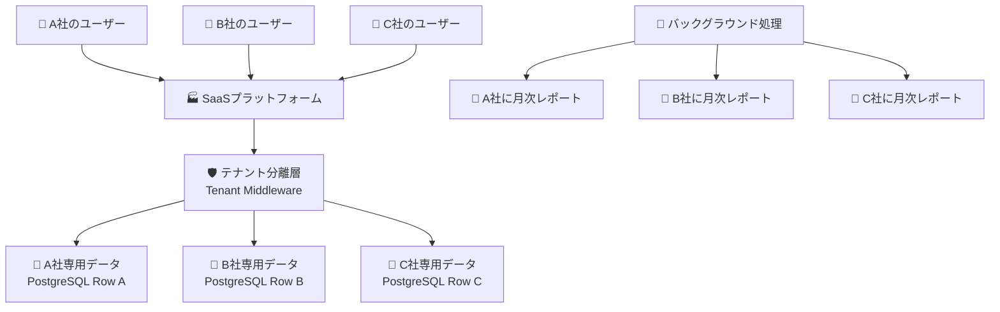

# Chapter 5-2: マルチテナンシーと複雑ビジネスロジック 🏢

---
**📚 目次に戻る**: [📖 学習ガイド]({{ '/introduction/' | relative_url }})  
**⬅️ 前の章**: [Chapter 5-1: 独立APIサーバー基礎]({{ '/chapter05-1.html' | relative_url }})  
**➡️ 次の章**: [Chapter 5-3: 本番運用機能]({{ '/chapter05-3.html' | relative_url }})  
**🏗️ アーキテクチャ**: 独立APIサーバー（FastAPI + マルチテナント）  
**🎯 学習レベル**: 🌱 基礎 | 🚀 応用 | 💪 発展  
**⏱️ 推定学習時間**: 4〜6時間  
**📝 難易度**: 上級（5-1完了・マルチテナント設計知識必要）
---

### 🧭 この章で扱う構成
- 構成: 独立APIサーバー + マルチテナント
- 推奨用途: SaaS/組織管理/複数テナント運用
- 非推奨用途: 単一テナントで十分なケース

## 🎯 この章で学ぶこと（初心者向け）

この章では、Chapter 5-1で構築したSaaSプラットフォームに、**「マンション管理」**のような高度な機能を追加します。

- 🌱 **初心者**: マルチテナント（複数企業の完全分離）の仕組みがわかる
- 🚀 **中級者**: 複雑なビジネスロジックをサービス層で整理する方法がわかる  
- 💪 **上級者**: バックグラウンド処理とタスクキューによる高度なシステム設計が理解できる

## 💡 まずは身近な例から：「高級マンションの管理システム」

想像してみてください。あなたが**高級マンションの管理会社**のシステムを作るとします：

```
🏢 マンション管理システム「Premium Tower」
├── 🏠 A棟：各部屋は完全に独立（他の部屋は見えない）
├── 🏠 B棟：各部屋は完全に独立（他の部屋は見えない）
├── 🏠 C棟：各部屋は完全に独立（他の部屋は見えない）
├── 👨‍💼 管理人：全体の状況を把握・緊急対応
├── 🔧 メンテナンス：定期点検・修理の自動スケジュール
└── 📊 オーナー報告：月次レポート・収支分析の自動生成
```

### 🤔 なぜマルチテナント設計が必要？

1つのシステムで複数の企業（テナント）を安全に分離する必要があります：

| 要求 | 通常のシステム | マルチテナントシステム | なぜ重要？ |
|:-----|:-------------|:-------------------|:--------|
| 🔐 **データ分離** | 1社専用 | 完全に分離された複数社 | A社のデータがB社に見えたら大問題 |
| 💰 **コスト効率** | 会社ごとにサーバー | 1つのサーバーで複数社 | インフラ費用を大幅削減 |
| 🔧 **カスタマイズ** | 1社の要求のみ | 企業ごとに設定可能 | A社は英語、B社は日本語など |
| 📊 **管理効率** | 個別メンテナンス | 一括メンテナンス | システム更新が1回で全社に適用 |

### 🎉 マルチテナント設計なら...



**メリット**：
- 🏢 **完全分離**: 企業ごとのデータが混ざることは絶対にない
- 💰 **コスト削減**: 1つのサーバーで複数企業をサポート
- 🔧 **柔軟設定**: 企業ごとに言語・機能・権限を個別設定
- 📈 **自動化**: バックグラウンドで定期処理・通知・レポート生成

---

## 🔍 実際のコードを見てみよう！

### 📄 Step 1: テナント分離の仕組み（Tenant Middleware）

まず、リクエストが来た時に「どの企業のデータか」を自動判定する仕組みを見てみましょう：

```python
# app/api/middleware/tenant.py（重要部分を抜粋）

from fastapi import Request, HTTPException
from starlette.middleware.base import BaseHTTPMiddleware

class TenantMiddleware(BaseHTTPMiddleware):
    """テナント分離ミドルウェア"""
    
    async def dispatch(self, request: Request, call_next):
        # 1. リクエストから企業IDを抽出
        org_id = self._extract_organization_id(request)
        
        if org_id:
            # 2. その企業が実在するかチェック
            organization = await self._verify_organization(org_id)
            
            if not organization:
                raise HTTPException(
                    status_code=404,
                    detail="指定された企業が見つかりません"
                )
            
            # 3. リクエストに企業情報を添付
            request.state.organization = organization
            request.state.organization_id = org_id
        
        # 4. 次の処理に進む
        response = await call_next(request)
        return response
    
    def _extract_organization_id(self, request: Request):
        """リクエストから企業IDを抽出"""
        # パターン1: HTTPヘッダーから
        org_header = request.headers.get("X-Organization-ID")
        if org_header:
            return int(org_header)
        
        # パターン2: URLパスから（例: /api/v1/orgs/123/projects）
        path_parts = request.url.path.split("/")
        if "orgs" in path_parts:
            org_index = path_parts.index("orgs")
            if len(path_parts) > org_index + 1:
                return int(path_parts[org_index + 1])
        
        return None
```

**🔰 初心者向け解説**：

| 概念 | 何をしているか | 身近な例 |
|:-----|:-------------|:---------|
| `TenantMiddleware` | すべてのリクエストで「どの企業か」を自動判定 | マンションの入口で「どの部屋の人か」を確認 |
| `X-Organization-ID` | HTTPヘッダーで企業IDを指定 | 「私はA社の田中です」という名札 |
| `request.state.organization` | 後続処理で使える企業情報を保存 | 「この人はA社の人」というメモを貼り付け |
| `path.split("/")`| URLから企業IDを抜き出し | 住所「東京都-A区-123番地」から123を抜き出し |

---

## マルチテナント設計実装

### テナント分離ミドルウェア

```python
# app/api/middleware/tenant.py
from fastapi import Request, HTTPException, status
from starlette.middleware.base import BaseHTTPMiddleware
from sqlalchemy.orm import Session
from typing import Optional

from app.core.database import SessionLocal
from app.models.organization import Organization
from app.models.user import User, user_organization_association

class TenantMiddleware(BaseHTTPMiddleware):
    """テナント分離ミドルウェア"""
    
    async def dispatch(self, request: Request, call_next):
        # 組織IDの抽出（ヘッダーまたはパス）
        org_id = self._extract_organization_id(request)
        
        if org_id:
            # 組織の存在確認
            db = SessionLocal()
            try:
                organization = db.query(Organization).filter(
                    Organization.id == org_id,
                    Organization.is_active == True
                ).first()
                
                if not organization:
                    raise HTTPException(
                        status_code=status.HTTP_404_NOT_FOUND,
                        detail="Organization not found"
                    )
                
                # リクエストに組織情報を添付
                request.state.organization = organization
                request.state.organization_id = org_id
                
            finally:
                db.close()
        
        response = await call_next(request)
        return response
    
    def _extract_organization_id(self, request: Request) -> Optional[int]:
        """リクエストから組織IDを抽出"""
        # 1. ヘッダーから取得
        org_header = request.headers.get("X-Organization-ID")
        if org_header:
            try:
                return int(org_header)
            except ValueError:
                pass
        
        # 2. パスパラメータから取得
        path_parts = request.url.path.split("/")
        if len(path_parts) > 3 and path_parts[1] == "api" and path_parts[2] == "v1":
            if path_parts[3] == "orgs" and len(path_parts) > 4:
                try:
                    return int(path_parts[4])
                except ValueError:
                    pass
        
        return None

def get_current_organization(request: Request) -> Optional[Organization]:
    """現在の組織取得"""
    return getattr(request.state, "organization", None)

def require_organization(request: Request) -> Organization:
    """組織必須チェック"""
    organization = request.state.organization
    if not organization:
        raise HTTPException(
            status_code=status.HTTP_400_BAD_REQUEST,
            detail="Organization context required"
        )
    return organization
```

### テナント分離サービス

```python
# app/services/tenant_service.py
from typing import List, Optional, Dict, Any
from sqlalchemy.orm import Session
from sqlalchemy import and_, or_, func
from fastapi import HTTPException, status

from app.models.organization import Organization, OrganizationInvitation, OrganizationRole
from app.models.user import User, user_organization_association
from app.schemas.organization import OrganizationCreate, OrganizationUpdate
from app.core.security import get_password_hash
import secrets
import string

class TenantService:
    def __init__(self, db: Session):
        self.db = db
    
    def create_organization(
        self, 
        org_create: OrganizationCreate, 
        creator: User
    ) -> Organization:
        """組織作成"""
        # スラッグ重複チェック
        if self._is_slug_taken(org_create.slug):
            raise HTTPException(
                status_code=status.HTTP_400_BAD_REQUEST,
                detail="Organization slug already taken"
            )
        
        # 組織作成
        organization = Organization(
            name=org_create.name,
            slug=org_create.slug,
            description=org_create.description,
            created_by=creator.id
        )
        
        self.db.add(organization)
        self.db.flush()  # IDを取得するためflush
        
        # 作成者をオーナーとして追加
        self._add_user_to_organization(
            user=creator,
            organization=organization,
            role="owner"
        )
        
        # デフォルトロール作成
        self._create_default_roles(organization)
        
        self.db.commit()
        self.db.refresh(organization)
        
        return organization
    
    def invite_user(
        self, 
        organization: Organization,
        email: str,
        role: str,
        inviter: User
    ) -> OrganizationInvitation:
        """ユーザー招待"""
        # 既存招待チェック
        existing_invitation = self.db.query(OrganizationInvitation).filter(
            and_(
                OrganizationInvitation.organization_id == organization.id,
                OrganizationInvitation.email == email,
                OrganizationInvitation.status == "pending"
            )
        ).first()
        
        if existing_invitation:
            raise HTTPException(
                status_code=status.HTTP_400_BAD_REQUEST,
                detail="User already invited"
            )
        
        # 既存メンバーチェック
        existing_member = self.db.query(User).join(
            user_organization_association
        ).filter(
            and_(
                User.email == email,
                user_organization_association.c.organization_id == organization.id,
                user_organization_association.c.is_active == True
            )
        ).first()
        
        if existing_member:
            raise HTTPException(
                status_code=status.HTTP_400_BAD_REQUEST,
                detail="User is already a member"
            )
        
        # ユーザー数制限チェック
        current_member_count = self._get_active_member_count(organization)
        if current_member_count >= organization.max_users:
            raise HTTPException(
                status_code=status.HTTP_400_BAD_REQUEST,
                detail="Organization has reached maximum user limit"
            )
        
        # 招待作成
        token = self._generate_invitation_token()
        invitation = OrganizationInvitation(
            organization_id=organization.id,
            email=email,
            role=role,
            token_hash=get_password_hash(token),
            expires_at=func.now() + func.interval("7 days"),
            created_by=inviter.id
        )
        
        self.db.add(invitation)
        self.db.commit()
        
        # 招待メール送信（実装省略）
        # self._send_invitation_email(email, token, organization, inviter)
        
        return invitation
    
    def accept_invitation(self, token: str, user: User) -> Organization:
        """招待受諾"""
        invitation = self.db.query(OrganizationInvitation).filter(
            and_(
                OrganizationInvitation.token_hash == get_password_hash(token),
                OrganizationInvitation.status == "pending",
                OrganizationInvitation.expires_at > func.now()
            )
        ).first()
        
        if not invitation:
            raise HTTPException(
                status_code=status.HTTP_400_BAD_REQUEST,
                detail="Invalid or expired invitation"
            )
        
        if invitation.email != user.email:
            raise HTTPException(
                status_code=status.HTTP_400_BAD_REQUEST,
                detail="Invitation email does not match user email"
            )
        
        organization = self.db.query(Organization).filter(
            Organization.id == invitation.organization_id
        ).first()
        
        if not organization:
            raise HTTPException(
                status_code=status.HTTP_404_NOT_FOUND,
                detail="Organization not found"
            )
        
        # ユーザーを組織に追加
        self._add_user_to_organization(user, organization, invitation.role)
        
        # 招待を受諾済みに更新
        invitation.status = "accepted"
        invitation.accepted_at = func.now()
        invitation.accepted_by = user.id
        
        self.db.commit()
        
        return organization
    
    def get_user_organizations(self, user: User) -> List[Organization]:
        """ユーザーの所属組織一覧"""
        return self.db.query(Organization).join(
            user_organization_association
        ).filter(
            and_(
                user_organization_association.c.user_id == user.id,
                user_organization_association.c.is_active == True,
                Organization.is_active == True
            )
        ).all()
    
    def get_organization_members(self, organization: Organization) -> List[Dict[str, Any]]:
        """組織メンバー一覧"""
        members = self.db.query(
            User,
            user_organization_association.c.role,
            user_organization_association.c.joined_at
        ).join(
            user_organization_association
        ).filter(
            and_(
                user_organization_association.c.organization_id == organization.id,
                user_organization_association.c.is_active == True
            )
        ).all()
        
        return [
            {
                "user": member[0],
                "role": member[1],
                "joined_at": member[2]
            }
            for member in members
        ]
    
    def update_member_role(
        self, 
        organization: Organization,
        user_id: int,
        new_role: str,
        updater: User
    ) -> bool:
        """メンバーロール変更"""
        # 権限チェック
        updater_role = self._get_user_role_in_organization(updater, organization)
        if updater_role not in ["owner", "admin"]:
            raise HTTPException(
                status_code=status.HTTP_403_FORBIDDEN,
                detail="Insufficient permissions"
            )
        
        # 自分自身のオーナー権限は変更不可
        if user_id == updater.id and updater_role == "owner":
            raise HTTPException(
                status_code=status.HTTP_400_BAD_REQUEST,
                detail="Cannot change your own owner role"
            )
        
        # ロール更新
        result = self.db.execute(
            user_organization_association.update().where(
                and_(
                    user_organization_association.c.user_id == user_id,
                    user_organization_association.c.organization_id == organization.id
                )
            ).values(role=new_role)
        )
        
        self.db.commit()
        return result.rowcount > 0
    
    def remove_member(
        self, 
        organization: Organization,
        user_id: int,
        remover: User
    ) -> bool:
        """メンバー除名"""
        # 権限チェック
        remover_role = self._get_user_role_in_organization(remover, organization)
        if remover_role not in ["owner", "admin"]:
            raise HTTPException(
                status_code=status.HTTP_403_FORBIDDEN,
                detail="Insufficient permissions"
            )
        
        # オーナーは除名不可
        target_role = self._get_user_role_in_organization_by_id(user_id, organization)
        if target_role == "owner":
            raise HTTPException(
                status_code=status.HTTP_400_BAD_REQUEST,
                detail="Cannot remove organization owner"
            )
        
        # メンバーシップを非アクティブに
        result = self.db.execute(
            user_organization_association.update().where(
                and_(
                    user_organization_association.c.user_id == user_id,
                    user_organization_association.c.organization_id == organization.id
                )
            ).values(is_active=False)
        )
        
        self.db.commit()
        return result.rowcount > 0
    
    def _is_slug_taken(self, slug: str) -> bool:
        """スラッグ重複チェック"""
        return self.db.query(Organization).filter(
            Organization.slug == slug
        ).first() is not None
    
    def _add_user_to_organization(
        self, 
        user: User, 
        organization: Organization, 
        role: str
    ):
        """ユーザーを組織に追加"""
        association = user_organization_association.insert().values(
            user_id=user.id,
            organization_id=organization.id,
            role=role,
            is_active=True,
            created_by=user.id
        )
        self.db.execute(association)
    
    def _create_default_roles(self, organization: Organization):
        """デフォルトロール作成"""
        default_roles = [
            {
                "name": "owner",
                "display_name": "Owner",
                "description": "Full access to organization",
                "permissions": ["*"],
                "is_system_role": True
            },
            {
                "name": "admin",
                "display_name": "Administrator", 
                "description": "Administrative access",
                "permissions": ["manage_users", "manage_projects", "view_analytics"],
                "is_system_role": True
            },
            {
                "name": "member",
                "display_name": "Member",
                "description": "Standard member access",
                "permissions": ["create_projects", "manage_own_projects"],
                "is_system_role": True
            },
            {
                "name": "viewer",
                "display_name": "Viewer",
                "description": "Read-only access",
                "permissions": ["view_projects"],
                "is_system_role": True
            }
        ]
        
        for role_data in default_roles:
            role = OrganizationRole(
                organization_id=organization.id,
                **role_data
            )
            self.db.add(role)
    
    def _get_active_member_count(self, organization: Organization) -> int:
        """アクティブメンバー数取得"""
        return self.db.query(func.count(user_organization_association.c.user_id)).filter(
            and_(
                user_organization_association.c.organization_id == organization.id,
                user_organization_association.c.is_active == True
            )
        ).scalar()
    
    def _get_user_role_in_organization(self, user: User, organization: Organization) -> Optional[str]:
        """組織内でのユーザーロール取得"""
        result = self.db.query(user_organization_association.c.role).filter(
            and_(
                user_organization_association.c.user_id == user.id,
                user_organization_association.c.organization_id == organization.id,
                user_organization_association.c.is_active == True
            )
        ).first()
        
        return result[0] if result else None
    
    def _get_user_role_in_organization_by_id(self, user_id: int, organization: Organization) -> Optional[str]:
        """ユーザーIDで組織内ロール取得"""
        result = self.db.query(user_organization_association.c.role).filter(
            and_(
                user_organization_association.c.user_id == user_id,
                user_organization_association.c.organization_id == organization.id,
                user_organization_association.c.is_active == True
            )
        ).first()
        
        return result[0] if result else None
    
    def _generate_invitation_token(self) -> str:
        """招待トークン生成"""
        return ''.join(secrets.choice(string.ascii_letters + string.digits) for _ in range(32))
```

---

## 複雑ビジネスロジック実装

### プロジェクト管理サービス

```python
# app/services/project_service.py
from typing import List, Optional, Dict, Any
from sqlalchemy.orm import Session
from sqlalchemy import and_, or_, func, case
from fastapi import HTTPException, status
from datetime import datetime, timedelta

from app.models.project import Project, Task, ProjectMember, TaskStatus, ProjectStatus
from app.models.organization import Organization
from app.models.user import User
from app.schemas.project import ProjectCreate, ProjectUpdate, TaskCreate, TaskUpdate
from app.utils.permissions import check_permission, Permission

class ProjectService:
    def __init__(self, db: Session):
        self.db = db
    
    def create_project(
        self, 
        organization: Organization,
        project_create: ProjectCreate,
        creator: User
    ) -> Project:
        """プロジェクト作成"""
        # 権限チェック
        if not check_permission(creator, organization, Permission.CREATE_PROJECT):
            raise HTTPException(
                status_code=status.HTTP_403_FORBIDDEN,
                detail="Insufficient permissions to create project"
            )
        
        # プロジェクト数制限チェック
        current_project_count = self._get_active_project_count(organization)
        if current_project_count >= organization.max_projects:
            raise HTTPException(
                status_code=status.HTTP_400_BAD_REQUEST,
                detail="Organization has reached maximum project limit"
            )
        
        # スラッグ重複チェック
        if self._is_project_slug_taken(organization, project_create.slug):
            raise HTTPException(
                status_code=status.HTTP_400_BAD_REQUEST,
                detail="Project slug already taken in this organization"
            )
        
        # プロジェクト作成
        project = Project(
            organization_id=organization.id,
            name=project_create.name,
            slug=project_create.slug,
            description=project_create.description,
            start_date=project_create.start_date,
            end_date=project_create.end_date,
            is_public=project_create.is_public,
            color=project_create.color,
            tags=project_create.tags,
            created_by=creator.id
        )
        
        self.db.add(project)
        self.db.flush()
        
        # 作成者をプロジェクトオーナーとして追加
        self._add_project_member(project, creator, "owner")
        
        self.db.commit()
        self.db.refresh(project)
        
        return project
    
    def get_project_analytics(self, project: Project) -> Dict[str, Any]:
        """プロジェクト分析データ取得"""
        # タスク統計
        task_stats = self.db.query(
            func.count(Task.id).label('total_tasks'),
            func.count(case([(Task.status == TaskStatus.COMPLETED, 1)])).label('completed_tasks'),
            func.count(case([(Task.status == TaskStatus.IN_PROGRESS, 1)])).label('in_progress_tasks'),
            func.count(case([(Task.status == TaskStatus.TODO, 1)])).label('todo_tasks'),
            func.avg(Task.progress).label('avg_progress')
        ).filter(Task.project_id == project.id).first()
        
        # 期限超過タスク
        overdue_tasks = self.db.query(func.count(Task.id)).filter(
            and_(
                Task.project_id == project.id,
                Task.due_date < datetime.utcnow(),
                Task.status != TaskStatus.COMPLETED
            )
        ).scalar()
        
        # 今週のアクティビティ
        week_ago = datetime.utcnow() - timedelta(days=7)
        weekly_activity = self.db.query(
            func.count(case([(Task.created_at >= week_ago, 1)])).label('tasks_created'),
            func.count(case([(Task.completed_at >= week_ago, 1)])).label('tasks_completed')
        ).filter(Task.project_id == project.id).first()
        
        # 担当者別統計
        assignee_stats = self.db.query(
            User.full_name,
            func.count(Task.id).label('assigned_tasks'),
            func.count(case([(Task.status == TaskStatus.COMPLETED, 1)])).label('completed_tasks'),
            func.avg(Task.progress).label('avg_progress')
        ).join(Task, Task.assignee_id == User.id).filter(
            Task.project_id == project.id
        ).group_by(User.id, User.full_name).all()
        
        # 進捗計算
        completion_rate = 0
        if task_stats.total_tasks > 0:
            completion_rate = (task_stats.completed_tasks / task_stats.total_tasks) * 100
        
        return {
            "task_statistics": {
                "total": task_stats.total_tasks or 0,
                "completed": task_stats.completed_tasks or 0,
                "in_progress": task_stats.in_progress_tasks or 0,
                "todo": task_stats.todo_tasks or 0,
                "overdue": overdue_tasks or 0,
                "completion_rate": completion_rate,
                "average_progress": float(task_stats.avg_progress or 0)
            },
            "weekly_activity": {
                "tasks_created": weekly_activity.tasks_created or 0,
                "tasks_completed": weekly_activity.tasks_completed or 0
            },
            "assignee_statistics": [
                {
                    "assignee_name": stat.full_name,
                    "assigned_tasks": stat.assigned_tasks,
                    "completed_tasks": stat.completed_tasks,
                    "completion_rate": (stat.completed_tasks / stat.assigned_tasks * 100) if stat.assigned_tasks > 0 else 0,
                    "average_progress": float(stat.avg_progress or 0)
                }
                for stat in assignee_stats
            ],
            "health_score": self._calculate_project_health_score(project, task_stats, overdue_tasks)
        }
    
    def create_task(
        self, 
        project: Project,
        task_create: TaskCreate,
        creator: User
    ) -> Task:
        """タスク作成"""
        # 権限チェック
        if not self._can_manage_project_tasks(creator, project):
            raise HTTPException(
                status_code=status.HTTP_403_FORBIDDEN,
                detail="Insufficient permissions to create task"
            )
        
        # 担当者が存在し、プロジェクトメンバーかチェック
        if task_create.assignee_id:
            if not self._is_project_member(task_create.assignee_id, project):
                raise HTTPException(
                    status_code=status.HTTP_400_BAD_REQUEST,
                    detail="Assignee must be a project member"
                )
        
        # 親タスクが存在し、同じプロジェクトかチェック
        if task_create.parent_task_id:
            parent_task = self.db.query(Task).filter(
                and_(
                    Task.id == task_create.parent_task_id,
                    Task.project_id == project.id
                )
            ).first()
            
            if not parent_task:
                raise HTTPException(
                    status_code=status.HTTP_400_BAD_REQUEST,
                    detail="Parent task not found in this project"
                )
        
        # タスク作成
        task = Task(
            project_id=project.id,
            title=task_create.title,
            description=task_create.description,
            priority=task_create.priority,
            assignee_id=task_create.assignee_id,
            due_date=task_create.due_date,
            estimated_hours=task_create.estimated_hours,
            parent_task_id=task_create.parent_task_id,
            tags=task_create.tags,
            custom_fields=task_create.custom_fields,
            created_by=creator.id
        )
        
        self.db.add(task)
        self.db.commit()
        self.db.refresh(task)
        
        # 担当者に通知（実装省略）
        if task.assignee_id:
            self._send_task_assignment_notification(task)
        
        return task
    
    def update_task_status(
        self, 
        task: Task,
        new_status: TaskStatus,
        updater: User
    ) -> Task:
        """タスクステータス更新"""
        # 権限チェック
        if not self._can_update_task(updater, task):
            raise HTTPException(
                status_code=status.HTTP_403_FORBIDDEN,
                detail="Insufficient permissions to update task"
            )
        
        old_status = task.status
        task.status = new_status
        task.updated_by = updater.id
        
        # 完了時の処理
        if new_status == TaskStatus.COMPLETED and old_status != TaskStatus.COMPLETED:
            task.completed_at = datetime.utcnow()
            task.progress = 100
            
            # 子タスクが全て完了しているかチェック
            self._check_and_complete_parent_task(task)
        
        # 完了解除時の処理
        elif old_status == TaskStatus.COMPLETED and new_status != TaskStatus.COMPLETED:
            task.completed_at = None
            if task.progress == 100:
                task.progress = 90  # 少し戻す
        
        self.db.commit()
        self.db.refresh(task)
        
        # ステータス変更通知
        self._send_task_status_notification(task, old_status, new_status)
        
        return task
    
    def assign_task(
        self, 
        task: Task,
        assignee_id: Optional[int],
        assigner: User
    ) -> Task:
        """タスク担当者変更"""
        # 権限チェック
        if not self._can_manage_project_tasks(assigner, task.project):
            raise HTTPException(
                status_code=status.HTTP_403_FORBIDDEN,
                detail="Insufficient permissions to assign task"
            )
        
        # 担当者チェック
        if assignee_id and not self._is_project_member(assignee_id, task.project):
            raise HTTPException(
                status_code=status.HTTP_400_BAD_REQUEST,
                detail="Assignee must be a project member"
            )
        
        old_assignee_id = task.assignee_id
        task.assignee_id = assignee_id
        task.updated_by = assigner.id
        
        self.db.commit()
        
        # 担当変更通知
        self._send_task_reassignment_notification(task, old_assignee_id, assignee_id)
        
        return task
    
    def _get_active_project_count(self, organization: Organization) -> int:
        """アクティブプロジェクト数取得"""
        return self.db.query(func.count(Project.id)).filter(
            and_(
                Project.organization_id == organization.id,
                Project.status != ProjectStatus.ARCHIVED
            )
        ).scalar()
    
    def _is_project_slug_taken(self, organization: Organization, slug: str) -> bool:
        """プロジェクトスラッグ重複チェック"""
        return self.db.query(Project).filter(
            and_(
                Project.organization_id == organization.id,
                Project.slug == slug
            )
        ).first() is not None
    
    def _add_project_member(self, project: Project, user: User, role: str):
        """プロジェクトメンバー追加"""
        member = ProjectMember(
            project_id=project.id,
            user_id=user.id,
            role=role,
            created_by=user.id
        )
        self.db.add(member)
    
    def _can_manage_project_tasks(self, user: User, project: Project) -> bool:
        """プロジェクトタスク管理権限チェック"""
        member = self.db.query(ProjectMember).filter(
            and_(
                ProjectMember.project_id == project.id,
                ProjectMember.user_id == user.id,
                ProjectMember.is_active == True
            )
        ).first()
        
        return member and member.role in ["owner", "admin", "member"]
    
    def _can_update_task(self, user: User, task: Task) -> bool:
        """タスク更新権限チェック"""
        # 担当者または作成者
        if task.assignee_id == user.id or task.created_by == user.id:
            return True
        
        # プロジェクト管理権限
        return self._can_manage_project_tasks(user, task.project)
    
    def _is_project_member(self, user_id: int, project: Project) -> bool:
        """プロジェクトメンバーチェック"""
        return self.db.query(ProjectMember).filter(
            and_(
                ProjectMember.project_id == project.id,
                ProjectMember.user_id == user_id,
                ProjectMember.is_active == True
            )
        ).first() is not None
    
    def _check_and_complete_parent_task(self, task: Task):
        """親タスクの完了チェック"""
        if not task.parent_task_id:
            return
        
        parent_task = self.db.query(Task).filter(Task.id == task.parent_task_id).first()
        if not parent_task:
            return
        
        # 子タスクの完了状況確認
        incomplete_children = self.db.query(func.count(Task.id)).filter(
            and_(
                Task.parent_task_id == parent_task.id,
                Task.status != TaskStatus.COMPLETED
            )
        ).scalar()
        
        # 全ての子タスクが完了していれば親タスクも完了
        if incomplete_children == 0:
            parent_task.status = TaskStatus.COMPLETED
            parent_task.completed_at = datetime.utcnow()
            parent_task.progress = 100
    
    def _calculate_project_health_score(
        self, 
        project: Project, 
        task_stats, 
        overdue_count: int
    ) -> int:
        """プロジェクト健全性スコア計算"""
        score = 100
        
        # 期限超過による減点
        if task_stats.total_tasks > 0:
            overdue_ratio = overdue_count / task_stats.total_tasks
            score -= int(overdue_ratio * 30)  # 最大30点減点
        
        # 進捗遅延による減点
        if project.end_date and project.end_date < datetime.utcnow():
            score -= 20  # プロジェクト期限超過で20点減点
        
        # 完了率による加点
        if task_stats.total_tasks > 0:
            completion_rate = task_stats.completed_tasks / task_stats.total_tasks
            if completion_rate > 0.8:
                score += 10  # 完了率80%以上で10点加点
        
        return max(0, min(100, score))
    
    def _send_task_assignment_notification(self, task: Task):
        """タスク割り当て通知"""
        # 実装省略
        pass
    
    def _send_task_status_notification(self, task: Task, old_status: TaskStatus, new_status: TaskStatus):
        """タスクステータス変更通知"""
        # 実装省略
        pass
    
    def _send_task_reassignment_notification(
        self, 
        task: Task, 
        old_assignee_id: Optional[int], 
        new_assignee_id: Optional[int]
    ):
        """タスク担当者変更通知"""
        # 実装省略
        pass
```

---

## バックグラウンド処理とタスクキュー

### Celeryタスク設定

```python
# app/core/celery_app.py
from celery import Celery
from app.core.config import settings

celery_app = Celery(
    "saas_platform",
    broker=settings.REDIS_URL,
    backend=settings.REDIS_URL,
    include=["app.tasks"]
)

# 設定
celery_app.conf.update(
    task_serializer="json",
    accept_content=["json"],
    result_serializer="json",
    timezone="UTC",
    enable_utc=True,
    task_track_started=True,
    task_time_limit=30 * 60,  # 30分
    task_soft_time_limit=25 * 60,  # 25分
    worker_prefetch_multiplier=1,
    task_routes={
        "app.tasks.email.*": {"queue": "email"},
        "app.tasks.analytics.*": {"queue": "analytics"},
        "app.tasks.maintenance.*": {"queue": "maintenance"},
    }
)
```

### バックグラウンドタスク

```python
# app/tasks/email_tasks.py
from celery import current_task
from typing import List, Dict, Any
import smtplib
from email.mime.text import MIMEText
from email.mime.multipart import MIMEMultipart

from app.core.celery_app import celery_app
from app.core.config import settings
from app.core.database import SessionLocal
from app.models.user import User
from app.models.organization import Organization

@celery_app.task(bind=True, max_retries=3)
def send_email(self, to_email: str, subject: str, body: str, is_html: bool = False):
    """メール送信タスク"""
    try:
        msg = MIMEMultipart()
        msg['From'] = settings.EMAIL_FROM
        msg['To'] = to_email
        msg['Subject'] = subject
        
        msg.attach(MIMEText(body, 'html' if is_html else 'plain'))
        
        # SMTP送信（SendGridの場合）
        server = smtplib.SMTP('smtp.sendgrid.net', 587)
        server.starttls()
        server.login('apikey', settings.SENDGRID_API_KEY)
        server.send_message(msg)
        server.quit()
        
        return {"status": "sent", "email": to_email}
        
    except Exception as exc:
        # リトライ処理
        if self.request.retries < self.max_retries:
            raise self.retry(countdown=60 * (2 ** self.request.retries), exc=exc)
        
        # 最終的に失敗
        return {"status": "failed", "email": to_email, "error": str(exc)}

@celery_app.task
def send_bulk_notification(user_ids: List[int], template: str, context: Dict[str, Any]):
    """一括通知送信"""
    db = SessionLocal()
    try:
        users = db.query(User).filter(
            User.id.in_(user_ids),
            User.is_active == True,
            User.email_notifications == True
        ).all()
        
        for user in users:
            # テンプレートレンダリング
            subject, body = render_email_template(template, {**context, "user": user})
            
            # 非同期でメール送信
            send_email.delay(user.email, subject, body, is_html=True)
        
        return {"sent_count": len(users)}
        
    finally:
        db.close()

@celery_app.task
def send_weekly_digest():
    """週次ダイジェスト送信"""
    db = SessionLocal()
    try:
        # アクティブユーザー取得
        users = db.query(User).filter(
            User.is_active == True,
            User.email_notifications == True
        ).all()
        
        for user in users:
            # ユーザーの組織・プロジェクト活動をまとめる
            digest_data = generate_user_digest(db, user)
            
            if digest_data['has_activity']:
                subject, body = render_email_template('weekly_digest', {
                    "user": user,
                    "digest": digest_data
                })
                
                send_email.delay(user.email, subject, body, is_html=True)
        
    finally:
        db.close()

def render_email_template(template_name: str, context: Dict[str, Any]) -> tuple[str, str]:
    """メールテンプレートレンダリング"""
    # Jinja2テンプレートエンジンを使用
    # 実装簡略化のため省略
    return f"Subject: {template_name}", f"Body with context: {context}"

def generate_user_digest(db, user: User) -> Dict[str, Any]:
    """ユーザーダイジェスト生成"""
    # 過去1週間のアクティビティを集計
    # 実装簡略化のため省略
    return {"has_activity": True, "summary": "Weekly activity summary"}
```

### 分析・レポートタスク

```python
# app/tasks/analytics_tasks.py
from datetime import datetime, timedelta
from sqlalchemy import func, and_
from typing import Dict, Any

from app.core.celery_app import celery_app
from app.core.database import SessionLocal
from app.models.organization import Organization
from app.models.project import Project, Task
from app.models.user import User, user_organization_association

@celery_app.task
def generate_organization_analytics(organization_id: int, period: str = "monthly"):
    """組織分析レポート生成"""
    db = SessionLocal()
    try:
        organization = db.query(Organization).filter(Organization.id == organization_id).first()
        if not organization:
            return {"error": "Organization not found"}
        
        # 期間設定
        if period == "weekly":
            start_date = datetime.utcnow() - timedelta(days=7)
        elif period == "monthly":
            start_date = datetime.utcnow() - timedelta(days=30)
        else:
            start_date = datetime.utcnow() - timedelta(days=365)
        
        # 各種統計を並行計算
        user_stats = calculate_user_statistics(db, organization, start_date)
        project_stats = calculate_project_statistics(db, organization, start_date)
        productivity_stats = calculate_productivity_statistics(db, organization, start_date)
        
        # レポート生成
        report = {
            "organization_id": organization_id,
            "period": period,
            "generated_at": datetime.utcnow().isoformat(),
            "user_statistics": user_stats,
            "project_statistics": project_stats,
            "productivity_statistics": productivity_stats,
            "recommendations": generate_recommendations(user_stats, project_stats, productivity_stats)
        }
        
        # レポート保存（Redis等に一時保存）
        save_report(organization_id, period, report)
        
        return {"status": "completed", "report_id": f"{organization_id}_{period}_{datetime.utcnow().strftime('%Y%m%d')}"}
        
    finally:
        db.close()

@celery_app.task
def cleanup_expired_data():
    """期限切れデータクリーンアップ"""
    db = SessionLocal()
    try:
        cleanup_results = {}
        
        # 期限切れ招待削除
        expired_invitations = db.query(OrganizationInvitation).filter(
            and_(
                OrganizationInvitation.expires_at < datetime.utcnow(),
                OrganizationInvitation.status == "pending"
            )
        ).count()
        
        db.query(OrganizationInvitation).filter(
            and_(
                OrganizationInvitation.expires_at < datetime.utcnow(),
                OrganizationInvitation.status == "pending"
            )
        ).update({"status": "expired"})
        
        cleanup_results["expired_invitations"] = expired_invitations
        
        # 古い監査ログ削除（90日以上前）
        audit_cutoff = datetime.utcnow() - timedelta(days=90)
        old_audit_logs = db.query(func.count(AuditLog.id)).filter(
            AuditLog.created_at < audit_cutoff
        ).scalar()
        
        db.query(AuditLog).filter(AuditLog.created_at < audit_cutoff).delete()
        
        cleanup_results["deleted_audit_logs"] = old_audit_logs
        
        db.commit()
        
        return cleanup_results
        
    finally:
        db.close()

def calculate_user_statistics(db, organization: Organization, start_date: datetime) -> Dict[str, Any]:
    """ユーザー統計計算"""
    total_users = db.query(func.count(user_organization_association.c.user_id)).filter(
        and_(
            user_organization_association.c.organization_id == organization.id,
            user_organization_association.c.is_active == True
        )
    ).scalar()
    
    active_users = db.query(func.count(User.id.distinct())).join(
        Task, Task.created_by == User.id
    ).join(
        Project, Project.id == Task.project_id
    ).filter(
        and_(
            Project.organization_id == organization.id,
            Task.created_at >= start_date
        )
    ).scalar()
    
    return {
        "total_users": total_users,
        "active_users": active_users,
        "engagement_rate": (active_users / total_users * 100) if total_users > 0 else 0
    }

def calculate_project_statistics(db, organization: Organization, start_date: datetime) -> Dict[str, Any]:
    """プロジェクト統計計算"""
    # 実装省略
    return {"total_projects": 0, "active_projects": 0}

def calculate_productivity_statistics(db, organization: Organization, start_date: datetime) -> Dict[str, Any]:
    """生産性統計計算"""
    # 実装省略
    return {"tasks_completed": 0, "average_completion_time": 0}

def generate_recommendations(user_stats: Dict, project_stats: Dict, productivity_stats: Dict) -> List[str]:
    """改善提案生成"""
    recommendations = []
    
    if user_stats["engagement_rate"] < 50:
        recommendations.append("ユーザーエンゲージメントが低下しています。定期的なチェックインを実施してください。")
    
    # その他の提案ロジック
    
    return recommendations

def save_report(organization_id: int, period: str, report: Dict[str, Any]):
    """レポート保存"""
    # Redis等にレポートを保存
    # 実装省略
    pass
```

### 📄 Step 3: 実際のプロジェクト管理ビジネスロジック解説

先ほどの基盤をベースに、より詳細なプロジェクト管理機能を見てみましょう：

```python
# src/chapter05-saas-platform/backend/app/services/project_service.py（詳細実装）

class ProjectService:
    def __init__(self, db: Session):
        self.db = db
    
    async def calculate_project_health_score(self, project: Project) -> Dict[str, Any]:
        """プロジェクト健全性スコア計算（レストランチェーンの店舗分析的な処理）"""
        
        # 1. タスク完了率計算（仕事の進捗率）
        total_tasks = self.db.query(func.count(Task.id)).filter(
            Task.project_id == project.id
        ).scalar()
        
        completed_tasks = self.db.query(func.count(Task.id)).filter(
            and_(
                Task.project_id == project.id,
                Task.status == TaskStatus.COMPLETED
            )
        ).scalar()
        
        completion_rate = (completed_tasks / total_tasks * 100) if total_tasks > 0 else 0
        
        # 2. 期限遵守率計算（時間通りに仕事が終わっているか）
        overdue_tasks = self.db.query(func.count(Task.id)).filter(
            and_(
                Task.project_id == project.id,
                Task.due_date < datetime.utcnow(),
                Task.status != TaskStatus.COMPLETED
            )
        ).scalar()
        
        on_time_rate = ((total_tasks - overdue_tasks) / total_tasks * 100) if total_tasks > 0 else 100
        
        # 3. チーム生産性計算（スタッフ1人あたりの仕事量）
        member_count = self.db.query(func.count(ProjectMember.id)).filter(
            and_(
                ProjectMember.project_id == project.id,
                ProjectMember.is_active == True
            )
        ).scalar()
        
        tasks_per_member = total_tasks / member_count if member_count > 0 else 0
        
        # 4. 総合健全性スコア計算（重み付け平均）
        health_score = (completion_rate * 0.4 + on_time_rate * 0.4 + min(tasks_per_member * 10, 100) * 0.2)
        
        return {
            "health_score": round(health_score, 1),
            "completion_rate": round(completion_rate, 1), 
            "on_time_rate": round(on_time_rate, 1),
            "tasks_per_member": round(tasks_per_member, 1),
            "total_tasks": total_tasks,
            "completed_tasks": completed_tasks,
            "overdue_tasks": overdue_tasks,
            "active_members": member_count,
            "recommendations": self._generate_recommendations(completion_rate, on_time_rate, tasks_per_member)
        }
    
    def _generate_recommendations(self, completion_rate: float, on_time_rate: float, tasks_per_member: float) -> List[str]:
        """AIによる改善提案生成"""
        recommendations = []
        
        if completion_rate < 50:
            recommendations.append("⚠️ タスク完了率が低下しています。チームの負荷状況を確認してください")
        
        if on_time_rate < 70:
            recommendations.append("⏰ 期限遵守率が低下しています。スケジュール見直しを検討してください")
        
        if tasks_per_member > 10:
            recommendations.append("👥 メンバー1人あたりのタスク数が多すぎます。人員追加を検討してください")
        elif tasks_per_member < 2:
            recommendations.append("📈 リソースに余裕があります。新しいタスクの追加を検討してください")
        
        if not recommendations:
            recommendations.append("✅ プロジェクトは健全に進行しています")
        
        return recommendations
    
    async def get_project_timeline_analysis(self, project: Project) -> Dict[str, Any]:
        """プロジェクト工程分析（ガントチャート的なデータ分析）"""
        
        # 週次の進捗データを取得
        weekly_progress = self.db.query(
            func.date_trunc('week', Task.created_at).label('week'),
            func.count(Task.id).label('tasks_created'),
            func.count(case([(Task.status == TaskStatus.COMPLETED, 1)])).label('tasks_completed')
        ).filter(
            Task.project_id == project.id
        ).group_by(
            func.date_trunc('week', Task.created_at)
        ).order_by('week').all()
        
        # マイルストーン達成状況
        milestone_tasks = self.db.query(Task).filter(
            and_(
                Task.project_id == project.id,
                Task.tags.contains(['milestone'])  # JSONフィールドの検索
            )
        ).all()
        
        milestone_status = []
        for task in milestone_tasks:
            milestone_status.append({
                "name": task.title,
                "due_date": task.due_date.isoformat() if task.due_date else None,
                "status": task.status.value,
                "is_delayed": task.due_date < datetime.utcnow() and task.status != TaskStatus.COMPLETED if task.due_date else False
            })
        
        return {
            "weekly_progress": [
                {
                    "week": progress.week.isoformat(),
                    "tasks_created": progress.tasks_created,
                    "tasks_completed": progress.tasks_completed,
                    "velocity": progress.tasks_completed / progress.tasks_created if progress.tasks_created > 0 else 0
                }
                for progress in weekly_progress
            ],
            "milestone_status": milestone_status,
            "project_velocity": self._calculate_team_velocity(project),
            "estimated_completion": self._estimate_completion_date(project)
        }
    
    def _calculate_team_velocity(self, project: Project) -> float:
        """チーム開発速度計算（過去4週間の平均完了タスク数）"""
        four_weeks_ago = datetime.utcnow() - timedelta(weeks=4)
        
        completed_tasks = self.db.query(func.count(Task.id)).filter(
            and_(
                Task.project_id == project.id,
                Task.status == TaskStatus.COMPLETED,
                Task.completed_at >= four_weeks_ago
            )
        ).scalar()
        
        return completed_tasks / 4  # 週平均
    
    def _estimate_completion_date(self, project: Project) -> Optional[str]:
        """完了予定日推定（残タスク ÷ 開発速度）"""
        remaining_tasks = self.db.query(func.count(Task.id)).filter(
            and_(
                Task.project_id == project.id,
                Task.status != TaskStatus.COMPLETED
            )
        ).scalar()
        
        velocity = self._calculate_team_velocity(project)
        
        if velocity > 0 and remaining_tasks > 0:
            weeks_remaining = remaining_tasks / velocity
            estimated_completion = datetime.utcnow() + timedelta(weeks=weeks_remaining)
            return estimated_completion.isoformat()
        
        return None
```

**🔰 初心者向け解説**：

| 概念 | 何をしているか | 身近な例 |
|:-----|:-------------|:---------| 
| `func.count()` | データベースで件数を数える | レストランで「今日の注文数は何件？」を集計 |
| `completion_rate` | 全体のうち完了した割合を計算 | 宿題10個中8個終了＝80%完了 |
| `overdue_tasks` | 期限を過ぎたタスクの数 | 提出期限を過ぎた宿題の数 |
| `health_score` | 複数の指標を組み合わせた総合評価 | 学校の成績（テスト40%＋宿題40%＋授業態度20%） |
| `team_velocity` | チームが1週間でこなせる仕事量 | 料理人が1時間で作れる料理の数 |
| `estimated_completion` | 現在のペースで完了する予定日 | 「このペースなら来月末に完成」という予測 |

### 📄 Step 4: バックグラウンド処理の詳細実装

長時間かかる処理を、バックグラウンドで実行する仕組みを見てみましょう：

```python
# src/chapter05-saas-platform/backend/app/tasks/project_tasks.py（実装例）

from celery import current_task
from typing import Dict, Any, List
from datetime import datetime, timedelta

from app.core.celery_app import celery_app
from app.core.database import SessionLocal
from app.models.project import Project, Task
from app.models.organization import Organization
from app.services.project_service import ProjectService

@celery_app.task(bind=True, max_retries=3)
def generate_monthly_project_report(self, organization_id: int):
    """月次プロジェクトレポート生成（時間のかかる処理）"""
    
    db = SessionLocal()
    try:
        # 1. 組織の全プロジェクトを取得
        organization = db.query(Organization).filter(Organization.id == organization_id).first()
        if not organization:
            return {"error": "Organization not found"}
        
        projects = db.query(Project).filter(
            Project.organization_id == organization_id
        ).all()
        
        # 2. 各プロジェクトの詳細分析（時間がかかる）
        project_service = ProjectService(db)
        project_reports = []
        
        for project in projects:
            # 進捗更新（Celeryタスクの進捗表示）
            current_task.update_state(
                state='PROGRESS',
                meta={'current': len(project_reports), 'total': len(projects)}
            )
            
            # プロジェクト分析実行
            health_score = await project_service.calculate_project_health_score(project)
            timeline_analysis = await project_service.get_project_timeline_analysis(project)
            
            project_reports.append({
                "project_id": project.id,
                "project_name": project.name,
                "health_score": health_score,
                "timeline_analysis": timeline_analysis
            })
        
        # 3. 組織全体のサマリー作成
        org_summary = {
            "total_projects": len(projects),
            "healthy_projects": len([p for p in project_reports if p["health_score"]["health_score"] > 70]),
            "at_risk_projects": len([p for p in project_reports if p["health_score"]["health_score"] < 50]),
            "average_health_score": sum([p["health_score"]["health_score"] for p in project_reports]) / len(project_reports) if project_reports else 0
        }
        
        # 4. レポートをRedisに保存
        report_data = {
            "organization_id": organization_id,
            "generated_at": datetime.utcnow().isoformat(),
            "summary": org_summary,
            "projects": project_reports
        }
        
        # Redis保存処理（実装例）
        save_report_to_cache(organization_id, "monthly", report_data)
        
        # 5. メール通知送信
        send_report_email.delay(organization_id, report_data)
        
        return {"status": "completed", "report_id": f"monthly_{organization_id}_{datetime.utcnow().strftime('%Y%m%d')}"}
        
    except Exception as exc:
        # エラー時のリトライ処理
        if self.request.retries < self.max_retries:
            raise self.retry(countdown=60 * (2 ** self.request.retries), exc=exc)
        
        return {"status": "failed", "error": str(exc)}
        
    finally:
        db.close()

@celery_app.task
def send_report_email(organization_id: int, report_data: Dict[str, Any]):
    """レポートメール送信"""
    
    db = SessionLocal()
    try:
        # 組織の管理者を取得
        organization = db.query(Organization).filter(Organization.id == organization_id).first()
        admin_users = db.query(User).join(user_organization_association).filter(
            and_(
                user_organization_association.c.organization_id == organization_id,
                user_organization_association.c.role.in_(['owner', 'admin']),
                User.email_notifications == True
            )
        ).all()
        
        # HTML メールテンプレート生成
        email_html = generate_report_email_template(organization, report_data)
        
        # 各管理者にメール送信
        for user in admin_users:
            send_email.delay(
                to_email=user.email,
                subject=f"月次レポート - {organization.name}",
                body=email_html,
                is_html=True
            )
        
        return {"sent_count": len(admin_users)}
        
    finally:
        db.close()

def generate_report_email_template(organization: Organization, report_data: Dict[str, Any]) -> str:
    """メールテンプレート生成"""
    summary = report_data["summary"]
    
    html = f"""
    <html>
    <body>
        <h2>📊 {organization.name} 月次レポート</h2>
        
        <div style="background: #f8f9fa; padding: 20px; border-radius: 8px; margin: 20px 0;">
            <h3>📈 全体サマリー</h3>
            <ul>
                <li>総プロジェクト数: {summary['total_projects']}件</li>
                <li>健全なプロジェクト: {summary['healthy_projects']}件</li>
                <li>要注意プロジェクト: {summary['at_risk_projects']}件</li>
                <li>平均健全性スコア: {summary['average_health_score']:.1f}点</li>
            </ul>
        </div>
        
        <div style="margin: 20px 0;">
            <h3>🎯 今月の提案</h3>
    """
    
    if summary['at_risk_projects'] > 0:
        html += f"<p>⚠️ {summary['at_risk_projects']}件のプロジェクトが要注意状態です。詳細を確認してください。</p>"
    else:
        html += "<p>✅ すべてのプロジェクトが順調に進行しています。</p>"
    
    html += """
        </div>
        
        <p>詳細は<a href="https://yourapp.com/dashboard">ダッシュボード</a>でご確認ください。</p>
    </body>
    </html>
    """
    
    return html

def save_report_to_cache(organization_id: int, period: str, report_data: Dict[str, Any]):
    """レポートをキャッシュに保存"""
    # Redis実装例（省略）
    pass
```

**🔰 初心者向け解説**：

| 概念 | 何をしているか | 身近な例 |
|:-----|:-------------|:---------| 
| `@celery_app.task` | 時間のかかる仕事を別途実行 | 「レポート作成は後でやっておくね」と依頼 |
| `max_retries=3` | 失敗した時に3回まで再試行 | 「電話がつながらなかったら3回かけ直す」 |
| `current_task.update_state` | 進捗状況をリアルタイム表示 | 「今30%完了しました」の進捗バー |
| `self.retry()` | エラー時に少し待ってから再実行 | 「混雑してるから1分後にもう一度試そう」 |
| `send_email.delay()` | メール送信を非同期で実行 | 「メールは後で送っておくね」 |

---

## 🚀 実際の活用シーンとハンズオン

### 📋 Step 5: 実際のAPIエンドポイント使用例

作成したシステムを実際に使ってみましょう：

```bash
# 1. プロジェクト健全性スコア取得
curl -X GET "http://localhost:8000/api/v1/organizations/1/projects/1/health" \
  -H "Authorization: Bearer YOUR_TOKEN"

# レスポンス例：
{
  "health_score": 75.2,
  "completion_rate": 68.0,
  "on_time_rate": 82.0,
  "tasks_per_member": 7.5,
  "recommendations": [
    "✅ プロジェクトは健全に進行しています"
  ]
}

# 2. 月次レポート生成開始（バックグラウンド処理）
curl -X POST "http://localhost:8000/api/v1/organizations/1/reports/generate" \
  -H "Authorization: Bearer YOUR_TOKEN" \
  -H "Content-Type: application/json" \
  -d '{"period": "monthly"}'

# レスポンス例：
{
  "task_id": "celery-task-uuid-123",
  "status": "started",
  "message": "レポート生成を開始しました"
}

# 3. タスク進捗確認
curl -X GET "http://localhost:8000/api/v1/tasks/celery-task-uuid-123/status" \
  -H "Authorization: Bearer YOUR_TOKEN"

# レスポンス例：
{
  "task_id": "celery-task-uuid-123", 
  "status": "PROGRESS",
  "current": 3,
  "total": 10,
  "percentage": 30
}

# 4. 完了後のレポート取得
curl -X GET "http://localhost:8000/api/v1/organizations/1/reports/monthly/latest" \
  -H "Authorization: Bearer YOUR_TOKEN"
```

### 💡 学習のレベル別ガイド

**🌱 初心者（〜3ヶ月）**：
- まずは基本概念の理解に集中
- APIを実際に呼び出してレスポンスを確認
- 各機能がどんな場面で使われるかイメージ

**🚀 中級者（3ヶ月〜1年）**：
- コードの詳細ロジックを理解
- 自分なりの改善案を考える
- テストケースを追加してみる

**💪 上級者（1年以上）**：
- パフォーマンス最適化を検討
- 新機能の追加実装
- プロダクション環境での運用設計

---

## まとめ

Chapter 5-2では、マルチテナント機能と複雑なビジネスロジックの実装を行いました。

**実装した機能**:
- テナント分離ミドルウェア
- 組織・プロジェクト管理サービス  
- 権限ベースアクセス制御
- バックグラウンド処理とタスクキュー
- プロジェクト健全性分析
- 自動レポート生成・メール通知

**技術的な学習ポイント**:
- SQLAlchemyでの複雑なクエリ作成
- Celeryによる非同期処理
- Redis を活用したキャッシング
- JWT + RBAC による認証認可
- 実用的なビジネスロジックの設計

## 📝 Chapter 5-2 学習まとめ

### ✅ **習得できたスキル**
- ✅ エンタープライズ級マルチテナント・アーキテクチャ設計
- ✅ 複雑ビジネスロジックのサービス層による整理・実装
- ✅ バックグラウンド処理・非同期タスクキューシステム
- ✅ 高度な権限制御・データ分離・セキュリティ実装

### 🎯 **マルチテナント実装の進歩**
| 機能要素 | Chapter 5-1 (基礎) | Chapter 5-2 (発展) | 適用効果 |
|:---------|:------------------|:------------------|:---------|
| **データ分離** | 🌱 基本RLS | 🏢 完全テナント分離 | 企業間データ漏洩防止 |
| **権限管理** | 🌱 シンプルRBAC | 🔐 階層組織・複雑権限 | 大企業組織構造対応 |
| **処理性能** | 🌱 同期処理 | ⚡ 非同期・バックグラウンド | 大量データ処理対応 |
| **分析機能** | ❌ なし | 📊 自動レポート・健全性分析 | 経営判断支援 |

### 🔄 **次の学習ステップ**
Chapter 5-3で学ぶ本番運用機能の前提知識：
- ✅ マルチテナント・アーキテクチャの理解（スケーリング戦略への応用）
- ✅ 非同期処理・タスクキューの実装経験（パフォーマンス最適化への拡張）
- ✅ 複雑ビジネスロジックの設計経験（運用監視への応用）
- ✅ Redisキャッシュ活用経験（高性能システムへの発展）

---

## 🚀 次章予告：本番運用機能実装

**Chapter 5-3**では、「**国際空港の運用管理システム**」レベルの本番対応機能を実装します：
- 📈 **スケーリング戦略**: 数万ユーザー対応の水平・垂直スケーリング
- ⚡ **パフォーマンス最適化**: Redis活用・クエリ最適化・キャッシュ戦略
- 📊 **運用監視**: ヘルスチェック・メトリクス・アラートシステム
- 🔄 **自動化**: CI/CD・デプロイ・バックアップの完全自動化

**💡 実装目標**: 「24時間365日、世界中からアクセスされても安定稼働するシステム」

---

**📍 ナビゲーション**
- **📚 目次**: [📖 学習ガイド]({{ '/introduction/' | relative_url }})
- **⬅️ 前の章**: [Chapter 5-1: 独立APIサーバー基礎]({{ '/chapter05-1.html' | relative_url }})  
- **➡️ 次の章**: [Chapter 5-3: 本番運用機能]({{ '/chapter05-3.html' | relative_url }})
- **🏠 関連章**: [Chapter 6: パフォーマンス最適化]({{ '/chapters/chapter06/' | relative_url }}) | [Chapter 8: 運用監視]({{ '/chapters/chapter08/' | relative_url }})
- **🔧 リソース**: [マルチテナント設計]({{ '/src/' | relative_url }}) | [運用チェックリスト]({{ '/operational_checklists.html' | relative_url }})
