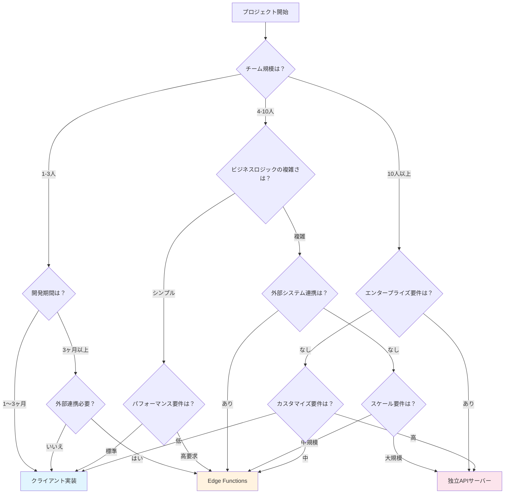

# Supabase アーキテクチャパターン選択ガイド

> **Supabase実践アーキテクチャパターン**1.0版 | 株式会社アイティードゥ | 2025年6月2日

## 目次

1. [クイック選択フローチャート](#クイック選択フローチャート)
2. [詳細評価フレームワーク](#詳細評価フレームワーク)
3. [要件別推奨パターン](#要件別推奨パターン)
4. [実装難易度・コスト分析](#実装難易度コスト分析)
5. [成功事例・ケーススタディ](#成功事例ケーススタディ)
6. [意思決定支援ツール](#意思決定支援ツール)

---

## クイック選択フローチャート



## 簡易診断フロー

### ステップ1: 基本要件確認

```typescript
interface BasicRequirements {
  projectType: 'mvp' | 'startup' | 'enterprise'
  timeline: 'urgent' | 'normal' | 'flexible'
  budget: 'limited' | 'moderate' | 'ample'
  teamExperience: 'beginner' | 'intermediate' | 'expert'
}

function quickRecommendation(req: BasicRequirements): string {
  // MVP + 緊急 + 限定予算 + 初心者 → クライアント実装
  if (req.projectType === 'mvp' && req.timeline === 'urgent' && 
      req.budget === 'limited' && req.teamExperience === 'beginner') {
    return 'client_implementation'
  }
  
  // スタートアップ + 通常 + 中程度予算 + 中級者 → Edge Functions
  if (req.projectType === 'startup' && req.timeline === 'normal' && 
      req.budget === 'moderate' && req.teamExperience === 'intermediate') {
    return 'edge_functions'
  }
  
  // エンタープライズ + 柔軟 + 十分予算 + 専門家 → 独立APIサーバー
  if (req.projectType === 'enterprise' && req.budget === 'ample' && 
      req.teamExperience === 'expert') {
    return 'independent_api'
  }
  
  return 'needs_detailed_analysis'
}
```

### ステップ2: 技術要件スコアリング

```typescript
interface TechnicalRequirements {
  userScale: 'small' | 'medium' | 'large'           // ~1K, ~10K, 100K+
  dataComplexity: 'simple' | 'moderate' | 'complex' // CRUD, Relations, Advanced
  integrations: 'none' | 'few' | 'many'             // 0, 1-3, 4+
  realtime: 'none' | 'basic' | 'advanced'           // No, Simple, Complex
  customAuth: 'standard' | 'custom' | 'complex'     // Basic, Custom, Enterprise
  compliance: 'none' | 'basic' | 'strict'           // No, Some, High
}

function calculatePatternScore(
  pattern: string, 
  requirements: TechnicalRequirements
): number {
  const scores = {
    client_implementation: {
      small: 10, medium: 6, large: 2,
      simple: 10, moderate: 7, complex: 3,
      none: 10, few: 6, many: 2,
      none: 10, basic: 8, advanced: 4,
      standard: 10, custom: 5, complex: 2,
      none: 10, basic: 8, strict: 3
    },
    edge_functions: {
      small: 8, medium: 10, large: 7,
      simple: 8, moderate: 10, complex: 8,
      none: 6, few: 10, many: 9,
      none: 8, basic: 9, advanced: 8,
      standard: 8, custom: 9, complex: 6,
      none: 8, basic: 9, strict: 7
    },
    independent_api: {
      small: 4, medium: 7, large: 10,
      simple: 6, moderate: 8, complex: 10,
      none: 7, few: 8, many: 10,
      none: 7, basic: 8, advanced: 10,
      standard: 7, custom: 10, complex: 10,
      none: 7, basic: 9, strict: 10
    }
  }
  
  const patternScores = scores[pattern as keyof typeof scores]
  if (!patternScores) return 0
  
  const weights = {
    userScale: 0.25,
    dataComplexity: 0.20,
    integrations: 0.15,
    realtime: 0.15,
    customAuth: 0.15,
    compliance: 0.10
  }
  
  let totalScore = 0
  for (const [key, value] of Object.entries(requirements)) {
    const score = patternScores[value as keyof typeof patternScores] || 0
    const weight = weights[key as keyof typeof weights] || 0
    totalScore += score * weight
  }
  
  return Math.round(totalScore * 10) / 10
}
```

---

## 詳細評価フレームワーク

### 多次元評価マトリックス

| 評価軸 | クライアント実装 | Edge Functions | 独立APIサーバー |
|--------|:---------------:|:-------------:|:-------------:|
| **開発速度**|  |  |  |
| **スケーラビリティ**|  |  |  |
| **カスタマイズ性**|  |  |  |
| **セキュリティ**|  |  |  |
| **運用負荷**|  |  |  |
| **コスト効率**|  |  |  |
| **学習コスト**|  |  |  |
| **長期保守性**|  |  |  |

### 詳細評価基準

```typescript
interface DetailedEvaluation {
  development: {
    timeToMarket: number        // weeks
    teamSkillRequirement: number // 1-5 scale
    toolingMaturity: number     // 1-5 scale
    debuggingComplexity: number // 1-5 scale
  }
  operation: {
    deploymentComplexity: number // 1-5 scale
    monitoringRequirement: number // 1-5 scale
    maintenanceEffort: number   // hours/week
    troubleshootingEase: number // 1-5 scale
  }
  business: {
    initialCost: number         // USD
    monthlyOperationalCost: number // USD/month
    scalingCost: number         // USD per 10x growth
    timeToBreakeven: number     // months
  }
  technical: {
    performanceBaseline: number // requests/second
    maxScalability: number      // max users
    customizationFlexibility: number // 1-5 scale
    integrationCapability: number // 1-5 scale
  }
}

const patternEvaluations: Record<string, DetailedEvaluation> = {
  client_implementation: {
    development: {
      timeToMarket: 4,           // 4週間
      teamSkillRequirement: 2,   // 初級-中級
      toolingMaturity: 5,        // 非常に成熟
      debuggingComplexity: 2     // 簡単
    },
    operation: {
      deploymentComplexity: 1,   // 非常に簡単
      monitoringRequirement: 2,  // 基本的な監視
      maintenanceEffort: 5,      // 5時間/週
      troubleshootingEase: 4     // 比較的簡単
    },
    business: {
      initialCost: 5000,         // $5K
      monthlyOperationalCost: 100, // $100/月
      scalingCost: 500,          // $500 per 10x
      timeToBreakeven: 3         // 3ヶ月
    },
    technical: {
      performanceBaseline: 100,  // 100 req/sec
      maxScalability: 10000,     // 1万ユーザー
      customizationFlexibility: 2, // 限定的
      integrationCapability: 2   // 基本的
    }
  },
  edge_functions: {
    development: {
      timeToMarket: 8,           // 8週間
      teamSkillRequirement: 3,   // 中級
      toolingMaturity: 4,        // 成熟
      debuggingComplexity: 3     // 中程度
    },
    operation: {
      deploymentComplexity: 2,   // 簡単
      monitoringRequirement: 3,  // 中程度の監視
      maintenanceEffort: 10,     // 10時間/週
      troubleshootingEase: 3     // 中程度
    },
    business: {
      initialCost: 15000,        // $15K
      monthlyOperationalCost: 300, // $300/月
      scalingCost: 1500,         // $1.5K per 10x
      timeToBreakeven: 6         // 6ヶ月
    },
    technical: {
      performanceBaseline: 500,  // 500 req/sec
      maxScalability: 100000,    // 10万ユーザー
      customizationFlexibility: 4, // 高い
      integrationCapability: 5   // 非常に高い
    }
  },
  independent_api: {
    development: {
      timeToMarket: 16,          // 16週間
      teamSkillRequirement: 4,   // 上級
      toolingMaturity: 5,        // 非常に成熟
      debuggingComplexity: 4     // 複雑
    },
    operation: {
      deploymentComplexity: 4,   // 複雑
      monitoringRequirement: 5,  // 包括的な監視
      maintenanceEffort: 25,     // 25時間/週
      troubleshootingEase: 2     // 困難
    },
    business: {
      initialCost: 50000,        // $50K
      monthlyOperationalCost: 1000, // $1K/月
      scalingCost: 2000,         // $2K per 10x
      timeToBreakeven: 12        // 12ヶ月
    },
    technical: {
      performanceBaseline: 2000, // 2000 req/sec
      maxScalability: 1000000,   // 100万ユーザー
      customizationFlexibility: 5, // 無制限
      integrationCapability: 5   // 無制限
    }
  }
}
```

---

## 要件別推奨パターン

### 1. プロジェクトタイプ別推奨

#### スタートアップ・MVP
```typescript
const mvpRequirements = {
  primaryGoals: ['迅速な市場投入', '低初期コスト', '検証可能性'],
  constraints: ['限定予算', '小チーム', '短期間'],
  recommendation: {
    primary: 'client_implementation',
    reason: '最速での市場投入と低コストを実現',
    migrationPath: ['edge_functions', 'independent_api'],
    keyBenefits: [
      '2〜4週間での初期リリース可能',
      '初期コスト$5K以下',
      'スキル要件が低い'
    ]
  }
}
```

#### 成長期スタートアップ
```typescript
const growthStartupRequirements = {
  primaryGoals: ['機能拡張', '外部連携', 'パフォーマンス向上'],
  constraints: ['中程度予算', '中規模チーム', '競合対応'],
  recommendation: {
    primary: 'edge_functions',
    reason: '拡張性と開発効率のバランス',
    migrationPath: ['independent_api'],
    keyBenefits: [
      '複雑なビジネスロジック対応',
      '外部API統合が容易',
      'スケーラビリティ確保'
    ]
  }
}
```

#### エンタープライズ
```typescript
const enterpriseRequirements = {
  primaryGoals: ['高可用性', 'セキュリティ', 'カスタマイズ', 'コンプライアンス'],
  constraints: ['品質要求', '長期運用', '監査対応'],
  recommendation: {
    primary: 'independent_api',
    reason: '最高レベルの制御と信頼性',
    migrationPath: [], // 最終形態
    keyBenefits: [
      '完全なカスタマイズ制御',
      'エンタープライズレベルの監視',
      'コンプライアンス要件対応'
    ]
  }
}
```

### 2. 業界・ドメイン別推奨

#### SaaS プラットフォーム
```typescript
const saasRecommendation = {
  characteristics: ['マルチテナント', 'API提供', 'サブスクリプション'],
  stages: {
    validation: {
      pattern: 'client_implementation',
      duration: '1-3 months',
      focus: 'プロダクトマーケットフィット検証'
    },
    growth: {
      pattern: 'edge_functions',
      duration: '6-12 months', 
      focus: '機能拡張と外部連携'
    },
    scale: {
      pattern: 'independent_api',
      duration: '12+ months',
      focus: 'エンタープライズ対応'
    }
  }
}
```

#### E-commerce
```typescript
const ecommerceRecommendation = {
  characteristics: ['決済処理', '在庫管理', '注文処理', '外部連携'],
  criticalRequirements: ['PCI DSS', '高可用性', 'リアルタイム在庫'],
  recommendation: {
    primary: 'edge_functions',
    reason: '決済・外部API統合が重要',
    specialConsiderations: [
      '決済処理の Edge Function 分離',
      '在庫管理のリアルタイム同期',
      'セキュリティ要件の厳格対応'
    ]
  }
}
```

#### IoT・リアルタイムシステム
```typescript
const iotRecommendation = {
  characteristics: ['大量データ', 'リアルタイム処理', 'デバイス管理'],
  criticalRequirements: ['低レイテンシ', 'スケーラビリティ', 'データ処理'],
  recommendation: {
    primary: 'independent_api',
    reason: '大量データとリアルタイム処理要件',
    specialConsiderations: [
      'ストリーミングデータ処理',
      'デバイス認証・管理',
      'エッジコンピューティング連携'
    ]
  }
}
```

### 3. チーム・組織特性別推奨

#### 小規模チーム (1-3人)
```typescript
const smallTeamStrategy = {
  challenges: ['リソース制限', 'スキル制約', '時間圧迫'],
  recommendation: {
    start: 'client_implementation',
    strategy: 'シンプルさ最優先',
    learningPath: [
      'Supabase基本機能習得',
      'フロントエンド開発強化',
      'RLS設計パターン学習'
    ],
    avoidance: ['複雑な設定', '多重技術スタック', '高度な運用']
  }
}
```

#### 中規模チーム (4-10人)
```typescript
const mediumTeamStrategy = {
  opportunities: ['専門分化可能', '並行開発', '品質向上'],
  recommendation: {
    start: 'edge_functions',
    strategy: '機能分散と専門化',
    teamStructure: {
      frontend: '2-3人',
      backend: '2-3人', 
      infrastructure: '1-2人',
      qa: '1人'
    },
    learningPath: [
      'Deno/TypeScript習得',
      'アーキテクチャ設計',
      'CI/CD構築'
    ]
  }
}
```

#### 大規模チーム (10人以上)
```typescript
const largeTeamStrategy = {
  advantages: ['高度専門化', '品質保証', '運用体制'],
  recommendation: {
    start: 'independent_api',
    strategy: '企業レベルの開発・運用',
    teamStructure: {
      architecture: '1-2人',
      backend: '3-5人',
      frontend: '3-5人',
      devops: '2-3人',
      qa: '2-3人',
      security: '1-2人'
    },
    processes: [
      'エンタープライズ開発プロセス',
      '包括的テスト戦略', 
      '運用監視体制'
    ]
  }
}
```

---

## 実装難易度・コスト分析

### 開発コスト詳細分析

```typescript
interface CostBreakdown {
  development: {
    planning: number      // person-days
    implementation: number // person-days
    testing: number       // person-days
    deployment: number    // person-days
  }
  infrastructure: {
    setup: number         // USD one-time
    monthly: number       // USD/month
    scaling: number       // USD per 10x growth
  }
  maintenance: {
    monitoring: number    // hours/week
    updates: number       // hours/month
    support: number       // hours/week
  }
  team: {
    minSkillLevel: 'junior' | 'mid' | 'senior'
    specialistRequired: boolean
    trainingRequired: number // days
  }
}

const costAnalysis: Record<string, CostBreakdown> = {
  client_implementation: {
    development: {
      planning: 3,
      implementation: 15,
      testing: 5,
      deployment: 2
    },
    infrastructure: {
      setup: 0,
      monthly: 25,
      scaling: 50
    },
    maintenance: {
      monitoring: 2,
      updates: 4,
      support: 3
    },
    team: {
      minSkillLevel: 'junior',
      specialistRequired: false,
      trainingRequired: 3
    }
  },
  edge_functions: {
    development: {
      planning: 8,
      implementation: 30,
      testing: 12,
      deployment: 5
    },
    infrastructure: {
      setup: 500,
      monthly: 75,
      scaling: 150
    },
    maintenance: {
      monitoring: 5,
      updates: 8,
      support: 6
    },
    team: {
      minSkillLevel: 'mid',
      specialistRequired: false,
      trainingRequired: 7
    }
  },
  independent_api: {
    development: {
      planning: 20,
      implementation: 80,
      testing: 30,
      deployment: 15
    },
    infrastructure: {
      setup: 5000,
      monthly: 300,
      scaling: 500
    },
    maintenance: {
      monitoring: 15,
      updates: 20,
      support: 12
    },
    team: {
      minSkillLevel: 'senior',
      specialistRequired: true,
      trainingRequired: 14
    }
  }
}
```

### ROI 計算モデル

```typescript
function calculateROI(
  pattern: string,
  projectParams: {
    expectedRevenue: number,    // monthly
    projectDuration: number,    // months
    teamSize: number,
    averageSalary: number      // monthly per person
  }
): {
  totalCost: number,
  breakEvenPoint: number,     // months
  roi12Months: number,        // percentage
  riskFactor: number         // 1-5 scale
} {
  const costs = costAnalysis[pattern]
  if (!costs) throw new Error('Pattern not found')
  
  // 開発コスト計算
  const developmentCost = (
    costs.development.planning +
    costs.development.implementation +
    costs.development.testing +
    costs.development.deployment
  ) * (projectParams.averageSalary / 20) // day rate
  
  // インフラコスト計算
  const infrastructureCost = costs.infrastructure.setup +
    (costs.infrastructure.monthly * projectParams.projectDuration)
  
  // 運用コスト計算
  const maintenanceCost = (
    costs.maintenance.monitoring +
    costs.maintenance.support
  ) * 4 * projectParams.projectDuration * (projectParams.averageSalary / 160) // hour rate
  
  const totalCost = developmentCost + infrastructureCost + maintenanceCost
  
  // ROI計算
  const monthlyRevenue = projectParams.expectedRevenue
  const breakEvenPoint = totalCost / monthlyRevenue
  const revenue12Months = monthlyRevenue * 12
  const roi12Months = ((revenue12Months - totalCost) / totalCost) * 100
  
  // リスクファクター
  const riskFactors = {
    client_implementation: 2,
    edge_functions: 3,
    independent_api: 4
  }
  
  return {
    totalCost,
    breakEvenPoint,
    roi12Months,
    riskFactor: riskFactors[pattern as keyof typeof riskFactors] || 3
  }
}
```

---

## 成功事例・ケーススタディ

### ケーススタディ1: EdTech スタートアップ

#### 背景
- **業界**: 教育技術
- **チーム**: 3人（フルスタック2人、デザイナー1人）
- **予算**: $50K
- **期間**: 6ヶ月でMVP

#### 選択パターン: クライアント実装
```typescript
const edtechCase = {
  initialDecision: {
    pattern: 'client_implementation',
    reasons: [
      '小規模チーム',
      '迅速なMVP開発',
      '限定予算',
      'シンプルな機能要件'
    ]
  },
  implementation: {
    frontend: 'React + TypeScript',
    authentication: 'Supabase Auth',
    database: 'PostgreSQL via Supabase',
    storage: 'Supabase Storage',
    realtime: 'Supabase Realtime'
  },
  results: {
    timeToMarket: '3 months',
    initialUsers: 1000,
    monthlyGrowth: '20%',
    customerAcquisitionCost: '$25'
  },
  challenges: [
    'RLS複雑性の増加',
    'カスタム認証要件',
    'パフォーマンス制限'
  ],
  migrationPlan: {
    trigger: '10,000 users',
    nextPattern: 'edge_functions',
    estimatedEffort: '2 months'
  }
}
```

### ケーススタディ2: フィンテック企業

#### 背景
- **業界**: 金融技術
- **チーム**: 12人
- **予算**: $500K
- **要件**: 決済処理、外部銀行API連携

#### 選択パターン: Edge Functions
```typescript
const fintechCase = {
  initialDecision: {
    pattern: 'edge_functions',
    reasons: [
      '複雑な決済ロジック',
      '外部API統合重要',
      'セキュリティ要件',
      'コンプライアンス対応'
    ]
  },
  architecture: {
    frontend: 'Next.js',
    edgeFunctions: [
      'payment_processing',
      'bank_api_integration', 
      'compliance_checks',
      'notification_service'
    ],
    database: 'Supabase PostgreSQL',
    monitoring: 'Grafana + Prometheus'
  },
  results: {
    timeToMarket: '8 months',
    transactionVolume: '$10M/month',
    uptime: '99.95%',
    complianceAuditPassed: true
  },
  keySuccessFactors: [
    'Edge Functions による決済処理分離',
    '包括的なエラーハンドリング',
    '詳細な監査ログ',
    '段階的ロールアウト'
  ]
}
```

### ケーススタディ3: エンタープライズSaaS

#### 背景
- **業界**: HR Tech
- **チーム**: 25人
- **要件**: マルチテナント、SOC2準拠、カスタマイズ対応

#### 選択パターン: 独立APIサーバー
```typescript
const enterpriseCase = {
  initialDecision: {
    pattern: 'independent_api',
    reasons: [
      'エンタープライズ顧客要件',
      'SOC2コンプライアンス',
      '高度なカスタマイズ',
      '大規模スケーリング'
    ]
  },
  architecture: {
    apiServer: 'FastAPI + Python',
    database: 'Supabase PostgreSQL + Read Replicas',
    cache: 'Redis Cluster',
    queue: 'Celery + RabbitMQ',
    monitoring: 'DataDog',
    deployment: 'Kubernetes + Helm'
  },
  results: {
    customers: 500,
    averageContractValue: '$50K/year',
    uptime: '99.99%',
    soc2Compliance: true,
    customizations: '80% of customers'
  },
  criticalDecisions: [
    'マイクロサービス vs モノリス → モノリス選択',
    'カスタムORM vs 既存ORM → SQLAlchemy選択',
    'セルフホスト vs クラウド → ハイブリッド選択'
  ]
}
```

---

## 意思決定支援ツール

### パターン選択診断ツール

```typescript
interface ProjectAssessment {
  // 基本情報
  teamSize: number
  budget: number
  timeline: number
  
  // 技術要件
  expectedUsers: number
  dataComplexity: 1 | 2 | 3 | 4 | 5
  integrationNeeds: number
  customAuthRequired: boolean
  complianceRequired: boolean
  
  // ビジネス要件
  revenueModel: 'subscription' | 'transaction' | 'advertising' | 'enterprise'
  competitiveAdvantage: 'speed' | 'features' | 'quality' | 'cost'
  riskTolerance: 'low' | 'medium' | 'high'
}

class PatternRecommendationEngine {
  assessProject(assessment: ProjectAssessment): {
    primaryRecommendation: string
    confidence: number
    alternatives: Array<{pattern: string, score: number}>
    warnings: string[]
    nextSteps: string[]
  } {
    const scores = this.calculateScores(assessment)
    const primaryPattern = this.getPrimaryRecommendation(scores)
    const confidence = this.calculateConfidence(scores, primaryPattern)
    
    return {
      primaryRecommendation: primaryPattern,
      confidence,
      alternatives: this.getAlternatives(scores, primaryPattern),
      warnings: this.generateWarnings(assessment, primaryPattern),
      nextSteps: this.getNextSteps(primaryPattern)
    }
  }
  
  private calculateScores(assessment: ProjectAssessment): Record<string, number> {
    const weights = {
      teamSize: 0.2,
      budget: 0.15,
      timeline: 0.15,
      expectedUsers: 0.15,
      dataComplexity: 0.1,
      integrationNeeds: 0.1,
      customAuth: 0.05,
      compliance: 0.1
    }
    
    // スコア計算ロジック
    const clientScore = this.calculateClientScore(assessment, weights)
    const edgeScore = this.calculateEdgeScore(assessment, weights)
    const apiScore = this.calculateApiScore(assessment, weights)
    
    return {
      client_implementation: clientScore,
      edge_functions: edgeScore,
      independent_api: apiScore
    }
  }
  
  private calculateClientScore(assessment: ProjectAssessment, weights: any): number {
    let score = 0
    
    // チームサイズ (小さいほど高スコア)
    score += (assessment.teamSize <= 3 ? 10 : 
              assessment.teamSize <= 6 ? 7 : 3) * weights.teamSize
    
    // 予算 (少ないほど高スコア)
    score += (assessment.budget <= 50000 ? 10 :
              assessment.budget <= 100000 ? 6 : 2) * weights.budget
    
    // 期間 (短いほど高スコア)
    score += (assessment.timeline <= 3 ? 10 :
              assessment.timeline <= 6 ? 7 : 4) * weights.timeline
    
    // ユーザー数 (少ないほど高スコア)
    score += (assessment.expectedUsers <= 1000 ? 10 :
              assessment.expectedUsers <= 10000 ? 6 : 2) * weights.expectedUsers
    
    // データ複雑度 (シンプルほど高スコア)
    score += (6 - assessment.dataComplexity) * 2 * weights.dataComplexity
    
    // 外部連携 (少ないほど高スコア)
    score += (assessment.integrationNeeds === 0 ? 10 :
              assessment.integrationNeeds <= 2 ? 6 : 2) * weights.integrationNeeds
    
    // カスタム認証 (不要なほど高スコア)
    score += (!assessment.customAuthRequired ? 10 : 3) * weights.customAuth
    
    // コンプライアンス (不要なほど高スコア)
    score += (!assessment.complianceRequired ? 10 : 2) * weights.compliance
    
    return Math.round(score * 10) / 10
  }
  
  private calculateEdgeScore(assessment: ProjectAssessment, weights: any): number {
    // Edge Functions に適したスコア計算
    let score = 0
    
    // 中規模チームで高スコア
    score += (assessment.teamSize >= 4 && assessment.teamSize <= 10 ? 10 : 6) * weights.teamSize
    
    // 中程度予算で高スコア
    score += (assessment.budget >= 50000 && assessment.budget <= 200000 ? 10 : 6) * weights.budget
    
    // 外部連携があると高スコア
    score += (assessment.integrationNeeds > 0 ? 10 : 5) * weights.integrationNeeds
    
    // 中程度の複雑さで高スコア
    score += (assessment.dataComplexity >= 2 && assessment.dataComplexity <= 4 ? 10 : 6) * weights.dataComplexity
    
    return Math.round(score * 10) / 10
  }
  
  private calculateApiScore(assessment: ProjectAssessment, weights: any): number {
    // 独立APIサーバーに適したスコア計算
    let score = 0
    
    // 大規模チームで高スコア
    score += (assessment.teamSize >= 8 ? 10 : 4) * weights.teamSize
    
    // 高予算で高スコア
    score += (assessment.budget >= 100000 ? 10 : 3) * weights.budget
    
    // 大規模ユーザーで高スコア
    score += (assessment.expectedUsers >= 50000 ? 10 : 5) * weights.expectedUsers
    
    // 高複雑度で高スコア
    score += (assessment.dataComplexity >= 4 ? 10 : 5) * weights.dataComplexity
    
    // コンプライアンス要件で高スコア
    score += (assessment.complianceRequired ? 10 : 3) * weights.compliance
    
    return Math.round(score * 10) / 10
  }
  
  private getPrimaryRecommendation(scores: Record<string, number>): string {
    return Object.entries(scores).sort(([,a], [,b]) => b - a)[0][0]
  }
  
  private calculateConfidence(scores: Record<string, number>, primary: string): number {
    const sortedScores = Object.values(scores).sort((a, b) => b - a)
    const primaryScore = scores[primary]
    const secondaryScore = sortedScores[1]
    
    // スコア差に基づく信頼度計算
    const scoreDiff = primaryScore - secondaryScore
    return Math.min(Math.round((scoreDiff / primaryScore) * 100), 95)
  }
  
  private getAlternatives(scores: Record<string, number>, primary: string): Array<{pattern: string, score: number}> {
    return Object.entries(scores)
      .filter(([pattern]) => pattern !== primary)
      .map(([pattern, score]) => ({pattern, score}))
      .sort((a, b) => b.score - a.score)
  }
  
  private generateWarnings(assessment: ProjectAssessment, recommendation: string): string[] {
    const warnings: string[] = []
    
    if (recommendation === 'client_implementation') {
      if (assessment.expectedUsers > 10000) {
        warnings.push('大規模ユーザー対応時にパフォーマンス問題が発生する可能性があります')
      }
      if (assessment.complianceRequired) {
        warnings.push('コンプライアンス要件の実装が困難な場合があります')
      }
    }
    
    if (recommendation === 'edge_functions') {
      if (assessment.teamSize < 3) {
        warnings.push('Deno/TypeScriptの学習コストが発生します')
      }
      if (assessment.dataComplexity >= 4) {
        warnings.push('複雑なデータ処理には制限があります')
      }
    }
    
    if (recommendation === 'independent_api') {
      if (assessment.teamSize < 8) {
        warnings.push('運用負荷が高く、専門知識が必要です')
      }
      if (assessment.timeline < 6) {
        warnings.push('開発期間が長期化する可能性があります')
      }
    }
    
    return warnings
  }
  
  private getNextSteps(recommendation: string): string[] {
    const nextSteps = {
      client_implementation: [
        'Supabaseプロジェクトのセットアップ',
        'RLS設計の検討',
        'フロントエンド開発環境の構築',
        'プロトタイプ開発開始'
      ],
      edge_functions: [
        'Deno開発環境のセットアップ',
        'Edge Functions設計の検討',
        '外部API連携の調査',
        'パイロット機能の実装'
      ],
      independent_api: [
        'アーキテクチャ設計の詳細化',
        'インフラ要件の定義',
        '開発チーム編成',
        'プロトタイプ環境構築'
      ]
    }
    
    return nextSteps[recommendation as keyof typeof nextSteps] || []
  }
}

// 使用例
const assessmentTool = new PatternRecommendationEngine()
const result = assessmentTool.assessProject({
  teamSize: 5,
  budget: 75000,
  timeline: 6,
  expectedUsers: 25000,
  dataComplexity: 3,
  integrationNeeds: 2,
  customAuthRequired: true,
  complianceRequired: false,
  revenueModel: 'subscription',
  competitiveAdvantage: 'features',
  riskTolerance: 'medium'
})

console.log('推奨パターン:', result.primaryRecommendation)
console.log('信頼度:', result.confidence + '%')
console.log('次のステップ:', result.nextSteps)
```

このガイドにより、プロジェクトの特性と要件に基づいて最適なSupabaseアーキテクチャパターンを体系的に選択できるようになります。
