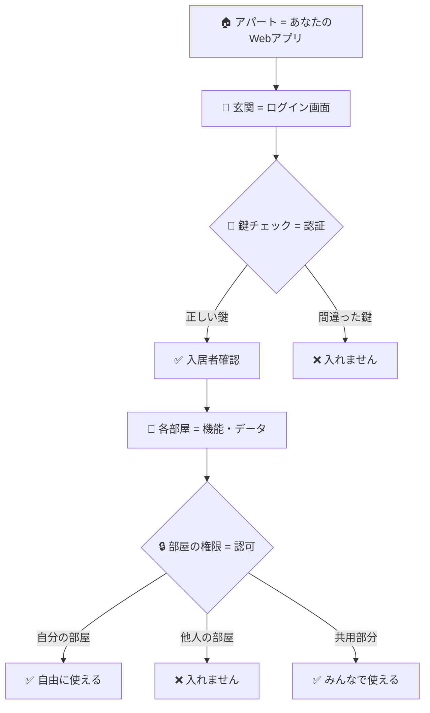
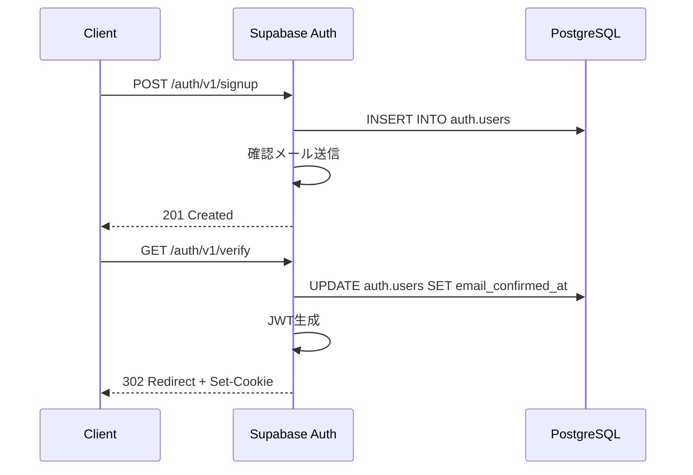

# Chapter 2: 認証・認可設計 🔐

---
**📚 目次に戻る**: [📖 学習ガイド](./textbook_index.md)  
**⬅️ 前の章**: [Chapter 1: Supabaseアーキテクチャ理解](./chapter01.md)  
**➡️ 次の章**: [Chapter 3: パターン1 - クライアントサイド実装](./chapter03.md)  
**🎯 学習フェーズ**: Part I - 基礎編（認証・認可）  
**🎯 学習レベル**: 🌱 基礎 | 🚀 応用 | 💪 発展  
**⏱️ 推定学習時間**: 3〜4時間  
**📝 難易度**: 基礎（セキュリティ概念の理解が重要）
---

## 🔄 **前章の復習**（Chapter 1からの継続）

Chapter 1で学んだ**Supabaseの3つの基本コンポーネント**を振り返りましょう：
- ✅ **PostgreSQL**: データを安全に保存する倉庫
- ✅ **PostgREST**: データベースから自動でAPIを作成
- ✅ **Realtime**: データ変更をリアルタイムで通知

これらの基盤の上に、今度は**「誰がアクセスできるか」「何をしていいか」**を制御するセキュリティの仕組みを構築します。

> 💡 **Chapter 1の理解度確認**: PostgreSQL・PostgREST・Realtimeの役割を説明できますか？不安な場合は[Chapter 1](./chapter01.md)を復習してください。

## 🎯 この章で学ぶこと（初心者向け）

この章では、**「誰がアプリを使えるのか」「何ができるのか」** を管理する仕組みを学びます。

- 🌱 **初心者**: ログイン・ログアウトの基本的な仕組みがわかる
- 🚀 **中級者**: セキュリティを保つための具体的な方法がわかる  
- 💪 **上級者**: 企業レベルのセキュリティシステムが設計できる

## 💡 身近な例から：「アパートの管理」に例えてみよう

Webアプリのセキュリティを**アパートの管理**に例えると理解しやすいです：



**用語説明**：
- 🔑 **認証（Authentication）**: 「あなたは誰ですか？」→ 身元確認
- 🔒 **認可（Authorization）**: 「何をしていいですか？」→ 権限確認

---

## 🔑 Supabase Auth：「ログイン・ログアウトを簡単に」

### 🤔 従来のログイン機能作成：「大変な手作業」

普通、ログイン機能を作るのはとても大変でした：

#### 📝 やることリスト（従来）
```bash
1. 📧 メールアドレス・パスワードの入力画面を作る
2. 🔒 パスワードを暗号化する仕組みを作る  
3. 💾 ユーザー情報をデータベースに保存する
4. 🔐 ログイン状態を管理する仕組みを作る
5. 📱 「ログインしているかどうか」を各画面で確認する
6. 🔄 「ログイン期限切れ」の処理を作る
7. 📩 「パスワードを忘れた」機能を作る
8. 🛡️ セキュリティの穴がないかチェックする
9. 🐛 バグがないかテストする
10. 🚀 本番環境で安全に動くか確認する
```

**時間**: 数週間〜数ヶ月 😱

#### 🔍 実際のコード例（Express.js）

```javascript
// パスワード暗号化
const bcrypt = require('bcrypt');
const jwt = require('jsonwebtoken');

// ユーザー登録（50行以上のコード）
app.post('/signup', async (req, res) => {
  // バリデーション、重複チェック、暗号化...
  // エラーハンドリング、データベース保存...
  // メール認証、レスポンス作成...
});

// ログイン（40行以上のコード）  
app.post('/login', async (req, res) => {
  // 認証情報確認、パスワード照合...
  // JWT生成、セッション管理...
});

// ログイン確認ミドルウェア（30行以上）
const authenticateToken = (req, res, next) => {
  // トークン確認、期限チェック...
  // ユーザー情報取得、権限確認...
};

// パスワードリセット（60行以上のコード）
// ... さらに続く
```

### 🎉 Supabase Authなら：「3行で完成」

```javascript
// ユーザー登録
const { data, error } = await supabase.auth.signUp({
  email: 'user@example.com',
  password: 'secure_password'
});

// ログイン  
const { data, error } = await supabase.auth.signInWithPassword({
  email: 'user@example.com', 
  password: 'secure_password'
});

// ログアウト
const { error } = await supabase.auth.signOut();
```

**時間**: 数時間で完成！ 🎉

### 🛡️ セキュリティも自動で完璧

Supabase Authが自動で処理してくれること：

| セキュリティ機能 | 従来（手作業） | Supabase Auth |
|:---------------:|:-------------:|:-------------:|
| 🔒 **パスワード暗号化** | ⚠️ 自分で実装（ミスのリスク） | ✅ 自動で安全な暗号化 |
| 🕐 **セッション管理** | ⚠️ 複雑な仕組みを自作 | ✅ 自動で期限管理 |
| 📧 **メール認証** | ⚠️ メール送信の仕組みを構築 | ✅ 自動でメール送信 |
| 🔄 **パスワードリセット** | ⚠️ 安全な仕組みを設計 | ✅ 自動で安全な仕組み |
| 🛡️ **攻撃対策** | ⚠️ セキュリティの穴を自分で塞ぐ | ✅ 業界標準の対策を自動実装 |

### 🚀 いろいろなログイン方式も対応済み

```javascript
// 📧 メール・パスワード
await supabase.auth.signInWithPassword({...});

// 🔗 Magic Link（パスワード不要）
await supabase.auth.signInWithOtp({
  email: 'user@example.com'
});

// 🌐 Google ログイン
await supabase.auth.signInWithOAuth({
  provider: 'google'
});

// 📱 電話番号
await supabase.auth.signInWithOtp({
  phone: '+81901234567'
});
```

### 従来の認証実装との違い

| 項目 | Supabase Auth | 自前実装 | Firebase Auth | Auth0 |
|------|:-------------:|:--------:|:-------------:|:-----:|
| **実装時間** | ✅ 数時間 | ❌ 数週間 | ✅ 数時間 | ✅ 数時間 |
| **セキュリティ** | ✅ 企業級 | ⚠️ 実装依存 | ✅ 企業級 | ✅ 企業級 |
| **カスタマイズ性** | ✅ 高い | ✅ 完全制御 | ⚠️ 限定的 | ✅ 高い |
| **コスト** | ✅ 低コスト | ❌ 開発・運用コスト | ⚠️ 従量課金 | ❌ 高コスト |
| **DB統合** | ✅ 完全統合 | ⚠️ 手動実装 | ❌ 別システム | ❌ 別システム |

**自前実装の課題解決例**:

```javascript
// 従来の自前実装（Express.js + bcrypt）
const bcrypt = require('bcrypt');
const jwt = require('jsonwebtoken');

app.post('/auth/signup', async (req, res) => {
  try {
    // 1. バリデーション（手動実装が必要）
    const { email, password } = req.body;
    if (!email || !password) {
      return res.status(400).json({ error: 'Email and password required' });
    }
    
    // 2. 重複チェック（手動実装が必要）
    const existingUser = await db.query('SELECT * FROM users WHERE email = ?', [email]);
    if (existingUser.length > 0) {
      return res.status(400).json({ error: 'User already exists' });
    }
    
    // 3. パスワードハッシュ化（手動実装が必要）
    const saltRounds = 12;
    const hashedPassword = await bcrypt.hash(password, saltRounds);
    
    // 4. ユーザー作成（手動実装が必要）
    const userId = uuid.v4();
    await db.query('INSERT INTO users (id, email, password) VALUES (?, ?, ?)', 
                   [userId, email, hashedPassword]);
    
    // 5. メール認証（手動実装が必要）
    const confirmationToken = jwt.sign({ userId }, EMAIL_SECRET, { expiresIn: '24h' });
    await sendConfirmationEmail(email, confirmationToken);
    
    // 6. レスポンス
    res.status(201).json({ message: 'Please check your email' });
    
  } catch (error) {
    console.error('Signup error:', error);
    res.status(500).json({ error: 'Internal server error' });
  }
});

// ログイン機能も同様に数十行の実装が必要...
```

```javascript
// Supabase Auth（自動実装）
const { data, error } = await supabase.auth.signUp({
  email: 'user@example.com',
  password: 'secure_password'
});

// → バリデーション、重複チェック、ハッシュ化、メール認証が自動実行
// → 実装コードが95%削減
```

### JWT構造とSupabase固有クレーム

Supabase AuthはJWT RFC 7519準拠のトークンを生成し、PostgreSQL RLSとの統合を最適化した独自クレームを含みます。

**標準クレーム**:
```json
{
  "iss": "https://your-project.supabase.co/auth/v1",
  "sub": "user-uuid",
  "aud": "authenticated", 
  "exp": 1640995200,
  "iat": 1640908800,
  "email": "user@example.com",
  "phone": "+1234567890"
}
```

**Supabase固有クレーム**:
```json
{
  "app_metadata": {
    "provider": "email",
    "providers": ["email"]
  },
  "user_metadata": {
    "display_name": "John Doe",
    "avatar_url": "https://..."
  },
  "role": "authenticated",
  "session_id": "session-uuid"
}
```

### 認証フロー実装

#### 1. Email/Password認証



**サインアップ実装**:
```sql
-- auth.users テーブル構造
SELECT column_name, data_type, is_nullable 
FROM information_schema.columns 
WHERE table_schema = 'auth' AND table_name = 'users';

-- パスワードハッシュ化（bcrypt）
INSERT INTO auth.users (
    id, email, encrypted_password, 
    email_confirmed_at, created_at, updated_at
) VALUES (
    uuid_generate_v4(),
    'user@example.com',
    crypt('password', gen_salt('bf')),
    NOW(), NOW(), NOW()
);
```

#### 2. OAuth実装

```typescript
// GoTrue内部実装（概念的）
interface OAuthProvider {
  name: string;
  authorize_url: string;
  token_url: string;
  user_info_url: string;
}

class GoogleProvider implements OAuthProvider {
  async exchangeCodeForToken(code: string): Promise<OAuthToken> {
    const response = await fetch('https://oauth2.googleapis.com/token', {
      method: 'POST',
      headers: { 'Content-Type': 'application/x-www-form-urlencoded' },
      body: new URLSearchParams({
        client_id: this.clientId,
        client_secret: this.clientSecret,
        code,
        grant_type: 'authorization_code',
        redirect_uri: this.redirectUri
      })
    });
    return response.json();
  }
}
```

### 匿名サインイン → 本登録の昇格パターン（AIアプリの試用導線）

AIアプリでは「まず試す→あとで登録」の導線が一般的です。  
そのため **匿名ユーザーの作業データを維持したまま正式登録へ昇格**できる設計が必要です。

**基本の流れ**:
1. 匿名セッションを作成（匿名ユーザーIDを確保）
2. そのユーザーIDに作業データ（チャット履歴・下書き・学習ログなど）を紐付け
3. 登録時に同一ユーザーとして昇格（またはデータを新アカウントへ移行）

**設計ポイント**:
- 匿名ユーザー用データには **期限（TTL）** を設ける
- RLSは **匿名ユーザーの読み書き許可範囲を最小化**
- 昇格時に **tenant_id / user_id の整合**をチェック

**実装例（概念）**:
```typescript
// 1) 匿名セッション作成（API名はSDKバージョンで確認）
const { data: anon, error: anonError } = await supabase.auth.signInAnonymously()
if (anonError) throw anonError

const anonUserId = anon.user.id

// 2) 匿名ユーザーに作業データを紐付け
await supabase.from('drafts').insert({
  tenant_id: tenantId,
  owner_id: anonUserId,
  content: 'tmp draft'
})

// 3) 本登録（メール確認などは運用方針に従う）
const { data: registered, error: regError } = await supabase.auth.signUp({
  email,
  password
})
if (regError) throw regError

// 4) 匿名データを本登録ユーザーへ移行
await supabase.from('drafts')
  .update({ owner_id: registered.user.id })
  .eq('owner_id', anonUserId)
```

> 補足: 匿名サインインのAPI名・可否はSDKのバージョン/設定に依存します。  
> 利用中のSDKドキュメントで確認してください。

### LLM生成SQL/RLSのレビュー手順（安全策）

LLMが生成したSQLやRLSはそのまま適用しない方針にします。  
**実運用での安全策**として以下をチェックします：

- **deny-by-default** になっているか（無条件許可を避ける）
- **境界条件**（tenant_id / user_id / role）の漏れがないか
- `EXPLAIN` で **意図したインデックス**が使われているか
- **ステージング環境**で想定外の読み書きが起きないか

---

### 🔐 AI時代のRLS設計（マルチテナント + 監査ログ）

AIアプリでは **RAG/ログ/評価テーブル**にもRLSを適用し、  
「どのテナントのデータにアクセスしているか」を明示します。

**典型スキーマ例**:

```sql
CREATE TABLE ai_documents (
  id BIGSERIAL PRIMARY KEY,
  tenant_id UUID NOT NULL,
  owner_id UUID NOT NULL,
  content TEXT NOT NULL,
  created_at TIMESTAMPTZ DEFAULT NOW()
);

CREATE TABLE ai_retrieval_logs (
  id BIGSERIAL PRIMARY KEY,
  tenant_id UUID NOT NULL,
  user_id UUID NOT NULL,
  query_text TEXT NOT NULL,
  retrieved_doc_ids BIGINT[],
  created_at TIMESTAMPTZ DEFAULT NOW()
);
```

**RLSポリシー例（tenant_id + user_id）**:

```sql
ALTER TABLE ai_documents ENABLE ROW LEVEL SECURITY;
ALTER TABLE ai_retrieval_logs ENABLE ROW LEVEL SECURITY;

CREATE POLICY "tenant_owner_read" ON ai_documents
  FOR SELECT USING (
    tenant_id = (auth.jwt() ->> 'tenant_id')::uuid
    AND owner_id = auth.uid()
  );

CREATE POLICY "tenant_user_log" ON ai_retrieval_logs
  FOR INSERT WITH CHECK (
    tenant_id = (auth.jwt() ->> 'tenant_id')::uuid
    AND user_id = auth.uid()
  );
```

### 🔐 SecretsはDBに置かない

APIキーや外部LLMの秘密情報は **DBに保存しない** 方針にします。  
必要な場合は **Vault / Edge Function Secrets** に集約し、  
**ログ・監査・ローテーション**の運用フローを定義します。

### JWT検証とミドルウェア

**PostgRESTでのJWT検証**:
```haskell
-- PostgREST内部実装（Haskell）
verifyJWT :: ByteString -> JWTSecret -> Either JWTError JWTClaims
verifyJWT token secret = do
  jwt <- decodeCompact token
  verifyClaims defaultJWTValidationSettings (view claimsSet jwt)
  
extractRole :: JWTClaims -> Maybe Role  
extractRole claims = 
  claims ^? claimSub . _Just . to parseRole
```

**カスタムJWT検証関数**:
```sql
-- PostgreSQL内カスタム関数
CREATE OR REPLACE FUNCTION auth.jwt_role()
RETURNS TEXT AS $$
  SELECT COALESCE(
    current_setting('request.jwt.claims', true)::json->>'role',
    'anon'
  );
$$ LANGUAGE sql STABLE;

CREATE OR REPLACE FUNCTION auth.uid()
RETURNS UUID AS $$
  SELECT COALESCE(
    current_setting('request.jwt.claims', true)::json->>'sub',
    '00000000-0000-0000-0000-000000000000'
  )::uuid;
$$ LANGUAGE sql STABLE;
```

---

## 2.2 RLSポリシー設計パターン

### 階層的アクセス制御

```sql
-- 組織階層テーブル設計
CREATE TABLE organizations (
    id BIGSERIAL PRIMARY KEY,
    name TEXT NOT NULL,
    parent_id BIGINT REFERENCES organizations(id),
    created_at TIMESTAMPTZ DEFAULT NOW()
);

CREATE TABLE user_org_memberships (
    user_id UUID REFERENCES auth.users(id),
    org_id BIGINT REFERENCES organizations(id),
    role org_role_type NOT NULL,
    created_at TIMESTAMPTZ DEFAULT NOW(),
    PRIMARY KEY (user_id, org_id)
);

-- カスタム型定義
CREATE TYPE org_role_type AS ENUM (
    'owner', 'admin', 'member', 'viewer'
);
```

### 継承的ポリシー

```sql
-- 再帰CTEによる階層アクセス
CREATE OR REPLACE FUNCTION user_accessible_orgs(user_uuid UUID)
RETURNS TABLE(org_id BIGINT, effective_role org_role_type) AS $$
WITH RECURSIVE org_hierarchy AS (
    -- 直接メンバーシップ
    SELECT 
        m.org_id,
        m.role,
        0 as depth
    FROM user_org_memberships m 
    WHERE m.user_id = user_uuid
    
    UNION ALL
    
    -- 子組織への継承
    SELECT 
        o.id as org_id,
        h.role,
        h.depth + 1
    FROM organizations o
    JOIN org_hierarchy h ON o.parent_id = h.org_id
    WHERE h.depth < 10  -- 無限ループ防止
)
SELECT DISTINCT ON (org_id) 
    org_id, 
    role as effective_role
FROM org_hierarchy
ORDER BY org_id, depth ASC;  -- より近い階層の権限を優先
$$ LANGUAGE sql STABLE;

-- 階層ポリシー適用
CREATE POLICY "Hierarchical access" ON documents
    FOR ALL USING (
        EXISTS (
            SELECT 1 FROM user_accessible_orgs(auth.uid()) 
            WHERE org_id = documents.org_id
        )
    );
```

### 時間ベースアクセス制御

```sql
-- 時限付きアクセス
CREATE TABLE temp_access_grants (
    id BIGSERIAL PRIMARY KEY,
    user_id UUID REFERENCES auth.users(id),
    resource_id BIGINT,
    resource_type TEXT,
    permissions TEXT[], 
    valid_from TIMESTAMPTZ DEFAULT NOW(),
    valid_until TIMESTAMPTZ NOT NULL,
    created_by UUID REFERENCES auth.users(id)
);

CREATE POLICY "Temporary access" ON sensitive_documents
    FOR SELECT USING (
        owner_id = auth.uid() OR
        EXISTS (
            SELECT 1 FROM temp_access_grants tag
            WHERE tag.user_id = auth.uid()
            AND tag.resource_id = sensitive_documents.id
            AND tag.resource_type = 'sensitive_document'
            AND 'read' = ANY(tag.permissions)
            AND NOW() BETWEEN tag.valid_from AND tag.valid_until
        )
    );
```

### 属性ベースアクセス制御 (ABAC)

```sql
-- ユーザー属性テーブル
CREATE TABLE user_attributes (
    user_id UUID REFERENCES auth.users(id),
    attribute_name TEXT NOT NULL,
    attribute_value TEXT NOT NULL,
    valid_until TIMESTAMPTZ,
    PRIMARY KEY (user_id, attribute_name)
);

-- 動的ポリシー関数
CREATE OR REPLACE FUNCTION check_user_attribute(
    user_uuid UUID, 
    attr_name TEXT, 
    required_value TEXT
) RETURNS BOOLEAN AS $$
    SELECT EXISTS (
        SELECT 1 FROM user_attributes 
        WHERE user_id = user_uuid 
        AND attribute_name = attr_name
        AND attribute_value = required_value
        AND (valid_until IS NULL OR valid_until > NOW())
    );
$$ LANGUAGE sql STABLE;

-- ABAC適用例
CREATE POLICY "Department access" ON financial_reports
    FOR SELECT USING (
        check_user_attribute(auth.uid(), 'department', 'finance') OR
        check_user_attribute(auth.uid(), 'clearance_level', 'executive')
    );
```

### ポリシー最適化

**インデックス戦略**:
```sql
-- RLSクエリ最適化用複合インデックス
CREATE INDEX idx_user_org_memberships_lookup 
ON user_org_memberships (user_id, org_id) 
INCLUDE (role);

-- 部分インデックス
CREATE INDEX idx_active_temp_grants 
ON temp_access_grants (user_id, resource_id, resource_type) 
WHERE valid_until > NOW();

-- GIN インデックス（配列検索用）
CREATE INDEX idx_permissions_gin 
ON temp_access_grants USING gin(permissions);
```

**パフォーマンス測定**:
```sql
-- ポリシー実行時間測定
EXPLAIN (ANALYZE, BUFFERS, FORMAT JSON) 
SELECT * FROM documents WHERE title ILIKE '%budget%';

-- RLS無効化での比較
SET row_security = off;
EXPLAIN (ANALYZE, BUFFERS) SELECT * FROM documents WHERE title ILIKE '%budget%';
SET row_security = on;
```

---

## 2.3 組織・ロールベースアクセス制御実装

### 多テナント設計パターン

#### 1. Row-based Multi-tenancy

```sql
-- 全テーブルにtenant_id追加
CREATE TABLE projects (
    id BIGSERIAL PRIMARY KEY,
    tenant_id BIGINT NOT NULL REFERENCES tenants(id),
    name TEXT NOT NULL,
    description TEXT,
    created_at TIMESTAMPTZ DEFAULT NOW()
);

-- テナント分離ポリシー
CREATE POLICY "Tenant isolation" ON projects
    FOR ALL USING (
        tenant_id IN (
            SELECT t.id FROM tenants t
            JOIN user_tenant_memberships utm ON t.id = utm.tenant_id
            WHERE utm.user_id = auth.uid()
        )
    );
```

#### 2. Schema-based Multi-tenancy

```sql
-- 動的スキーマ作成
CREATE OR REPLACE FUNCTION create_tenant_schema(tenant_name TEXT)
RETURNS VOID AS $$
DECLARE
    schema_name TEXT := 'tenant_' || tenant_name;
BEGIN
    -- スキーマ作成
    EXECUTE format('CREATE SCHEMA %I', schema_name);
    
    -- テーブル作成
    EXECUTE format('
        CREATE TABLE %I.projects (
            id BIGSERIAL PRIMARY KEY,
            name TEXT NOT NULL,
            created_at TIMESTAMPTZ DEFAULT NOW()
        )', schema_name);
    
    -- RLS有効化
    EXECUTE format('ALTER TABLE %I.projects ENABLE ROW LEVEL SECURITY', schema_name);
END;
$$ LANGUAGE plpgsql;
```

### 高度な権限モデル

**リソースベース権限**:
```sql
-- 権限定義テーブル
CREATE TABLE permissions (
    id BIGSERIAL PRIMARY KEY,
    name TEXT UNIQUE NOT NULL,
    description TEXT,
    resource_type TEXT NOT NULL
);

-- ロール-権限マッピング
CREATE TABLE role_permissions (
    role_id BIGINT REFERENCES roles(id),
    permission_id BIGINT REFERENCES permissions(id),
    PRIMARY KEY (role_id, permission_id)
);

-- 動的権限チェック関数
CREATE OR REPLACE FUNCTION user_has_permission(
    user_uuid UUID,
    permission_name TEXT,
    resource_id BIGINT DEFAULT NULL
) RETURNS BOOLEAN AS $$
BEGIN
    RETURN EXISTS (
        SELECT 1 
        FROM user_role_assignments ura
        JOIN role_permissions rp ON ura.role_id = rp.role_id
        JOIN permissions p ON rp.permission_id = p.id
        WHERE ura.user_id = user_uuid
        AND p.name = permission_name
        AND (resource_id IS NULL OR ura.resource_id = resource_id)
        AND ura.valid_from <= NOW()
        AND (ura.valid_until IS NULL OR ura.valid_until > NOW())
    );
END;
$$ LANGUAGE plpgsql STABLE;
```

### 監査とコンプライアンス

**操作ログテーブル**:
```sql
CREATE TABLE audit_logs (
    id BIGSERIAL PRIMARY KEY,
    user_id UUID REFERENCES auth.users(id),
    action TEXT NOT NULL,
    resource_type TEXT NOT NULL,
    resource_id BIGINT,
    old_values JSONB,
    new_values JSONB,
    ip_address INET,
    user_agent TEXT,
    created_at TIMESTAMPTZ DEFAULT NOW()
);

-- 監査トリガー関数
CREATE OR REPLACE FUNCTION audit_trigger_function()
RETURNS TRIGGER AS $$
BEGIN
    INSERT INTO audit_logs (
        user_id, action, resource_type, resource_id,
        old_values, new_values, ip_address
    ) VALUES (
        auth.uid(),
        TG_OP,
        TG_TABLE_NAME,
        COALESCE(NEW.id, OLD.id),
        CASE WHEN TG_OP = 'DELETE' THEN to_jsonb(OLD) ELSE NULL END,
        CASE WHEN TG_OP IN ('INSERT', 'UPDATE') THEN to_jsonb(NEW) ELSE NULL END,
        COALESCE(
            current_setting('request.headers', true)::json->>'x-forwarded-for',
            '0.0.0.0'
        )::inet
    );
    
    RETURN COALESCE(NEW, OLD);
END;
$$ LANGUAGE plpgsql;

-- トリガー適用
CREATE TRIGGER audit_trigger_projects
    AFTER INSERT OR UPDATE OR DELETE ON projects
    FOR EACH ROW EXECUTE FUNCTION audit_trigger_function();
```

### セキュリティヘッダーとCSP

**Kong設定での追加**:
```yaml
# kong.yml
_format_version: "2.1"

services:
  - name: supabase-auth
    url: http://supabase-auth:9999
    routes:
      - name: auth-route
        paths: ["/auth/v1/"]
        strip_path: true

plugins:
  - name: response-transformer
    config:
      add:
        headers:
          - "X-Content-Type-Options: nosniff"
          - "X-Frame-Options: DENY"
          - "X-XSS-Protection: 1; mode=block"
          - "Strict-Transport-Security: max-age=31536000; includeSubDomains"
          - "Content-Security-Policy: default-src 'self'; script-src 'self' 'unsafe-inline'"
```

### 実装例: エンタープライズSaaS認可システム

```sql
-- 完全な認可システム実装
CREATE SCHEMA authorization;

-- 基本エンティティ
CREATE TABLE authorization.tenants (
    id BIGSERIAL PRIMARY KEY,
    name TEXT UNIQUE NOT NULL,
    plan subscription_plan_type NOT NULL,
    max_users INTEGER NOT NULL,
    features TEXT[] NOT NULL,
    created_at TIMESTAMPTZ DEFAULT NOW()
);

CREATE TABLE authorization.roles (
    id BIGSERIAL PRIMARY KEY,
    tenant_id BIGINT REFERENCES authorization.tenants(id),
    name TEXT NOT NULL,
    is_system_role BOOLEAN DEFAULT FALSE,
    permissions JSONB NOT NULL,
    created_at TIMESTAMPTZ DEFAULT NOW(),
    UNIQUE(tenant_id, name)
);

-- 統合認可チェック関数
CREATE OR REPLACE FUNCTION authorization.check_access(
    user_uuid UUID,
    action TEXT,
    resource_type TEXT,
    resource_id BIGINT DEFAULT NULL,
    tenant_context BIGINT DEFAULT NULL
) RETURNS BOOLEAN AS $$
DECLARE
    user_tenant_id BIGINT;
    user_roles BIGINT[];
    required_permission TEXT;
BEGIN
    -- テナントコンテキスト取得
    user_tenant_id := COALESCE(
        tenant_context,
        (SELECT tenant_id FROM authorization.user_tenants 
         WHERE user_id = user_uuid LIMIT 1)
    );
    
    -- ユーザーロール取得
    SELECT array_agg(role_id) INTO user_roles
    FROM authorization.user_role_assignments 
    WHERE user_id = user_uuid 
    AND tenant_id = user_tenant_id
    AND NOW() BETWEEN valid_from AND COALESCE(valid_until, 'infinity');
    
    -- 権限チェック実行
    required_permission := resource_type || ':' || action;
    
    RETURN EXISTS (
        SELECT 1 FROM authorization.roles r
        WHERE r.id = ANY(user_roles)
        AND r.permissions ? required_permission
        AND CASE 
            WHEN resource_id IS NOT NULL THEN
                r.permissions->>required_permission @> '{"scope": "all"}' OR
                r.permissions->>required_permission @> format('{"resources": [%s]}', resource_id)
            ELSE TRUE
        END
    );
END;
$$ LANGUAGE plpgsql STABLE;
```

---

## まとめ

認証・認可システムの設計では、セキュリティと実装効率のバランスが重要です。RLSによる多層防御と、柔軟な権限モデルの組み合わせにより、エンタープライズレベルの要件に対応できます。

**設計原則**:
- **最小権限の原則**: 必要最小限の権限のみ付与
- **深層防御**: 複数レイヤーでのセキュリティチェック  
- **監査可能性**: すべての操作の追跡可能性確保
- **パフォーマンス考慮**: インデックス戦略による最適化

## 📝 Chapter 2 学習まとめ

### 📊 **学習進捗トラッキング**
この章の学習進捗を以下のチェックリストで確認してください：

#### 🌱 **基礎理解（必須）**
- [ ] 認証（Authentication）と認可（Authorization）の違いを説明できる
- [ ] JWT（JSON Web Token）の基本的な仕組みを理解した
- [ ] RLS（Row Level Security）によるデータアクセス制御の概念を理解した
- [ ] Supabase Authの基本的な機能（サインアップ・ログイン）を理解した

#### 🚀 **応用理解（推奨）**
- [ ] ロールベースアクセス制御（RBAC）の設計パターンを理解した
- [ ] 組織・テナント単位での権限管理設計を理解した
- [ ] RLSポリシーの具体的な作成・適用方法を理解した
- [ ] JWT Claimsとカスタムクレームの活用方法を理解した

#### 💪 **発展理解（上級者向け）**
- [ ] 複雑な組織階層・権限継承システムの設計ができる
- [ ] セキュリティ脅威（SQL Injection・XSS・CSRF等）と対策を理解した
- [ ] パフォーマンスを考慮したRLSポリシー・インデックス設計ができる
- [ ] OAuth・SAML等の外部認証プロバイダー連携を理解した

#### 🔧 **実践スキル（確認推奨）**
- [ ] Supabase Authを使った基本的な認証フローを実装できる
- [ ] テーブルにRLSを有効化し、基本的なポリシーを作成できる
- [ ] JWT トークンの確認・デバッグができる
- [ ] 認証エラーの基本的なトラブルシューティングができる

### ✅ **習得できたスキル**
- ✅ JWT認証・Supabase Auth による安全なユーザー管理
- ✅ RLS（Row Level Security）による行レベルアクセス制御
- ✅ ロールベース・組織ベース認可システム設計
- ✅ セキュリティとパフォーマンスを両立する実装手法

### 🎯 **認証・認可の重要ポイント**
| 概念 | 説明 | 実際の例 |
|:-----|:-----|:---------:|
| **認証 (Authentication)** | 「あなたは誰ですか？」の確認 | ログイン・パスワード確認 |
| **認可 (Authorization)** | 「何をしていいですか？」の制御 | 管理者のみ削除可能など |
| **RLS** | データベースレベルでの自動制御 | 作成者のみが自分のデータ操作可能 |
| **JWT** | 安全なセッション管理 | ログイン状態の維持・API認証 |

### 🔄 **次章への準備**
Chapter 3で学ぶクライアントサイド実装の前提知識：
- ✅ ユーザー認証の流れ理解（サインアップ・ログイン・ログアウト）
- ✅ RLSの基本概念理解（誰がどのデータにアクセス可能か）
- ✅ JWT の役割理解（安全なAPI呼び出しの仕組み）

### 💡 **実践演習**

#### 🌱 **基礎演習（必須）**
1. **概念確認**: 認証（Authentication）と認可（Authorization）の違いを具体例で説明してください

2. **RLS設計**: 以下のシナリオでRLSポリシーを設計してください
   - テーブル: `documents`（文書管理）
   - 要件: 作成者のみが自分の文書を表示・編集できる

#### 🚀 **応用演習（推奨）**
3. **権限設計**: 以下の組織でのロールベース権限設計を考えてください
   - 組織: 中小企業（部長・課長・一般社員）
   - システム: 経費申請・承認システム
   - 要件: 階層的な承認フロー

4. **セキュリティ分析**: パスワード認証の脆弱性と、それに対するSupabaseの対策をまとめてください

#### 💪 **発展演習（上級者向け）**
5. **複雑権限実装**: マルチテナント（複数企業）での複雑な権限システムを設計してください
   - 企業A・Bのデータは完全分離
   - 企業内での部署・役職による細かい権限制御

6. **実装演習**: Supabase Studioで実際に以下を実装してください
   - ユーザーテーブル
   - RLSポリシー
   - 基本的な認証フロー

#### 📝 **演習の解答例・解説**
<details>
<summary>解答例を確認（クリックして展開）</summary>

**1. 概念確認の解答例**
- **認証**: 「あなたは誰ですか？」の確認（例：ログイン・パスワード入力）
- **認可**: 「何をする権限がありますか？」の制御（例：管理者のみ削除可能）

**2. RLS設計の解答例**
```sql
-- RLS有効化
ALTER TABLE documents ENABLE ROW LEVEL SECURITY;

-- 作成者のみアクセス可能
CREATE POLICY "Own documents only" ON documents
  FOR ALL USING (auth.uid() = user_id);
```

</details>

---

## 🚀 次章予告：クライアントサイド実装

Chapter 3では、「**診療所の電子カルテシステム**」を例に、実践的なアプリケーション開発を学習します：
- 🖥️ **Python Flet UI**: デスクトップアプリライクな直感的インターフェース
- 📋 **タスク管理機能**: 患者予約・診療記録・進捗管理システム
- 🔐 **認証統合**: Chapter 2で学んだ認証機能の実装適用
- ⚡ **リアルタイム**: 複数スタッフでの同時作業・即座の情報共有

**💡 実装目標**: 「病院スタッフが使いやすく、患者情報も安全に管理できるシステム」

### 📋 **次章に向けた準備課題**

Chapter 3のクライアントサイド実装をスムーズに進めるために、以下を確認・準備してください：

#### **必須準備**
- [ ] Supabaseプロジェクト作成済み（無料アカウントでOK）
- [ ] 基本的なSQL操作の理解（CREATE TABLE、INSERT、SELECT）
- [ ] JWT の概念理解（トークンベース認証の仕組み）

#### **推奨準備**  
- [ ] Python基礎知識（変数・関数・クラスの基本）
- [ ] 簡単なRLSポリシーの作成経験
- [ ] Supabase Studio の基本操作に慣れている

#### **準備が不安な場合**
- 🔍 [Supabase公式チュートリアル](https://supabase.com/docs/guides/getting-started) を実施
- 📚 [付録：環境構築](./appendix.md#a-環境構築スクリプト集) で開発環境を準備
- 💬 不明点は [GitHub Discussions](https://github.com/supabase/supabase/discussions) で質問

---

**📍 ナビゲーション**
- **📚 目次**: [📖 学習ガイド](./textbook_index.md)
- **⬅️ 前の章**: [Chapter 1: Supabaseアーキテクチャ理解](./chapter01.md)  
- **➡️ 次の章**: [Chapter 3: クライアントサイド実装](./chapter03.md)
- **🏠 関連章**: [Chapter 7: セキュリティ強化](./chapter07.md) | [全体設計](./pattern_selection_guide.md)
- **🔧 リソース**: [認証テンプレート](./src/) | [セキュリティ・ガイド](./troubleshooting_guide.md)
