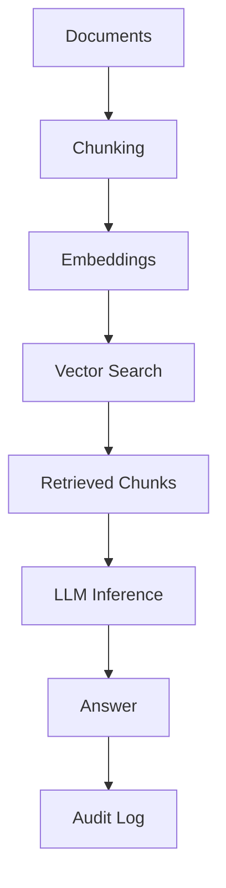

# Chapter 5-4: RAG/ベクトル検索アーキテクチャ 🧠

---
**📚 目次に戻る**: [📖 学習ガイド](../../introduction/)  
**⬅️ 前の章**: [Chapter 5-3: 本番運用機能](../chapter05-3/)  
**➡️ 次の章**: [Chapter 6: パフォーマンス最適化](../chapter06/)  
**🏗️ アーキテクチャ**: RAG / ベクトル検索 / 監査ログ  
**🎯 学習レベル**: 🌱 基礎 | 🚀 応用 | 💪 発展  
**⏱️ 推定学習時間**: 5〜7時間  
**📝 難易度**: 中上級（RLS・Edge Functions 基礎必須）
---

## 🧭 この章で扱う構成
- 構成: RAG/ベクトル検索
- 推奨用途: AI検索・FAQ・ナレッジ活用
- 非推奨用途: AI機能が不要、またはデータが極小のケース

## 🎯 この章で学ぶこと

- Supabaseで **RAG（Retrieval Augmented Generation）** を構成するための全体像
- **pgvector** と **Vector Buckets** の使い分け
- 自動埋め込み生成（キュー + Edge Functions）の実装方針
- 監査・評価ログの設計と、マルチテナントRLSの適用

---

## 5-4.1 RAGアーキテクチャの全体像

RAGは「**検索**」と「**生成**」を分離して安全性・再現性を高める構成です。



**基本設計のポイント**:
- 検索結果（chunk_id）は **必ずDBへ記録**
- プロンプト・モデル名・コストは **監査ログへ保存**
- **tenant_id / user_id** を全テーブルに付与

---

## 5-4.2 pgvector と Vector Buckets の比較

| 項目 | pgvector（DB内） | Vector Buckets（Storage） |
|------|------------------|---------------------------|
| 成熟度 | ✅ 安定運用向き | ⚠️ Alpha（破壊的変更の可能性） |
| 検索性能 | ✅ 高速（同一DB内） | ✅ 大規模向き |
| 運用 | ✅ SQLで完結 | ⚠️ 仕様追従が必要 |
| 推奨用途 | まずはこちら | 大規模/実験用途 |

**実務方針**:
- まずは **pgvector** で開始
- Vector Bucketsは **検証用途**として導入
  - 成熟度は更新される可能性があるため、最新情報を確認

---

## 5-4.3 典型スキーマ設計

```sql
CREATE TABLE documents (
  id BIGSERIAL PRIMARY KEY,
  tenant_id UUID NOT NULL,
  owner_id UUID NOT NULL,
  source_url TEXT,
  content TEXT NOT NULL,
  created_at TIMESTAMPTZ DEFAULT NOW()
);

CREATE TABLE chunks (
  id BIGSERIAL PRIMARY KEY,
  tenant_id UUID NOT NULL,
  document_id BIGINT REFERENCES documents(id),
  content TEXT NOT NULL,
  created_at TIMESTAMPTZ DEFAULT NOW()
);

CREATE TABLE embeddings (
  id BIGSERIAL PRIMARY KEY,
  tenant_id UUID NOT NULL,
  chunk_id BIGINT REFERENCES chunks(id),
  embedding VECTOR(1536),
  created_at TIMESTAMPTZ DEFAULT NOW()
);

CREATE TABLE retrieval_logs (
  id BIGSERIAL PRIMARY KEY,
  tenant_id UUID NOT NULL,
  user_id UUID NOT NULL,
  query_text TEXT NOT NULL,
  retrieved_chunk_ids BIGINT[],
  model_name TEXT,
  prompt_hash TEXT,
  cost_usd NUMERIC(10,4),
  created_at TIMESTAMPTZ DEFAULT NOW()
);

-- インデックス定義（RAGパフォーマンス最適化 / マルチテナント対応）
-- マルチテナントフィルタ用
CREATE INDEX IF NOT EXISTS idx_chunks_tenant_id ON chunks (tenant_id);
CREATE INDEX IF NOT EXISTS idx_embeddings_tenant_id ON embeddings (tenant_id);
CREATE INDEX IF NOT EXISTS idx_retrieval_logs_tenant_id_created_at
  ON retrieval_logs (tenant_id, created_at DESC);

-- 外部キー用（JOIN 最適化）
CREATE INDEX IF NOT EXISTS idx_chunks_document_id ON chunks (document_id);
CREATE INDEX IF NOT EXISTS idx_embeddings_chunk_id ON embeddings (chunk_id);

-- 類似度検索用ベクトルインデックス（pgvector）
CREATE INDEX IF NOT EXISTS idx_embeddings_embedding_hnsw
  ON embeddings
  USING hnsw (embedding vector_cosine_ops);
```

---

## 5-4.4 自動埋め込み生成（キュー + Edge Functions）

**推奨パターン**:
1. `documents` 追加 → トリガ
2. `pgmq` にジョブ投入
3. Edge Functions が埋め込み生成
4. `embeddings` に保存
5. 失敗時は **再試行（pg_cron）**

**補足（pgmqについて）**:
- `pgmq` は PostgreSQL 上にメッセージキューを実装する拡張機能です
- Supabaseの標準コンポーネントではないため、導入が難しい場合は  
  **jobsテーブル方式**（`status`, `retry_count`, `last_error` など）で代替できます

**運用上の注意**:
- 失敗ジョブの **dead letter** を必ず残す
- 生成に使った **モデル名** を保存

---

## 5-4.5 マルチテナントRAGとRLS

RAGは **tenant_id を最優先キー**にします。

```sql
ALTER TABLE documents ENABLE ROW LEVEL SECURITY;
ALTER TABLE embeddings ENABLE ROW LEVEL SECURITY;
ALTER TABLE retrieval_logs ENABLE ROW LEVEL SECURITY;
ALTER TABLE chunks ENABLE ROW LEVEL SECURITY;

CREATE POLICY "tenant_read" ON documents
  FOR SELECT USING (tenant_id = (auth.jwt() ->> 'tenant_id')::uuid);

CREATE POLICY "tenant_read" ON chunks
  FOR SELECT USING (tenant_id = (auth.jwt() ->> 'tenant_id')::uuid);

CREATE POLICY "tenant_log" ON retrieval_logs
  FOR INSERT WITH CHECK (
    tenant_id = (auth.jwt() ->> 'tenant_id')::uuid
    AND user_id = auth.uid()
  );
```

---

## 5-4.6 評価と監査（必須）

AIアプリは **再現性・説明責任** が重要です。

**記録すべき情報**:
- `retrieved_chunk_ids`
- `model_name` / `prompt_hash`
- `cost_usd` / `latency_ms`
- 失敗時のエラー内容

**プロンプトインジェクション対策**:
- 参照元を **信頼境界で分離**
- 検索結果の **サニタイズ**
- システムプロンプトで **禁止事項**を明示

---

## ✅ まとめ

- RAGは **検索と生成を分離**して安全性を上げる
- **pgvectorが基本、Vector Bucketsは検証用途**
- 自動埋め込みは **キュー + Edge Functions** で安定運用
- **監査ログ**がAI運用の核になる

---

**📍 ナビゲーション**
- **📚 目次**: [📖 学習ガイド](../../introduction/)
- **➡️ 次の章**: [Chapter 6: パフォーマンス最適化](../chapter06/)
